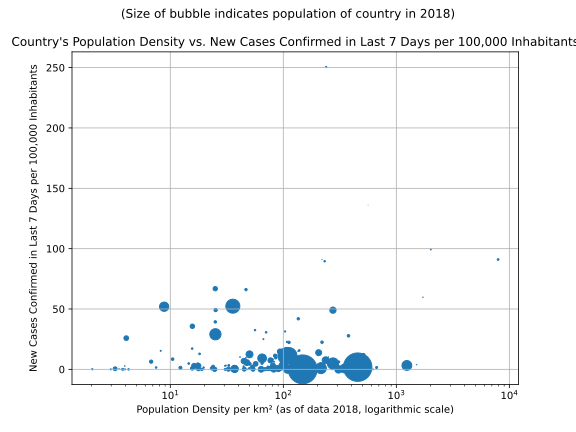

# Most Recent Figures: Highest Rate of New Confirmed Cases over Last 7 Days per 100,000 Inhabitants

| Country | Confirmed Cases in Last 7 days | Confirmed Cases in last 7 Days per 100,000 Population |
|---------|--------------------------------|-------------------------------------------------------|
| [Qatar](./perCountry/QAT_confirmed7daysper100kpop.md) (QAT) |   6969 | 250.532 | 
| [SanMarino](./perCountry/SMR_confirmed7daysper100kpop.md) (SMR) |     46 | 136.155 | 
| [Bahrain](./perCountry/BHR_confirmed7daysper100kpop.md) (BHR) |   1558 | 99.271 | 
| [Singapore](./perCountry/SGP_confirmed7daysper100kpop.md) (SGP) |   5131 | 90.997 | 
| [SaoTome and Principe](./perCountry/STP_confirmed7daysper100kpop.md) (STP) |    192 | 90.983 | 
| [Kuwait](./perCountry/KWT_confirmed7daysper100kpop.md) (KWT) |   3705 | 89.551 | 
| [Peru](./perCountry/PER_confirmed7daysper100kpop.md) (PER) |  21379 | 66.832 | 
| [Belarus](./perCountry/BLR_confirmed7daysper100kpop.md) (BLR) |   6268 | 66.081 | 
| [Maldives](./perCountry/MDV_confirmed7daysper100kpop.md) (MDV) |    308 | 59.725 | 
| [US](./perCountry/USA_confirmed7daysper100kpop.md) (USA) | 171220 | 52.334 | 
| [Russia](./perCountry/RUS_confirmed7daysper100kpop.md) (RUS) |  75001 | 51.912 | 
| [Chile](./perCountry/CHL_confirmed7daysper100kpop.md) (CHL) |   9203 | 49.137 | 
| [UnitedKingdom](./perCountry/GBR_confirmed7daysper100kpop.md) (GBR) |  32607 | 49.041 | 
| [UnitedArab Emirates](./perCountry/ARE_confirmed7daysper100kpop.md) (ARE) |   4035 | 41.896 | 
| [Sweden](./perCountry/SWE_confirmed7daysper100kpop.md) (SWE) |   4005 | 39.330 | 
| [SaudiArabia](./perCountry/SAU_confirmed7daysper100kpop.md) (SAU) |  12037 | 35.718 | 
| [Panama](./perCountry/PAN_confirmed7daysper100kpop.md) (PAN) |   1358 | 32.512 | 
| [Armenia](./perCountry/ARM_confirmed7daysper100kpop.md) (ARM) |    927 | 31.405 | 
| [Ireland](./perCountry/IRL_confirmed7daysper100kpop.md) (IRL) |   1490 | 30.699 | 
| [Brazil](./perCountry/BRA_confirmed7daysper100kpop.md) (BRA) |  60873 | 29.061 | 
| [Belgium](./perCountry/BEL_confirmed7daysper100kpop.md) (BEL) |   3175 | 27.797 | 
| [Canada](./perCountry/CAN_confirmed7daysper100kpop.md) (CAN) |   9587 | 25.870 | 
| [Guinea-Bissau](./perCountry/GNB_confirmed7daysper100kpop.md) (GNB) |    469 | 25.023 | 
| [Moldova](./perCountry/MDA_confirmed7daysper100kpop.md) (MDA) |    806 | 22.731 | 
| [DominicanRepublic](./perCountry/DOM_confirmed7daysper100kpop.md) (DOM) |   2393 | 22.518 | 
| [Portugal](./perCountry/PRT_confirmed7daysper100kpop.md) (PRT) |   2299 | 22.360 | 
| [Oman](./perCountry/OMN_confirmed7daysper100kpop.md) (OMN) |    831 | 17.207 | 
| [Denmark](./perCountry/DNK_confirmed7daysper100kpop.md) (DNK) |    906 | 15.628 | 
| [Gabon](./perCountry/GAB_confirmed7daysper100kpop.md) (GAB) |    326 | 15.383 | 
| [Turkey](./perCountry/TUR_confirmed7daysper100kpop.md) (TUR) |  12612 | 15.321 | 
| [CaboVerde](./perCountry/CPV_confirmed7daysper100kpop.md) (CPV) |     81 | 14.896 | 
| [Spain](./perCountry/ESP_confirmed7daysper100kpop.md) (ESP) |   6884 | 14.733 | 
| [Italy](./perCountry/ITA_confirmed7daysper100kpop.md) (ITA) |   8353 | 13.822 | 
| [Finland](./perCountry/FIN_confirmed7daysper100kpop.md) (FIN) |    708 | 12.831 | 
| [Iran](./perCountry/IRN_confirmed7daysper100kpop.md) (IRN) |  10179 | 12.444 | 
| [France](./perCountry/FRA_confirmed7daysper100kpop.md) (FRA) |   8169 | 12.195 | 
| [Netherlands](./perCountry/NLD_confirmed7daysper100kpop.md) (NLD) |   2057 | 11.938 | 
| [European Union 27](./perCountry/EUE_confirmed7daysper100kpop.md) (EUE) |  50514 | 11.311 | 
| [Romania](./perCountry/ROU_confirmed7daysper100kpop.md) (ROU) |   2199 | 11.292 | 
| [Schengen Area](./perCountry/XXS_confirmed7daysper100kpop.md) (XXS) |  47021 | 11.085 | 
| [Djibouti](./perCountry/DJI_confirmed7daysper100kpop.md) (DJI) |     98 | 10.220 | 
| [Luxembourg](./perCountry/LUX_confirmed7daysper100kpop.md) (LUX) |     62 | 10.202 | 
| [Honduras](./perCountry/HND_confirmed7daysper100kpop.md) (HND) |    917 | 9.565 | 
| [EquatorialGuinea](./perCountry/GNQ_confirmed7daysper100kpop.md) (GNQ) |    124 | 9.473 | 
| [Mexico](./perCountry/MEX_confirmed7daysper100kpop.md) (MEX) |  11551 | 9.154 | 
| [Andorra](./perCountry/AND_confirmed7daysper100kpop.md) (AND) |      7 | 9.090 | 
| [Bolivia](./perCountry/BOL_confirmed7daysper100kpop.md) (BOL) |    962 | 8.473 | 
| [Serbia](./perCountry/SRB_confirmed7daysper100kpop.md) (SRB) |    568 | 8.135 | 
| [Bosniaand Herzegovina](./perCountry/BIH_confirmed7daysper100kpop.md) (BIH) |    260 | 7.822 | 
| [Germany](./perCountry/GER_confirmed7daysper100kpop.md) (GER) |   6215 | 7.507 | 
| [Ukraine](./perCountry/UKR_confirmed7daysper100kpop.md) (UKR) |   3319 | 7.438 | 
| [Ghana](./perCountry/GHA_confirmed7daysper100kpop.md) (GHA) |   2094 | 7.035 | 
| [Colombia](./perCountry/COL_confirmed7daysper100kpop.md) (COL) |   3395 | 6.838 | 
| [Kazakhstan](./perCountry/KAZ_confirmed7daysper100kpop.md) (KAZ) |   1170 | 6.402 | 
| [NorthMacedonia](./perCountry/MKD_confirmed7daysper100kpop.md) (MKD) |    131 | 6.289 | 
| [ElSalvador](./perCountry/SLV_confirmed7daysper100kpop.md) (SLV) |    399 | 6.214 | 
| [Poland](./perCountry/POL_confirmed7daysper100kpop.md) (POL) |   2303 | 6.064 | 
| [Azerbaijan](./perCountry/AZE_confirmed7daysper100kpop.md) (AZE) |    587 | 5.904 | 
| [SouthAfrica](./perCountry/ZAF_confirmed7daysper100kpop.md) (ZAF) |   3232 | 5.594 | 
| [Eswatini](./perCountry/SWZ_confirmed7daysper100kpop.md) (SWZ) |     60 | 5.281 | 
| [Bulgaria](./perCountry/BGR_confirmed7daysper100kpop.md) (BGR) |    347 | 4.940 | 
| [Norway](./perCountry/NOR_confirmed7daysper100kpop.md) (NOR) |    258 | 4.855 | 
| [Pakistan](./perCountry/PAK_confirmed7daysper100kpop.md) (PAK) |  10250 | 4.830 | 
| [Switzerland](./perCountry/CHE_confirmed7daysper100kpop.md) (CHE) |    400 | 4.697 | 
| [Afghanistan](./perCountry/AFG_confirmed7daysper100kpop.md) (AFG) |   1698 | 4.568 | 
| [Paraguay](./perCountry/PRY_confirmed7daysper100kpop.md) (PRY) |    317 | 4.557 | 
| [Guinea](./perCountry/GIN_confirmed7daysper100kpop.md) (GIN) |    560 | 4.511 | 
| [Malta](./perCountry/MLT_confirmed7daysper100kpop.md) (MLT) |     19 | 3.929 | 
| [Senegal](./perCountry/SEN_confirmed7daysper100kpop.md) (SEN) |    527 | 3.324 | 
| [Kyrgyzstan](./perCountry/KGZ_confirmed7daysper100kpop.md) (KGZ) |    207 | 3.277 | 
| [Bangladesh](./perCountry/BGD_confirmed7daysper100kpop.md) (BGD) |   5202 | 3.224 | 
| [Morocco](./perCountry/MAR_confirmed7daysper100kpop.md) (MAR) |   1160 | 3.220 | 
| [Czechia](./perCountry/CZE_confirmed7daysper100kpop.md) (CZE) |    342 | 3.219 | 
| [Latvia](./perCountry/LVA_confirmed7daysper100kpop.md) (LVA) |     60 | 3.114 | 
| [Austria](./perCountry/AUT_confirmed7daysper100kpop.md) (AUT) |    274 | 3.097 | 
| [Israel](./perCountry/ISR_confirmed7daysper100kpop.md) (ISR) |    269 | 3.028 | 
| [Egypt](./perCountry/EGY_confirmed7daysper100kpop.md) (EGY) |   2935 | 2.982 | 
| [Algeria](./perCountry/DZA_confirmed7daysper100kpop.md) (DZA) |   1249 | 2.958 | 
| [Estonia](./perCountry/EST_confirmed7daysper100kpop.md) (EST) |     39 | 2.953 | 
| [Guyana](./perCountry/GUY_confirmed7daysper100kpop.md) (GUY) |     22 | 2.824 | 
| [Argentina](./perCountry/ARG_confirmed7daysper100kpop.md) (ARG) |   1251 | 2.812 | 
| [Hungary](./perCountry/HUN_confirmed7daysper100kpop.md) (HUN) |    265 | 2.713 | 
| [Monaco](./perCountry/MCO_confirmed7daysper100kpop.md) (MCO) |      1 | 2.585 | 
| [Albania](./perCountry/ALB_confirmed7daysper100kpop.md) (ALB) |     73 | 2.547 | 
| [Lithuania](./perCountry/LTU_confirmed7daysper100kpop.md) (LTU) |     69 | 2.474 | 
| [Bahamas](./perCountry/BHS_confirmed7daysper100kpop.md) (BHS) |      9 | 2.334 | 
| [Croatia](./perCountry/HRV_confirmed7daysper100kpop.md) (HRV) |     91 | 2.225 | 
| [Somalia](./perCountry/SOM_confirmed7daysper100kpop.md) (SOM) |    332 | 2.212 | 
| [Cyprus](./perCountry/CYP_confirmed7daysper100kpop.md) (CYP) |     26 | 2.186 | 
| [Guatemala](./perCountry/GTM_confirmed7daysper100kpop.md) (GTM) |    349 | 2.023 | 
| [Benin](./perCountry/BEN_confirmed7daysper100kpop.md) (BEN) |    229 | 1.994 | 
| [Cameroon](./perCountry/CMR_confirmed7daysper100kpop.md) (CMR) |    502 | 1.991 | 
| [Sudan](./perCountry/SDN_confirmed7daysper100kpop.md) (SDN) |    773 | 1.849 | 
| [SierraLeone](./perCountry/SLE_confirmed7daysper100kpop.md) (SLE) |    141 | 1.843 | 
| [India](./perCountry/IND_confirmed7daysper100kpop.md) (IND) |  24656 | 1.823 | 
| [Lebanon](./perCountry/LBN_confirmed7daysper100kpop.md) (LBN) |    108 | 1.577 | 
| [CentralAfrican Republic](./perCountry/CAF_confirmed7daysper100kpop.md) (CAF) |     71 | 1.522 | 
| [Uruguay](./perCountry/URY_confirmed7daysper100kpop.md) (URY) |     52 | 1.508 | 
| [Philippines](./perCountry/PHL_confirmed7daysper100kpop.md) (PHL) |   1571 | 1.473 | 
| [Chad](./perCountry/TCD_confirmed7daysper100kpop.md) (TCD) |    205 | 1.324 | 
| [Georgia](./perCountry/GEO_confirmed7daysper100kpop.md) (GEO) |     46 | 1.233 | 
| [Iraq](./perCountry/IRQ_confirmed7daysper100kpop.md) (IRQ) |    471 | 1.225 | 
| [Coted&#39;Ivoire](./perCountry/CIV_confirmed7daysper100kpop.md) (CIV) |    302 | 1.205 | 
| [Malaysia](./perCountry/MYS_confirmed7daysper100kpop.md) (MYS) |    358 | 1.135 | 
| [Jamaica](./perCountry/JAM_confirmed7daysper100kpop.md) (JAM) |     33 | 1.124 | 
| [Indonesia](./perCountry/IDN_confirmed7daysper100kpop.md) (IDN) |   2840 | 1.061 | 
| [CostaRica](./perCountry/CRI_confirmed7daysper100kpop.md) (CRI) |     53 | 1.060 | 
| [Cuba](./perCountry/CUB_confirmed7daysper100kpop.md) (CUB) |    117 | 1.032 | 
| [Nigeria](./perCountry/NGA_confirmed7daysper100kpop.md) (NGA) |   1841 | 0.940 | 
| [SaintVincent and the Grenadines](./perCountry/VCT_confirmed7daysper100kpop.md) (VCT) |      1 | 0.907 | 
| [Slovakia](./perCountry/SVK_confirmed7daysper100kpop.md) (SVK) |     49 | 0.900 | 
| [Slovenia](./perCountry/SVN_confirmed7daysper100kpop.md) (SVN) |     18 | 0.871 | 
| [Congo(Brazzaville)](./perCountry/COG_confirmed7daysper100kpop.md) (COG) |     45 | 0.858 | 
| [Liberia](./perCountry/LBR_confirmed7daysper100kpop.md) (LBR) |     41 | 0.851 | 
| [Haiti](./perCountry/HTI_confirmed7daysper100kpop.md) (HTI) |     94 | 0.845 | 
| [Greece](./perCountry/GRC_confirmed7daysper100kpop.md) (GRC) |     90 | 0.839 | 
| [Zambia](./perCountry/ZMB_confirmed7daysper100kpop.md) (ZMB) |    143 | 0.824 | 
| [Uzbekistan](./perCountry/UZB_confirmed7daysper100kpop.md) (UZB) |    269 | 0.816 | 
| [Jordan](./perCountry/JOR_confirmed7daysper100kpop.md) (JOR) |     79 | 0.793 | 
| [Mali](./perCountry/MLI_confirmed7daysper100kpop.md) (MLI) |    141 | 0.739 | 
| [Japan](./perCountry/JPN_confirmed7daysper100kpop.md) (JPN) |    900 | 0.711 | 
| [Brunei](./perCountry/BRN_confirmed7daysper100kpop.md) (BRN) |      3 | 0.699 | 
| [Barbados](./perCountry/BRB_confirmed7daysper100kpop.md) (BRB) |      2 | 0.698 | 
| [SouthSudan](./perCountry/SSD_confirmed7daysper100kpop.md) (SSD) |     74 | 0.674 | 
| [SriLanka](./perCountry/LKA_confirmed7daysper100kpop.md) (LKA) |    145 | 0.669 | 
| [Togo](./perCountry/TGO_confirmed7daysper100kpop.md) (TGO) |     50 | 0.634 | 
| [Iceland](./perCountry/ISL_confirmed7daysper100kpop.md) (ISL) |      2 | 0.566 | 
| [Australia](./perCountry/AUS_confirmed7daysper100kpop.md) (AUS) |    126 | 0.504 | 
| [BurkinaFaso](./perCountry/BFA_confirmed7daysper100kpop.md) (BFA) |     89 | 0.451 | 
| [Kenya](./perCountry/KEN_confirmed7daysper100kpop.md) (KEN) |    207 | 0.403 | 
| [Congo(Kinshasa)](./perCountry/COD_confirmed7daysper100kpop.md) (COD) |    317 | 0.377 | 
| [Montenegro](./perCountry/MNE_confirmed7daysper100kpop.md) (MNE) |      2 | 0.321 | 
| [Niger](./perCountry/NER_confirmed7daysper100kpop.md) (NER) |     71 | 0.316 | 
| [Korea,South](./perCountry/KOR_confirmed7daysper100kpop.md) (KOR) |    108 | 0.209 | 
| [NewZealand](./perCountry/NZL_confirmed7daysper100kpop.md) (NZL) |     10 | 0.205 | 
| [Rwanda](./perCountry/RWA_confirmed7daysper100kpop.md) (RWA) |     25 | 0.203 | 
| [Venezuela](./perCountry/VEN_confirmed7daysper100kpop.md) (VEN) |     57 | 0.197 | 
| [Madagascar](./perCountry/MDG_confirmed7daysper100kpop.md) (MDG) |     44 | 0.168 | 
| [Tunisia](./perCountry/TUN_confirmed7daysper100kpop.md) (TUN) |     19 | 0.164 | 
| [Yemen](./perCountry/YEM_confirmed7daysper100kpop.md) (YEM) |     41 | 0.144 | 
| [Gambia](./perCountry/GMB_confirmed7daysper100kpop.md) (GMB) |      3 | 0.132 | 
| [Nepal](./perCountry/NPL_confirmed7daysper100kpop.md) (NPL) |     35 | 0.125 | 
| [Ecuador](./perCountry/ECU_confirmed7daysper100kpop.md) (ECU) |     21 | 0.123 | 
| [Ethiopia](./perCountry/ETH_confirmed7daysper100kpop.md) (ETH) |    104 | 0.095 | 
| [Mongolia](./perCountry/MNG_confirmed7daysper100kpop.md) (MNG) |      3 | 0.095 | 
| [Malawi](./perCountry/MWI_confirmed7daysper100kpop.md) (MWI) |     17 | 0.094 | 
| [Uganda](./perCountry/UGA_confirmed7daysper100kpop.md) (UGA) |     32 | 0.075 | 
| [Thailand](./perCountry/THA_confirmed7daysper100kpop.md) (THA) |     40 | 0.058 | 
| [Tanzania](./perCountry/TZA_confirmed7daysper100kpop.md) (TZA) |     29 | 0.051 | 
| [Burma](./perCountry/MMR_confirmed7daysper100kpop.md) (MMR) |     25 | 0.047 | 
| [Mozambique](./perCountry/MOZ_confirmed7daysper100kpop.md) (MOZ) |     11 | 0.037 | 
| [Angola](./perCountry/AGO_confirmed7daysper100kpop.md) (AGO) |     10 | 0.032 | 
| [Vietnam](./perCountry/VNM_confirmed7daysper100kpop.md) (VNM) |     17 | 0.018 | 
| [Syria](./perCountry/SYR_confirmed7daysper100kpop.md) (SYR) |      3 | 0.018 | 
| [Nicaragua](./perCountry/NIC_confirmed7daysper100kpop.md) (NIC) |      1 | 0.015 | 
| [Libya](./perCountry/LBY_confirmed7daysper100kpop.md) (LBY) |      1 | 0.015 | 
| [Zimbabwe](./perCountry/ZWE_confirmed7daysper100kpop.md) (ZWE) |      2 | 0.014 | 
| [China](./perCountry/CHN_confirmed7daysper100kpop.md) (CHN) |     46 | 0.003 | 
| [Suriname](./perCountry/SUR_confirmed7daysper100kpop.md) (SUR) |      0 | 0.000 | 
| [PapuaNew Guinea](./perCountry/PNG_confirmed7daysper100kpop.md) (PNG) |      0 | 0.000 | 
| [Namibia](./perCountry/NAM_confirmed7daysper100kpop.md) (NAM) |      0 | 0.000 | 
| [Timor-Leste](./perCountry/TLS_confirmed7daysper100kpop.md) (TLS) |      0 | 0.000 | 
| [Trinidadand Tobago](./perCountry/TTO_confirmed7daysper100kpop.md) (TTO) |      0 | 0.000 | 
| [Mauritius](./perCountry/MUS_confirmed7daysper100kpop.md) (MUS) |      0 | 0.000 | 
| [Mauritania](./perCountry/MRT_confirmed7daysper100kpop.md) (MRT) |      0 | 0.000 | 
| [Liechtenstein](./perCountry/LIE_confirmed7daysper100kpop.md) (LIE) |      0 | 0.000 | 
| [SaintLucia](./perCountry/LCA_confirmed7daysper100kpop.md) (LCA) |      0 | 0.000 | 
| [Laos](./perCountry/LAO_confirmed7daysper100kpop.md) (LAO) |      0 | 0.000 | 
| [SaintKitts and Nevis](./perCountry/KNA_confirmed7daysper100kpop.md) (KNA) |      0 | 0.000 | 
| [Cambodia](./perCountry/KHM_confirmed7daysper100kpop.md) (KHM) |      0 | 0.000 | 
| [Grenada](./perCountry/GRD_confirmed7daysper100kpop.md) (GRD) |      0 | 0.000 | 
| [Fiji](./perCountry/FJI_confirmed7daysper100kpop.md) (FJI) |      0 | 0.000 | 
| [Dominica](./perCountry/DMA_confirmed7daysper100kpop.md) (DMA) |      0 | 0.000 | 
| [Botswana](./perCountry/BWA_confirmed7daysper100kpop.md) (BWA) |      0 | 0.000 | 
| [Bhutan](./perCountry/BTN_confirmed7daysper100kpop.md) (BTN) |      0 | 0.000 | 
| [Belize](./perCountry/BLZ_confirmed7daysper100kpop.md) (BLZ) |      0 | 0.000 | 
| [Burundi](./perCountry/BDI_confirmed7daysper100kpop.md) (BDI) |      0 | 0.000 | 
| [Seychelles](./perCountry/SYC_confirmed7daysper100kpop.md) (SYC) |      0 | 0.000 | 
| [Antiguaand Barbuda](./perCountry/ATG_confirmed7daysper100kpop.md) (ATG) |      0 | 0.000 | 

