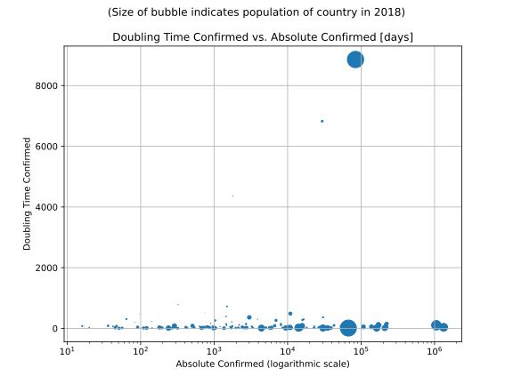

# Most Recent Figures: Lowest Doubling Time Rate by Country

The doubling time mentioned below is calculated based on 
* an exponential growth assumption
* for time difference of past seven (7) days
* showing the most recent reported value available
* for confirmed (not active!) cases.

The doubling time's unit is "days". 

| Country | Doubling Time (Confirmed) |
|---------|---------------------------|
| [SaoTome and Principe](./perCountry/STP_doublingtime.md) (STP) | 2.2 days | 
| [Yemen](./perCountry/YEM_doublingtime.md) (YEM) | 3.3 days | 
| [Benin](./perCountry/BEN_doublingtime.md) (BEN) | 4.2 days | 
| [Guinea-Bissau](./perCountry/GNB_doublingtime.md) (GNB) | 5.0 days | 
| [Chad](./perCountry/TCD_doublingtime.md) (TCD) | 5.1 days | 
| [SouthSudan](./perCountry/SSD_doublingtime.md) (SSD) | 5.4 days | 
| [Sudan](./perCountry/SDN_doublingtime.md) (SDN) | 6.1 days | 
| [Zambia](./perCountry/ZMB_doublingtime.md) (ZMB) | 6.7 days | 
| [Haiti](./perCountry/HTI_doublingtime.md) (HTI) | 7.0 days | 
| [CentralAfrican Republic](./perCountry/CAF_doublingtime.md) (CAF) | 7.4 days | 
| [Gabon](./perCountry/GAB_doublingtime.md) (GAB) | 7.5 days | 
| [Ghana](./perCountry/GHA_doublingtime.md) (GHA) | 7.5 days | 
| [Honduras](./perCountry/HND_doublingtime.md) (HND) | 8.1 days | 
| [SierraLeone](./perCountry/SLE_doublingtime.md) (SLE) | 8.2 days | 
| [ElSalvador](./perCountry/SLV_doublingtime.md) (SLV) | 8.5 days | 
| [Paraguay](./perCountry/PRY_doublingtime.md) (PRY) | 8.6 days | 
| [Ethiopia](./perCountry/ETH_doublingtime.md) (ETH) | 8.8 days | 
| [Kuwait](./perCountry/KWT_doublingtime.md) (KWT) | 9.1 days | 
| [Nigeria](./perCountry/NGA_doublingtime.md) (NGA) | 9.3 days | 
| [Afghanistan](./perCountry/AFG_doublingtime.md) (AFG) | 10.3 days | 
| [Bolivia](./perCountry/BOL_doublingtime.md) (BOL) | 10.6 days | 
| [Brazil](./perCountry/BRA_doublingtime.md) (BRA) | 10.7 days | 
| [Maldives](./perCountry/MDV_doublingtime.md) (MDV) | 10.9 days | 
| [India](./perCountry/IND_doublingtime.md) (IND) | 10.9 days | 
| [Russia](./perCountry/RUS_doublingtime.md) (RUS) | 11.3 days | 
| [Bangladesh](./perCountry/BGD_doublingtime.md) (BGD) | 11.4 days | 
| [Eswatini](./perCountry/SWZ_doublingtime.md) (SWZ) | 11.7 days | 
| [Pakistan](./perCountry/PAK_doublingtime.md) (PAK) | 12.1 days | 
| [Guatemala](./perCountry/GTM_doublingtime.md) (GTM) | 12.4 days | 
| [Mexico](./perCountry/MEX_doublingtime.md) (MEX) | 12.5 days | 
| [CaboVerde](./perCountry/CPV_doublingtime.md) (CPV) | 12.5 days | 
| [SouthAfrica](./perCountry/ZAF_doublingtime.md) (ZAF) | 12.8 days | 
| [Congo(Kinshasa)](./perCountry/COD_doublingtime.md) (COD) | 12.9 days | 
| [Chile](./perCountry/CHL_doublingtime.md) (CHL) | 13.0 days | 
| [Nepal](./perCountry/NPL_doublingtime.md) (NPL) | 13.0 days | 
| [Peru](./perCountry/PER_doublingtime.md) (PER) | 13.0 days | 
| [Bahrain](./perCountry/BHR_doublingtime.md) (BHR) | 13.2 days | 
| [Somalia](./perCountry/SOM_doublingtime.md) (SOM) | 13.2 days | 
| [Egypt](./perCountry/EGY_doublingtime.md) (EGY) | 13.3 days | 
| [Qatar](./perCountry/QAT_doublingtime.md) (QAT) | 13.4 days | 
| [Senegal](./perCountry/SEN_doublingtime.md) (SEN) | 13.5 days | 
| [SaudiArabia](./perCountry/SAU_doublingtime.md) (SAU) | 13.5 days | 
| [Kenya](./perCountry/KEN_doublingtime.md) (KEN) | 13.5 days | 
| [Colombia](./perCountry/COL_doublingtime.md) (COL) | 13.6 days | 
| [Malawi](./perCountry/MWI_doublingtime.md) (MWI) | 13.8 days | 
| [Togo](./perCountry/TGO_doublingtime.md) (TGO) | 14.7 days | 
| [EquatorialGuinea](./perCountry/GNQ_doublingtime.md) (GNQ) | 15.0 days | 
| [Armenia](./perCountry/ARM_doublingtime.md) (ARM) | 15.1 days | 
| [Belarus](./perCountry/BLR_doublingtime.md) (BLR) | 15.6 days | 
| [Uganda](./perCountry/UGA_doublingtime.md) (UGA) | 16.1 days | 
| [Guinea](./perCountry/GIN_doublingtime.md) (GIN) | 16.4 days | 
| [Oman](./perCountry/OMN_doublingtime.md) (OMN) | 17.7 days | 
| [Azerbaijan](./perCountry/AZE_doublingtime.md) (AZE) | 18.6 days | 
| [DominicanRepublic](./perCountry/DOM_doublingtime.md) (DOM) | 18.8 days | 
| [Kazakhstan](./perCountry/KAZ_doublingtime.md) (KAZ) | 18.9 days | 
| [Madagascar](./perCountry/MDG_doublingtime.md) (MDG) | 19.1 days | 
| [Angola](./perCountry/AGO_doublingtime.md) (AGO) | 19.7 days | 
| [UnitedArab Emirates](./perCountry/ARE_doublingtime.md) (ARE) | 19.7 days | 
| [Singapore](./perCountry/SGP_doublingtime.md) (SGP) | 19.9 days | 
| [Algeria](./perCountry/DZA_doublingtime.md) (DZA) | 20.1 days | 
| [Ukraine](./perCountry/UKR_doublingtime.md) (UKR) | 20.1 days | 
| [Guyana](./perCountry/GUY_doublingtime.md) (GUY) | 20.8 days | 
| [Argentina](./perCountry/ARG_doublingtime.md) (ARG) | 21.2 days | 
| [Kyrgyzstan](./perCountry/KGZ_doublingtime.md) (KGZ) | 21.3 days | 
| [Liberia](./perCountry/LBR_doublingtime.md) (LBR) | 21.4 days | 
| [Indonesia](./perCountry/IDN_doublingtime.md) (IDN) | 21.8 days | 
| [Mali](./perCountry/MLI_doublingtime.md) (MLI) | 22.1 days | 
| [Cameroon](./perCountry/CMR_doublingtime.md) (CMR) | 22.8 days | 
| [Morocco](./perCountry/MAR_doublingtime.md) (MAR) | 23.2 days | 
| [Coted&#39;Ivoire](./perCountry/CIV_doublingtime.md) (CIV) | 25.2 days | 
| [Bulgaria](./perCountry/BGR_doublingtime.md) (BGR) | 25.3 days | 
| [Iraq](./perCountry/IRQ_doublingtime.md) (IRQ) | 26.3 days | 
| [SriLanka](./perCountry/LKA_doublingtime.md) (LKA) | 26.7 days | 
| [Congo(Brazzaville)](./perCountry/COG_doublingtime.md) (COG) | 27.4 days | 
| [Moldova](./perCountry/MDA_doublingtime.md) (MDA) | 27.5 days | 
| [Panama](./perCountry/PAN_doublingtime.md) (PAN) | 28.0 days | 
| [Sweden](./perCountry/SWE_doublingtime.md) (SWE) | 29.7 days | 
| [Gambia](./perCountry/GMB_doublingtime.md) (GMB) | 30.2 days | 
| [UnitedKingdom](./perCountry/GBR_doublingtime.md) (GBR) | 30.7 days | 
| [Jordan](./perCountry/JOR_doublingtime.md) (JOR) | 31.0 days | 
| [Philippines](./perCountry/PHL_doublingtime.md) (PHL) | 31.2 days | 
| [Poland](./perCountry/POL_doublingtime.md) (POL) | 31.6 days | 
| [Romania](./perCountry/ROU_doublingtime.md) (ROU) | 31.8 days | 
| [Burma](./perCountry/MMR_doublingtime.md) (MMR) | 32.8 days | 
| [Venezuela](./perCountry/VEN_doublingtime.md) (VEN) | 33.1 days | 
| [Canada](./perCountry/CAN_doublingtime.md) (CAN) | 33.3 days | 
| [US](./perCountry/USA_doublingtime.md) (USA) | 35.5 days | 
| [Lebanon](./perCountry/LBN_doublingtime.md) (LBN) | 35.8 days | 
| [Bosniaand Herzegovina](./perCountry/BIH_doublingtime.md) (BIH) | 37.4 days | 
| [Mozambique](./perCountry/MOZ_doublingtime.md) (MOZ) | 38.0 days | 
| [Finland](./perCountry/FIN_doublingtime.md) (FIN) | 38.7 days | 
| [BurkinaFaso](./perCountry/BFA_doublingtime.md) (BFA) | 38.8 days | 
| [Uzbekistan](./perCountry/UZB_doublingtime.md) (UZB) | 41.5 days | 
| [Bahamas](./perCountry/BHS_doublingtime.md) (BHS) | 47.5 days | 
| [Iran](./perCountry/IRN_doublingtime.md) (IRN) | 49.2 days | 
| [Turkey](./perCountry/TUR_doublingtime.md) (TUR) | 51.2 days | 
| [Rwanda](./perCountry/RWA_doublingtime.md) (RWA) | 53.0 days | 
| [Niger](./perCountry/NER_doublingtime.md) (NER) | 54.0 days | 
| [Denmark](./perCountry/DNK_doublingtime.md) (DNK) | 54.8 days | 
| [Albania](./perCountry/ALB_doublingtime.md) (ALB) | 55.6 days | 
| [Portugal](./perCountry/PRT_doublingtime.md) (PRT) | 56.1 days | 
| [VaticanCity](./perCountry/VAT_doublingtime.md) (VAT) | 56.1 days | 
| [Hungary](./perCountry/HUN_doublingtime.md) (HUN) | 57.6 days | 
| [Djibouti](./perCountry/DJI_doublingtime.md) (DJI) | 57.8 days | 
| [NorthMacedonia](./perCountry/MKD_doublingtime.md) (MKD) | 58.7 days | 
| [Uruguay](./perCountry/URY_doublingtime.md) (URY) | 63.9 days | 
| [SanMarino](./perCountry/SMR_doublingtime.md) (SMR) | 64.1 days | 
| [Georgia](./perCountry/GEO_doublingtime.md) (GEO) | 64.9 days | 
| [Mongolia](./perCountry/MNG_doublingtime.md) (MNG) | 65.8 days | 
| [CostaRica](./perCountry/CRI_doublingtime.md) (CRI) | 70.4 days | 
| [Cuba](./perCountry/CUB_doublingtime.md) (CUB) | 71.1 days | 
| [Jamaica](./perCountry/JAM_doublingtime.md) (JAM) | 71.7 days | 
| [Ireland](./perCountry/IRL_doublingtime.md) (IRL) | 72.8 days | 
| [Latvia](./perCountry/LVA_doublingtime.md) (LVA) | 73.8 days | 
| [Syria](./perCountry/SYR_doublingtime.md) (SYR) | 73.9 days | 
| [Nicaragua](./perCountry/NIC_doublingtime.md) (NIC) | 75.5 days | 
| [Belgium](./perCountry/BEL_doublingtime.md) (BEL) | 79.0 days | 
| [Vietnam](./perCountry/VNM_doublingtime.md) (VNM) | 80.1 days | 
| [SaintVincent and the Grenadines](./perCountry/VCT_doublingtime.md) (VCT) | 80.4 days | 
| [Japan](./perCountry/JPN_doublingtime.md) (JPN) | 83.0 days | 
| [Tanzania](./perCountry/TZA_doublingtime.md) (TZA) | 83.1 days | 
| [Serbia](./perCountry/SRB_doublingtime.md) (SRB) | 83.6 days | 
| [Zimbabwe](./perCountry/ZWE_doublingtime.md) (ZWE) | 85.2 days | 
| [Malaysia](./perCountry/MYS_doublingtime.md) (MYS) | 88.1 days | 
| [Netherlands](./perCountry/NLD_doublingtime.md) (NLD) | 98.9 days | 
| [European Union 27](./perCountry/EUE_doublingtime.md) (EUE) | 99.7 days | 
| [Lithuania](./perCountry/LTU_doublingtime.md) (LTU) | 101.9 days | 
| [France](./perCountry/FRA_doublingtime.md) (FRA) | 103.1 days | 
| [Schengen Area](./perCountry/XXS_doublingtime.md) (XXS) | 106.9 days | 
| [Czechia](./perCountry/CZE_doublingtime.md) (CZE) | 113.1 days | 
| [Croatia](./perCountry/HRV_doublingtime.md) (HRV) | 114.5 days | 
| [Malta](./perCountry/MLT_doublingtime.md) (MLT) | 124.6 days | 
| [Italy](./perCountry/ITA_doublingtime.md) (ITA) | 125.2 days | 
| [Germany](./perCountry/GER_doublingtime.md) (GER) | 132.1 days | 
| [Slovakia](./perCountry/SVK_doublingtime.md) (SVK) | 142.2 days | 
| [Greece](./perCountry/GRC_doublingtime.md) (GRC) | 144.3 days | 
| [Norway](./perCountry/NOR_doublingtime.md) (NOR) | 150.3 days | 
| [Spain](./perCountry/ESP_doublingtime.md) (ESP) | 156.0 days | 
| [Cyprus](./perCountry/CYP_doublingtime.md) (CYP) | 165.5 days | 
| [Barbados](./perCountry/BRB_doublingtime.md) (BRB) | 201.7 days | 
| [Estonia](./perCountry/EST_doublingtime.md) (EST) | 214.3 days | 
| [Brunei](./perCountry/BRN_doublingtime.md) (BRN) | 226.0 days | 
| [Tunisia](./perCountry/TUN_doublingtime.md) (TUN) | 261.5 days | 
| [Australia](./perCountry/AUS_doublingtime.md) (AUS) | 265.5 days | 
| [Austria](./perCountry/AUT_doublingtime.md) (AUT) | 279.0 days | 
| [Israel](./perCountry/ISR_doublingtime.md) (ISR) | 295.1 days | 
| [Luxembourg](./perCountry/LUX_doublingtime.md) (LUX) | 302.0 days | 
| [Libya](./perCountry/LBY_doublingtime.md) (LBY) | 308.4 days | 
| [Thailand](./perCountry/THA_doublingtime.md) (THA) | 362.9 days | 
| [Switzerland](./perCountry/CHE_doublingtime.md) (CHE) | 365.5 days | 
| [Slovenia](./perCountry/SVN_doublingtime.md) (SVN) | 390.7 days | 
| [Monaco](./perCountry/MCO_doublingtime.md) (MCO) | 463.7 days | 
| [Korea,South](./perCountry/KOR_doublingtime.md) (KOR) | 488.0 days | 
| [Andorra](./perCountry/AND_doublingtime.md) (AND) | 521.2 days | 
| [Taiwan](./perCountry/TWN_doublingtime.md) (TWN) | 531.6 days | 
| [NewZealand](./perCountry/NZL_doublingtime.md) (NZL) | 724.3 days | 
| [Montenegro](./perCountry/MNE_doublingtime.md) (MNE) | 783.9 days | 
| [Iceland](./perCountry/ISL_doublingtime.md) (ISL) | 4367.2 days | 
| [Ecuador](./perCountry/ECU_doublingtime.md) (ECU) | 6827.5 days | 
| [China](./perCountry/CHN_doublingtime.md) (CHN) | 8859.2 days | 

