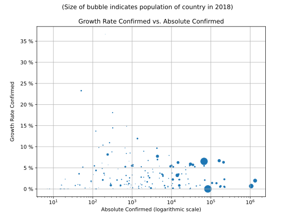

# Most Recent Figures: Highest Confirmed Growth Rate by Country

The Growth Rate mentioned below is calculated based on 
* an exponential growth assumption
* for time difference of past seven (7) days
* showing the most recent reported value available
* for confirmed (not active!) cases.

The rate is based on "growth by day". 

| Country | Confirmed Growth Rate |
|---------|-----------------------|
| [SaoTome and Principe](./perCountry/STP_growthrate.md) (STP) | 36.64 % | 
| [Yemen](./perCountry/YEM_growthrate.md) (YEM) | 23.27 % | 
| [Benin](./perCountry/BEN_growthrate.md) (BEN) | 18.08 % | 
| [Guinea-Bissau](./perCountry/GNB_growthrate.md) (GNB) | 14.84 % | 
| [Chad](./perCountry/TCD_growthrate.md) (TCD) | 14.46 % | 
| [SouthSudan](./perCountry/SSD_growthrate.md) (SSD) | 13.70 % | 
| [Sudan](./perCountry/SDN_growthrate.md) (SDN) | 11.93 % | 
| [Zambia](./perCountry/ZMB_growthrate.md) (ZMB) | 10.96 % | 
| [Haiti](./perCountry/HTI_growthrate.md) (HTI) | 10.38 % | 
| [CentralAfrican Republic](./perCountry/CAF_growthrate.md) (CAF) | 9.80 % | 
| [Gabon](./perCountry/GAB_growthrate.md) (GAB) | 9.71 % | 
| [Ghana](./perCountry/GHA_growthrate.md) (GHA) | 9.65 % | 
| [Honduras](./perCountry/HND_growthrate.md) (HND) | 8.94 % | 
| [SierraLeone](./perCountry/SLE_growthrate.md) (SLE) | 8.78 % | 
| [ElSalvador](./perCountry/SLV_growthrate.md) (SLV) | 8.51 % | 
| [Paraguay](./perCountry/PRY_growthrate.md) (PRY) | 8.40 % | 
| [Ethiopia](./perCountry/ETH_growthrate.md) (ETH) | 8.16 % | 
| [Kuwait](./perCountry/KWT_growthrate.md) (KWT) | 7.94 % | 
| [Nigeria](./perCountry/NGA_growthrate.md) (NGA) | 7.75 % | 
| [Afghanistan](./perCountry/AFG_growthrate.md) (AFG) | 6.96 % | 
| [Bolivia](./perCountry/BOL_growthrate.md) (BOL) | 6.75 % | 
| [Brazil](./perCountry/BRA_growthrate.md) (BRA) | 6.69 % | 
| [Maldives](./perCountry/MDV_growthrate.md) (MDV) | 6.57 % | 
| [India](./perCountry/IND_growthrate.md) (IND) | 6.54 % | 
| [Russia](./perCountry/RUS_growthrate.md) (RUS) | 6.32 % | 
| [Bangladesh](./perCountry/BGD_growthrate.md) (BGD) | 6.26 % | 
| [Eswatini](./perCountry/SWZ_growthrate.md) (SWZ) | 6.13 % | 
| [Pakistan](./perCountry/PAK_growthrate.md) (PAK) | 5.89 % | 
| [Guatemala](./perCountry/GTM_growthrate.md) (GTM) | 5.76 % | 
| [Mexico](./perCountry/MEX_growthrate.md) (MEX) | 5.72 % | 
| [CaboVerde](./perCountry/CPV_growthrate.md) (CPV) | 5.71 % | 
| [SouthAfrica](./perCountry/ZAF_growthrate.md) (ZAF) | 5.57 % | 
| [Congo(Kinshasa)](./perCountry/COD_growthrate.md) (COD) | 5.51 % | 
| [Chile](./perCountry/CHL_growthrate.md) (CHL) | 5.48 % | 
| [Nepal](./perCountry/NPL_growthrate.md) (NPL) | 5.47 % | 
| [Peru](./perCountry/PER_growthrate.md) (PER) | 5.46 % | 
| [Bahrain](./perCountry/BHR_growthrate.md) (BHR) | 5.41 % | 
| [Somalia](./perCountry/SOM_growthrate.md) (SOM) | 5.40 % | 
| [Egypt](./perCountry/EGY_growthrate.md) (EGY) | 5.35 % | 
| [Qatar](./perCountry/QAT_growthrate.md) (QAT) | 5.29 % | 
| [Senegal](./perCountry/SEN_growthrate.md) (SEN) | 5.27 % | 
| [SaudiArabia](./perCountry/SAU_growthrate.md) (SAU) | 5.26 % | 
| [Kenya](./perCountry/KEN_growthrate.md) (KEN) | 5.26 % | 
| [Colombia](./perCountry/COL_growthrate.md) (COL) | 5.24 % | 
| [Malawi](./perCountry/MWI_growthrate.md) (MWI) | 5.17 % | 
| [Togo](./perCountry/TGO_growthrate.md) (TGO) | 4.84 % | 
| [EquatorialGuinea](./perCountry/GNQ_growthrate.md) (GNQ) | 4.74 % | 
| [Armenia](./perCountry/ARM_growthrate.md) (ARM) | 4.69 % | 
| [Belarus](./perCountry/BLR_growthrate.md) (BLR) | 4.55 % | 
| [Uganda](./perCountry/UGA_growthrate.md) (UGA) | 4.39 % | 
| [Guinea](./perCountry/GIN_growthrate.md) (GIN) | 4.32 % | 
| [Oman](./perCountry/OMN_growthrate.md) (OMN) | 4.01 % | 
| [Azerbaijan](./perCountry/AZE_growthrate.md) (AZE) | 3.79 % | 
| [DominicanRepublic](./perCountry/DOM_growthrate.md) (DOM) | 3.76 % | 
| [Kazakhstan](./perCountry/KAZ_growthrate.md) (KAZ) | 3.73 % | 
| [Madagascar](./perCountry/MDG_growthrate.md) (MDG) | 3.70 % | 
| [Angola](./perCountry/AGO_growthrate.md) (AGO) | 3.59 % | 
| [UnitedArab Emirates](./perCountry/ARE_growthrate.md) (ARE) | 3.58 % | 
| [Singapore](./perCountry/SGP_growthrate.md) (SGP) | 3.55 % | 
| [Algeria](./perCountry/DZA_growthrate.md) (DZA) | 3.52 % | 
| [Ukraine](./perCountry/UKR_growthrate.md) (UKR) | 3.51 % | 
| [Guyana](./perCountry/GUY_growthrate.md) (GUY) | 3.40 % | 
| [Argentina](./perCountry/ARG_growthrate.md) (ARG) | 3.32 % | 
| [Kyrgyzstan](./perCountry/KGZ_growthrate.md) (KGZ) | 3.31 % | 
| [Liberia](./perCountry/LBR_growthrate.md) (LBR) | 3.30 % | 
| [Indonesia](./perCountry/IDN_growthrate.md) (IDN) | 3.23 % | 
| [Mali](./perCountry/MLI_growthrate.md) (MLI) | 3.19 % | 
| [Cameroon](./perCountry/CMR_growthrate.md) (CMR) | 3.09 % | 
| [Morocco](./perCountry/MAR_growthrate.md) (MAR) | 3.03 % | 
| [Coted&#39;Ivoire](./perCountry/CIV_growthrate.md) (CIV) | 2.79 % | 
| [Bulgaria](./perCountry/BGR_growthrate.md) (BGR) | 2.78 % | 
| [Iraq](./perCountry/IRQ_growthrate.md) (IRQ) | 2.67 % | 
| [SriLanka](./perCountry/LKA_growthrate.md) (LKA) | 2.63 % | 
| [Congo(Brazzaville)](./perCountry/COG_growthrate.md) (COG) | 2.56 % | 
| [Moldova](./perCountry/MDA_growthrate.md) (MDA) | 2.55 % | 
| [Panama](./perCountry/PAN_growthrate.md) (PAN) | 2.50 % | 
| [Sweden](./perCountry/SWE_growthrate.md) (SWE) | 2.36 % | 
| [Gambia](./perCountry/GMB_growthrate.md) (GMB) | 2.32 % | 
| [UnitedKingdom](./perCountry/GBR_growthrate.md) (GBR) | 2.29 % | 
| [Jordan](./perCountry/JOR_growthrate.md) (JOR) | 2.26 % | 
| [Philippines](./perCountry/PHL_growthrate.md) (PHL) | 2.25 % | 
| [Poland](./perCountry/POL_growthrate.md) (POL) | 2.22 % | 
| [Romania](./perCountry/ROU_growthrate.md) (ROU) | 2.21 % | 
| [Burma](./perCountry/MMR_growthrate.md) (MMR) | 2.14 % | 
| [Venezuela](./perCountry/VEN_growthrate.md) (VEN) | 2.12 % | 
| [Canada](./perCountry/CAN_growthrate.md) (CAN) | 2.10 % | 
| [US](./perCountry/USA_growthrate.md) (USA) | 1.97 % | 
| [Lebanon](./perCountry/LBN_growthrate.md) (LBN) | 1.95 % | 
| [Bosniaand Herzegovina](./perCountry/BIH_growthrate.md) (BIH) | 1.87 % | 
| [Mozambique](./perCountry/MOZ_growthrate.md) (MOZ) | 1.84 % | 
| [Finland](./perCountry/FIN_growthrate.md) (FIN) | 1.81 % | 
| [BurkinaFaso](./perCountry/BFA_growthrate.md) (BFA) | 1.80 % | 
| [Uzbekistan](./perCountry/UZB_growthrate.md) (UZB) | 1.68 % | 
| [Bahamas](./perCountry/BHS_growthrate.md) (BHS) | 1.47 % | 
| [Iran](./perCountry/IRN_growthrate.md) (IRN) | 1.42 % | 
| [Turkey](./perCountry/TUR_growthrate.md) (TUR) | 1.36 % | 
| [Rwanda](./perCountry/RWA_growthrate.md) (RWA) | 1.32 % | 
| [Niger](./perCountry/NER_growthrate.md) (NER) | 1.29 % | 
| [Denmark](./perCountry/DNK_growthrate.md) (DNK) | 1.27 % | 
| [Albania](./perCountry/ALB_growthrate.md) (ALB) | 1.25 % | 
| [Portugal](./perCountry/PRT_growthrate.md) (PRT) | 1.24 % | 
| [VaticanCity](./perCountry/VAT_growthrate.md) (VAT) | 1.24 % | 
| [Hungary](./perCountry/HUN_growthrate.md) (HUN) | 1.21 % | 
| [Djibouti](./perCountry/DJI_growthrate.md) (DJI) | 1.21 % | 
| [NorthMacedonia](./perCountry/MKD_growthrate.md) (MKD) | 1.19 % | 
| [Uruguay](./perCountry/URY_growthrate.md) (URY) | 1.09 % | 
| [SanMarino](./perCountry/SMR_growthrate.md) (SMR) | 1.09 % | 
| [Georgia](./perCountry/GEO_growthrate.md) (GEO) | 1.07 % | 
| [Mongolia](./perCountry/MNG_growthrate.md) (MNG) | 1.06 % | 
| [CostaRica](./perCountry/CRI_growthrate.md) (CRI) | 0.99 % | 
| [Cuba](./perCountry/CUB_growthrate.md) (CUB) | 0.98 % | 
| [Jamaica](./perCountry/JAM_growthrate.md) (JAM) | 0.97 % | 
| [Ireland](./perCountry/IRL_growthrate.md) (IRL) | 0.96 % | 
| [Latvia](./perCountry/LVA_growthrate.md) (LVA) | 0.94 % | 
| [Syria](./perCountry/SYR_growthrate.md) (SYR) | 0.94 % | 
| [Nicaragua](./perCountry/NIC_growthrate.md) (NIC) | 0.92 % | 
| [Belgium](./perCountry/BEL_growthrate.md) (BEL) | 0.88 % | 
| [Vietnam](./perCountry/VNM_growthrate.md) (VNM) | 0.87 % | 
| [SaintVincent and the Grenadines](./perCountry/VCT_growthrate.md) (VCT) | 0.87 % | 
| [Japan](./perCountry/JPN_growthrate.md) (JPN) | 0.84 % | 
| [Tanzania](./perCountry/TZA_growthrate.md) (TZA) | 0.84 % | 
| [Serbia](./perCountry/SRB_growthrate.md) (SRB) | 0.83 % | 
| [Zimbabwe](./perCountry/ZWE_growthrate.md) (ZWE) | 0.82 % | 
| [Malaysia](./perCountry/MYS_growthrate.md) (MYS) | 0.79 % | 
| [Netherlands](./perCountry/NLD_growthrate.md) (NLD) | 0.70 % | 
| [European Union 27](./perCountry/EUE_growthrate.md) (EUE) | 0.70 % | 
| [Lithuania](./perCountry/LTU_growthrate.md) (LTU) | 0.68 % | 
| [France](./perCountry/FRA_growthrate.md) (FRA) | 0.67 % | 
| [Schengen Area](./perCountry/XXS_growthrate.md) (XXS) | 0.65 % | 
| [Czechia](./perCountry/CZE_growthrate.md) (CZE) | 0.61 % | 
| [Croatia](./perCountry/HRV_growthrate.md) (HRV) | 0.61 % | 
| [Malta](./perCountry/MLT_growthrate.md) (MLT) | 0.56 % | 
| [Italy](./perCountry/ITA_growthrate.md) (ITA) | 0.56 % | 
| [Germany](./perCountry/GER_growthrate.md) (GER) | 0.53 % | 
| [Slovakia](./perCountry/SVK_growthrate.md) (SVK) | 0.49 % | 
| [Greece](./perCountry/GRC_growthrate.md) (GRC) | 0.48 % | 
| [Norway](./perCountry/NOR_growthrate.md) (NOR) | 0.46 % | 
| [Spain](./perCountry/ESP_growthrate.md) (ESP) | 0.45 % | 
| [Cyprus](./perCountry/CYP_growthrate.md) (CYP) | 0.42 % | 
| [Barbados](./perCountry/BRB_growthrate.md) (BRB) | 0.34 % | 
| [Estonia](./perCountry/EST_growthrate.md) (EST) | 0.32 % | 
| [Brunei](./perCountry/BRN_growthrate.md) (BRN) | 0.31 % | 
| [Tunisia](./perCountry/TUN_growthrate.md) (TUN) | 0.27 % | 
| [Australia](./perCountry/AUS_growthrate.md) (AUS) | 0.26 % | 
| [Austria](./perCountry/AUT_growthrate.md) (AUT) | 0.25 % | 
| [Israel](./perCountry/ISR_growthrate.md) (ISR) | 0.24 % | 
| [Luxembourg](./perCountry/LUX_growthrate.md) (LUX) | 0.23 % | 
| [Libya](./perCountry/LBY_growthrate.md) (LBY) | 0.22 % | 
| [Thailand](./perCountry/THA_growthrate.md) (THA) | 0.19 % | 
| [Switzerland](./perCountry/CHE_growthrate.md) (CHE) | 0.19 % | 
| [Slovenia](./perCountry/SVN_growthrate.md) (SVN) | 0.18 % | 
| [Monaco](./perCountry/MCO_growthrate.md) (MCO) | 0.15 % | 
| [Korea,South](./perCountry/KOR_growthrate.md) (KOR) | 0.14 % | 
| [Andorra](./perCountry/AND_growthrate.md) (AND) | 0.13 % | 
| [Taiwan](./perCountry/TWN_growthrate.md) (TWN) | 0.13 % | 
| [NewZealand](./perCountry/NZL_growthrate.md) (NZL) | 0.10 % | 
| [Montenegro](./perCountry/MNE_growthrate.md) (MNE) | 0.09 % | 
| [Iceland](./perCountry/ISL_growthrate.md) (ISL) | 0.02 % | 
| [Ecuador](./perCountry/ECU_growthrate.md) (ECU) | 0.01 % | 
| [China](./perCountry/CHN_growthrate.md) (CHN) | 0.01 % | 
| [Bhutan](./perCountry/BTN_growthrate.md) (BTN) | 0.00 % | 
| [Timor-Leste](./perCountry/TLS_growthrate.md) (TLS) | 0.00 % | 
| [Dominica](./perCountry/DMA_growthrate.md) (DMA) | 0.00 % | 
| [Trinidadand Tobago](./perCountry/TTO_growthrate.md) (TTO) | 0.00 % | 
| [Botswana](./perCountry/BWA_growthrate.md) (BWA) | 0.00 % | 
| [Eritrea](./perCountry/ERI_growthrate.md) (ERI) | 0.00 % | 
| [Seychelles](./perCountry/SYC_growthrate.md) (SYC) | 0.00 % | 
| [Laos](./perCountry/LAO_growthrate.md) (LAO) | 0.00 % | 
| [Antiguaand Barbuda](./perCountry/ATG_growthrate.md) (ATG) | 0.00 % | 
| [Liechtenstein](./perCountry/LIE_growthrate.md) (LIE) | 0.00 % | 
| [SaintLucia](./perCountry/LCA_growthrate.md) (LCA) | 0.00 % | 
| [SaintKitts and Nevis](./perCountry/KNA_growthrate.md) (KNA) | 0.00 % | 
| [Fiji](./perCountry/FJI_growthrate.md) (FJI) | 0.00 % | 
| [Burundi](./perCountry/BDI_growthrate.md) (BDI) | 0.00 % | 
| [Grenada](./perCountry/GRD_growthrate.md) (GRD) | 0.00 % | 
| [Cambodia](./perCountry/KHM_growthrate.md) (KHM) | 0.00 % | 
| [WesternSahara](./perCountry/ESH_growthrate.md) (ESH) | 0.00 % | 
| [Mauritania](./perCountry/MRT_growthrate.md) (MRT) | 0.00 % | 
| [Mauritius](./perCountry/MUS_growthrate.md) (MUS) | 0.00 % | 
| [Namibia](./perCountry/NAM_growthrate.md) (NAM) | 0.00 % | 

