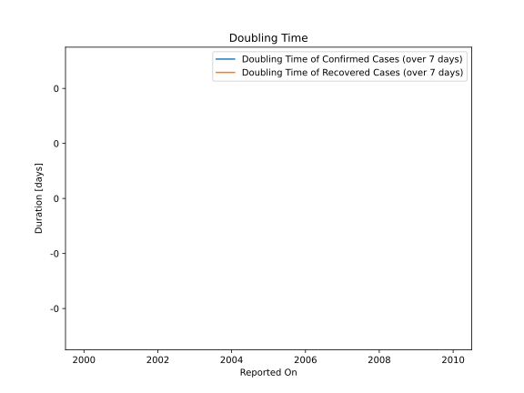

# Country Figures: New Infections in Previous 7 Days per 100,000 Population for Aruba 

<!--  --> 

| Reported On | &Delta; Confirmed (on the day) | &Delta; Confirmed (last 7 days) | New Cases in Previous 7 Days per 100,000 Population |
|-------------|--------------------------------|---------------------------------|-----------------------------------------------------|
| 2020-03-19 |  None  |  2  |  1.890  |
| 2020-03-18 |  1  |  2  |  1.890  |
| 2020-03-17 |  1  |  1  |  0.945  |
| 2020-03-16 |  None  |  None  |  None  |
| 2020-03-15 |  None  |  None  |  None  |
| 2020-03-14 |  None  |  None  |  None  |
| 2020-03-13 |  None  |  None  |  None  |

