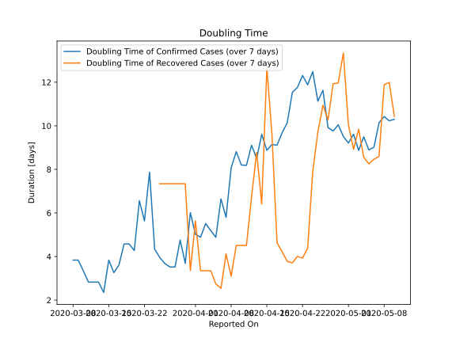

# Country Figures: New Infections in Previous 7 Days per 100,000 Population for Afghanistan 

<!--  --> 

| Reported On | &Delta; Confirmed (on the day) | &Delta; Confirmed (last 7 days) | New Cases in Previous 7 Days per 100,000 Population |
|-------------|--------------------------------|---------------------------------|-----------------------------------------------------|
| 2020-05-10 |  369  |  1698  |  4.568  |
| 2020-05-09 |  255  |  1564  |  4.207  |
| 2020-05-08 |  215  |  1443  |  3.882  |
| 2020-05-07 |  171  |  1392  |  3.745  |
| 2020-05-06 |  168  |  1453  |  3.909  |
| 2020-05-05 |  330  |  1396  |  3.755  |
| 2020-05-04 |  190  |  1191  |  3.204  |
| 2020-05-03 |  235  |  1173  |  3.156  |
| 2020-05-02 |  134  |  1006  |  2.706  |
| 2020-05-01 |  164  |  984  |  2.647  |
| 2020-04-30 |  232  |  892  |  2.400  |
| 2020-04-29 |  111  |  763  |  2.053  |
| 2020-04-28 |  125  |  736  |  1.980  |
| 2020-04-27 |  172  |  677  |  1.821  |
| 2020-04-26 |  68  |  535  |  1.439  |
| 2020-04-25 |  112  |  530  |  1.426  |
| 2020-04-24 |  72  |  445  |  1.197  |
| 2020-04-23 |  103  |  439  |  1.181  |
| 2020-04-22 |  84  |  392  |  1.055  |
| 2020-04-21 |  66  |  378  |  1.017  |
| 2020-04-20 |  30  |  361  |  0.971  |
| 2020-04-19 |  63  |  389  |  1.046  |
| 2020-04-18 |  27  |  378  |  1.017  |
| 2020-04-17 |  66  |  385  |  1.036  |
| 2020-04-16 |  56  |  356  |  0.958  |
| 2020-04-15 |  70  |  340  |  0.915  |
| 2020-04-14 |  49  |  291  |  0.783  |
| 2020-04-13 |  58  |  298  |  0.802  |
| 2020-04-12 |  52  |  258  |  0.694  |
| 2020-04-11 |  34  |  256  |  0.689  |
| 2020-04-10 |  37  |  240  |  0.646  |
| 2020-04-09 |  40  |  211  |  0.568  |
| 2020-04-08 |  21  |  207  |  0.557  |
| 2020-04-07 |  56  |  249  |  0.670  |
| 2020-04-06 |  18  |  197  |  0.530  |
| 2020-04-05 |  50  |  229  |  0.616  |
| 2020-04-04 |  18  |  189  |  0.508  |
| 2020-04-03 |  8  |  171  |  0.460  |
| 2020-04-02 |  36  |  179  |  0.482  |
| 2020-04-01 |  63  |  153  |  0.412  |
| 2020-03-31 |  4  |  100  |  0.269  |
| 2020-03-30 |  50  |  130  |  0.350  |
| 2020-03-29 |  10  |  80  |  0.215  |
| 2020-03-28 |  None  |  86  |  0.231  |
| 2020-03-27 |  16  |  86  |  0.231  |
| 2020-03-26 |  10  |  72  |  0.194  |
| 2020-03-25 |  10  |  62  |  0.167  |
| 2020-03-24 |  34  |  52  |  0.140  |
| 2020-03-23 |  None  |  19  |  0.051  |
| 2020-03-22 |  16  |  24  |  0.065  |
| 2020-03-21 |  None  |  13  |  0.035  |
| 2020-03-20 |  2  |  17  |  0.046  |
| 2020-03-19 |  None  |  15  |  0.040  |
| 2020-03-18 |  None  |  15  |  0.040  |
| 2020-03-17 |  1  |  17  |  0.046  |
| 2020-03-16 |  5  |  17  |  0.046  |
| 2020-03-15 |  5  |  12  |  0.032  |
| 2020-03-14 |  4  |  10  |  0.027  |
| 2020-03-13 |  None  |  6  |  0.016  |
| 2020-03-12 |  None  |  6  |  0.016  |
| 2020-03-11 |  2  |  6  |  0.016  |
| 2020-03-10 |  1  |  4  |  0.011  |
| 2020-03-09 |  None  |  3  |  0.008  |
| 2020-03-08 |  3  |  3  |  0.008  |
| 2020-03-07 |  None  |  None  |  None  |
| 2020-03-06 |  None  |  None  |  None  |
| 2020-03-05 |  None  |  None  |  None  |
| 2020-03-04 |  None  |  None  |  None  |
| 2020-03-03 |  None  |  None  |  None  |
| 2020-03-02 |  None  |  None  |  None  |
| 2020-03-01 |  None  |  None  |  None  |
| 2020-02-29 |  None  |  None  |  None  |
| 2020-02-28 |  None  |  None  |  None  |
| 2020-02-27 |  None  |  None  |  None  |
| 2020-02-26 |  None  |  None  |  None  |
| 2020-02-25 |  None  |  None  |  None  |
| 2020-02-24 |  None  |  None  |  None  |

