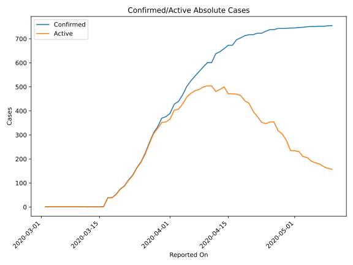
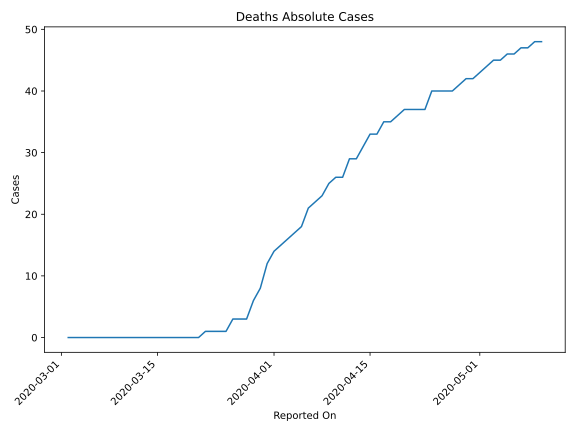
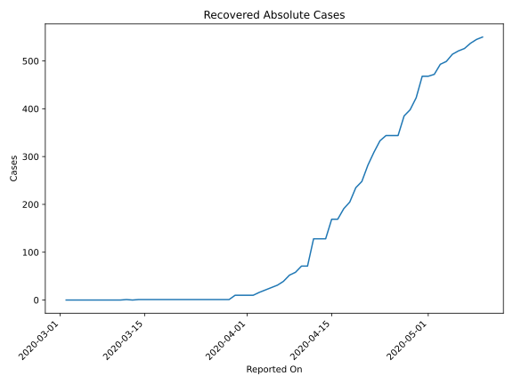
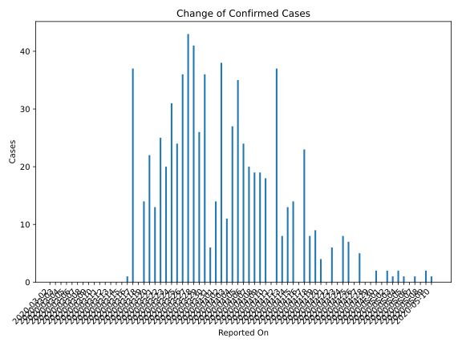
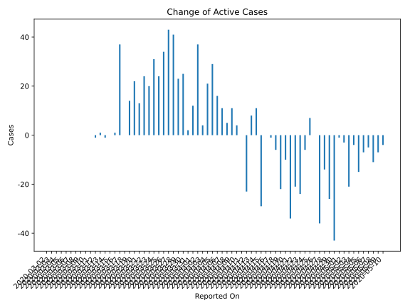
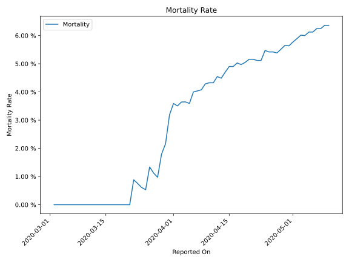

# Country Figures: Time Series for Andorra 

| Reported On | Confirmed | Deaths | Recovered | Active | Mortality | &Delta; Confirmed | &Delta; Deaths | &Delta; Recovered | &Delta; Active | % Active of Population |
|-------------|-----------|--------|-----------|--------|-----------|-------------------|----------------|-------------------|----------------|------------------------|
| 2020-05-10 | 755 | 48 | 550 | 157 |  6.36 %  | 1 | 0 | 5 | -4 |  0.204 %  | 
| 2020-05-09 | 754 | 48 | 545 | 161 |  6.37 %  | 2 | 1 | 8 | -7 |  0.209 %  | 
| 2020-05-08 | 752 | 47 | 537 | 168 |  6.25 %  | 0 | 0 | 11 | -11 |  0.218 %  | 
| 2020-05-07 | 752 | 47 | 526 | 179 |  6.25 %  | 1 | 1 | 5 | -5 |  0.232 %  | 
| 2020-05-06 | 751 | 46 | 521 | 184 |  6.13 %  | 0 | 0 | 7 | -7 |  0.239 %  | 
| 2020-05-05 | 751 | 46 | 514 | 191 |  6.13 %  | 1 | 1 | 15 | -15 |  0.248 %  | 
| 2020-05-04 | 750 | 45 | 499 | 206 |  6.00 %  | 2 | 0 | 6 | -4 |  0.268 %  | 
| 2020-05-03 | 748 | 45 | 493 | 210 |  6.02 %  | 1 | 1 | 21 | -21 |  0.273 %  | 
| 2020-05-02 | 747 | 44 | 472 | 231 |  5.89 %  | 2 | 1 | 4 | -3 |  0.300 %  | 
| 2020-05-01 | 745 | 43 | 468 | 234 |  5.77 %  | 0 | 1 | 0 | -1 |  0.304 %  | 
| 2020-04-30 | 745 | 42 | 468 | 235 |  5.64 %  | 2 | 0 | 45 | -43 |  0.305 %  | 
| 2020-04-29 | 743 | 42 | 423 | 278 |  5.65 %  | 0 | 1 | 25 | -26 |  0.361 %  | 
| 2020-04-28 | 743 | 41 | 398 | 304 |  5.52 %  | 0 | 1 | 13 | -14 |  0.395 %  | 
| 2020-04-27 | 743 | 40 | 385 | 318 |  5.38 %  | 5 | 0 | 41 | -36 |  0.413 %  | 
| 2020-04-26 | 738 | 40 | 344 | 354 |  5.42 %  | 0 | 0 | 0 | 0 |  0.460 %  | 
| 2020-04-25 | 738 | 40 | 344 | 354 |  5.42 %  | 7 | 0 | 0 | 7 |  0.460 %  | 
| 2020-04-24 | 731 | 40 | 344 | 347 |  5.47 %  | 8 | 3 | 11 | -6 |  0.451 %  | 
| 2020-04-23 | 723 | 37 | 333 | 353 |  5.12 %  | 0 | 0 | 24 | -24 |  0.458 %  | 
| 2020-04-22 | 723 | 37 | 309 | 377 |  5.12 %  | 6 | 0 | 27 | -21 |  0.490 %  | 
| 2020-04-21 | 717 | 37 | 282 | 398 |  5.16 %  | 0 | 0 | 34 | -34 |  0.517 %  | 
| 2020-04-20 | 717 | 37 | 248 | 432 |  5.16 %  | 4 | 1 | 13 | -10 |  0.561 %  | 
| 2020-04-19 | 713 | 36 | 235 | 442 |  5.05 %  | 9 | 1 | 30 | -22 |  0.574 %  | 
| 2020-04-18 | 704 | 35 | 205 | 464 |  4.97 %  | 8 | 0 | 14 | -6 |  0.603 %  | 
| 2020-04-17 | 696 | 35 | 191 | 470 |  5.03 %  | 23 | 2 | 22 | -1 |  0.610 %  | 
| 2020-04-16 | 673 | 33 | 169 | 471 |  4.90 %  | 0 | 0 | 0 | 0 |  0.612 %  | 
| 2020-04-15 | 673 | 33 | 169 | 471 |  4.90 %  | 14 | 2 | 41 | -29 |  0.612 %  | 
| 2020-04-14 | 659 | 31 | 128 | 500 |  4.70 %  | 13 | 2 | 0 | 11 |  0.649 %  | 
| 2020-04-13 | 646 | 29 | 128 | 489 |  4.49 %  | 8 | 0 | 0 | 8 |  0.635 %  | 
| 2020-04-12 | 638 | 29 | 128 | 481 |  4.55 %  | 37 | 3 | 57 | -23 |  0.625 %  | 
| 2020-04-11 | 601 | 26 | 71 | 504 |  4.33 %  | 0 | 0 | 0 | 0 |  0.654 %  | 
| 2020-04-10 | 601 | 26 | 71 | 504 |  4.33 %  | 18 | 1 | 13 | 4 |  0.654 %  | 
| 2020-04-09 | 583 | 25 | 58 | 500 |  4.29 %  | 19 | 2 | 6 | 11 |  0.649 %  | 
| 2020-04-08 | 564 | 23 | 52 | 489 |  4.08 %  | 19 | 1 | 13 | 5 |  0.635 %  | 
| 2020-04-07 | 545 | 22 | 39 | 484 |  4.04 %  | 20 | 1 | 8 | 11 |  0.629 %  | 
| 2020-04-06 | 525 | 21 | 31 | 473 |  4.00 %  | 24 | 3 | 5 | 16 |  0.614 %  | 
| 2020-04-05 | 501 | 18 | 26 | 457 |  3.59 %  | 35 | 1 | 5 | 29 |  0.593 %  | 
| 2020-04-04 | 466 | 17 | 21 | 428 |  3.65 %  | 27 | 1 | 5 | 21 |  0.556 %  | 
| 2020-04-03 | 439 | 16 | 16 | 407 |  3.64 %  | 11 | 1 | 6 | 4 |  0.529 %  | 
| 2020-04-02 | 428 | 15 | 10 | 403 |  3.50 %  | 38 | 1 | 0 | 37 |  0.523 %  | 
| 2020-04-01 | 390 | 14 | 10 | 366 |  3.59 %  | 14 | 2 | 0 | 12 |  0.475 %  | 
| 2020-03-31 | 376 | 12 | 10 | 354 |  3.19 %  | 6 | 4 | 0 | 2 |  0.460 %  | 
| 2020-03-30 | 370 | 8 | 10 | 352 |  2.16 %  | 36 | 2 | 9 | 25 |  0.457 %  | 
| 2020-03-29 | 334 | 6 | 1 | 327 |  1.80 %  | 26 | 3 | 0 | 23 |  0.425 %  | 
| 2020-03-28 | 308 | 3 | 1 | 304 |  0.97 %  | 41 | 0 | 0 | 41 |  0.395 %  | 
| 2020-03-27 | 267 | 3 | 1 | 263 |  1.12 %  | 43 | 0 | 0 | 43 |  0.342 %  | 
| 2020-03-26 | 224 | 3 | 1 | 220 |  1.34 %  | 36 | 2 | 0 | 34 |  0.286 %  | 
| 2020-03-25 | 188 | 1 | 1 | 186 |  0.53 %  | 24 | 0 | 0 | 24 |  0.242 %  | 
| 2020-03-24 | 164 | 1 | 1 | 162 |  0.61 %  | 31 | 0 | 0 | 31 |  0.210 %  | 
| 2020-03-23 | 133 | 1 | 1 | 131 |  0.75 %  | 20 | 0 | 0 | 20 |  0.170 %  | 
| 2020-03-22 | 113 | 1 | 1 | 111 |  0.88 %  | 25 | 1 | 0 | 24 |  0.144 %  | 
| 2020-03-21 | 88 | 0 | 1 | 87 |  None  | 13 | 0 | 0 | 13 |  0.113 %  | 
| 2020-03-20 | 75 | 0 | 1 | 74 |  None  | 22 | 0 | 0 | 22 |  0.096 %  | 
| 2020-03-19 | 53 | 0 | 1 | 52 |  None  | 14 | 0 | 0 | 14 |  0.068 %  | 
| 2020-03-18 | 39 | 0 | 1 | 38 |  None  | 0 | 0 | 0 | 0 |  0.049 %  | 
| 2020-03-17 | 39 | 0 | 1 | 38 |  None  | 37 | 0 | 0 | 37 |  0.049 %  | 
| 2020-03-16 | 2 | 0 | 1 | 1 |  None  | 1 | 0 | 0 | 1 |  0.001 %  | 
| 2020-03-15 | 1 | 0 | 1 | 0 |  None  | 0 | 0 | 0 | 0 |  n/a  | 
| 2020-03-14 | 1 | 0 | 1 | 0 |  None  | 0 | 0 | 1 | -1 |  n/a  | 
| 2020-03-13 | 1 | 0 | 0 | 1 |  None  | 0 | 0 | -1 | 1 |  0.001 %  | 
| 2020-03-12 | 1 | 0 | 1 | 0 |  None  | 0 | 0 | 1 | -1 |  n/a  | 
| 2020-03-11 | 1 | 0 | 0 | 1 |  None  | 0 | 0 | 0 | 0 |  0.001 %  | 
| 2020-03-10 | 1 | 0 | 0 | 1 |  None  | 0 | 0 | 0 | 0 |  0.001 %  | 
| 2020-03-09 | 1 | 0 | 0 | 1 |  None  | 0 | 0 | 0 | 0 |  0.001 %  | 
| 2020-03-08 | 1 | 0 | 0 | 1 |  None  | 0 | 0 | 0 | 0 |  0.001 %  | 
| 2020-03-07 | 1 | 0 | 0 | 1 |  None  | 0 | 0 | 0 | 0 |  0.001 %  | 
| 2020-03-06 | 1 | 0 | 0 | 1 |  None  | 0 | 0 | 0 | 0 |  0.001 %  | 
| 2020-03-05 | 1 | 0 | 0 | 1 |  None  | 0 | 0 | 0 | 0 |  0.001 %  | 
| 2020-03-04 | 1 | 0 | 0 | 1 |  None  | 0 | 0 | 0 | 0 |  0.001 %  | 
| 2020-03-03 | 1 | 0 | 0 | 1 |  None  | 0 | 0 | 0 | 0 |  0.001 %  | 
| 2020-03-02 | 1 | 0 | 0 | 1 |  None  | None | None | None | None |  0.001 %  | 

