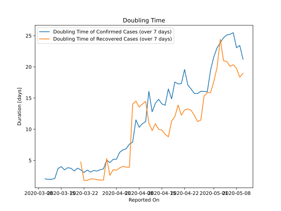

# Country Figures: New Infections in Previous 7 Days per 100,000 Population for Argentina 

<!--  --> 

| Reported On | &Delta; Confirmed (on the day) | &Delta; Confirmed (last 7 days) | New Cases in Previous 7 Days per 100,000 Population |
|-------------|--------------------------------|---------------------------------|-----------------------------------------------------|
| 2020-05-10 |  258  |  1251  |  2.812  |
| 2020-05-09 |  165  |  1095  |  2.461  |
| 2020-05-08 |  240  |  1079  |  2.425  |
| 2020-05-07 |  163  |  943  |  2.119  |
| 2020-05-06 |  188  |  923  |  2.074  |
| 2020-05-05 |  133  |  893  |  2.007  |
| 2020-05-04 |  104  |  884  |  1.987  |
| 2020-05-03 |  102  |  891  |  2.002  |
| 2020-05-02 |  149  |  901  |  2.025  |
| 2020-05-01 |  104  |  925  |  2.079  |
| 2020-04-30 |  143  |  993  |  2.232  |
| 2020-04-29 |  158  |  1141  |  2.564  |
| 2020-04-28 |  124  |  1096  |  2.463  |
| 2020-04-27 |  111  |  1062  |  2.387  |
| 2020-04-26 |  112  |  1053  |  2.367  |
| 2020-04-25 |  173  |  1022  |  2.297  |
| 2020-04-24 |  172  |  938  |  2.108  |
| 2020-04-23 |  291  |  864  |  1.942  |
| 2020-04-22 |  113  |  701  |  1.575  |
| 2020-04-21 |  90  |  754  |  1.695  |
| 2020-04-20 |  102  |  733  |  1.647  |
| 2020-04-19 |  81  |  697  |  1.566  |
| 2020-04-18 |  89  |  783  |  1.760  |
| 2020-04-17 |  98  |  694  |  1.560  |
| 2020-04-16 |  128  |  776  |  1.744  |
| 2020-04-15 |  166  |  728  |  1.636  |
| 2020-04-14 |  69  |  649  |  1.459  |
| 2020-04-13 |  66  |  654  |  1.470  |
| 2020-04-12 |  167  |  691  |  1.553  |
| 2020-04-11 |  None  |  524  |  1.178  |
| 2020-04-10 |  180  |  710  |  1.596  |
| 2020-04-09 |  80  |  662  |  1.488  |
| 2020-04-08 |  87  |  661  |  1.486  |
| 2020-04-07 |  74  |  574  |  1.290  |
| 2020-04-06 |  103  |  734  |  1.650  |
| 2020-04-05 |  None  |  706  |  1.587  |
| 2020-04-04 |  186  |  761  |  1.710  |
| 2020-04-03 |  132  |  676  |  1.519  |
| 2020-04-02 |  79  |  631  |  1.418  |
| 2020-04-01 |  None  |  667  |  1.499  |
| 2020-03-31 |  234  |  667  |  1.499  |
| 2020-03-30 |  75  |  554  |  1.245  |
| 2020-03-29 |  55  |  479  |  1.077  |
| 2020-03-28 |  101  |  532  |  1.196  |
| 2020-03-27 |  87  |  461  |  1.036  |
| 2020-03-26 |  115  |  405  |  0.910  |
| 2020-03-25 |  None  |  308  |  0.692  |
| 2020-03-24 |  121  |  319  |  0.717  |
| 2020-03-23 |  None  |  210  |  0.472  |
| 2020-03-22 |  108  |  221  |  0.497  |
| 2020-03-21 |  30  |  124  |  0.279  |
| 2020-03-20 |  31  |  97  |  0.218  |
| 2020-03-19 |  18  |  78  |  0.175  |
| 2020-03-18 |  11  |  60  |  0.135  |
| 2020-03-17 |  12  |  51  |  0.115  |
| 2020-03-16 |  11  |  44  |  0.099  |
| 2020-03-15 |  11  |  33  |  0.074  |
| 2020-03-14 |  3  |  26  |  0.058  |
| 2020-03-13 |  12  |  29  |  0.065  |
| 2020-03-12 |  None  |  18  |  0.040  |
| 2020-03-11 |  2  |  18  |  0.040  |
| 2020-03-10 |  5  |  16  |  0.036  |
| 2020-03-09 |  None  |  11  |  0.025  |
| 2020-03-08 |  4  |  11  |  0.025  |
| 2020-03-07 |  6  |  7  |  0.016  |
| 2020-03-06 |  1  |  1  |  0.002  |
| 2020-03-05 |  None  |  None  |  None  |
| 2020-03-04 |  None  |  None  |  None  |
| 2020-03-03 |  None  |  None  |  None  |

