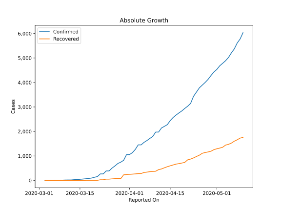
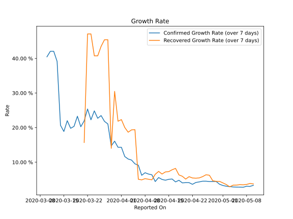

# Country Figures: Growth Rate for Argentina 

The growth rates below are calculated based on
* an exponential growth assumption
* for time difference of past seven (7) days.
The growth rate is to be understood as on "growth per day".

The first growth rate indicates the increase of confirmed (infected) cases.

The second growth rate indicates the increase of recovered (healed) cases.

| Reported On | Confirmed | Growth Rate (Confirmed) | Recovered | Growth Rate (Recovered) |
|-------------|-----------|-------------------------|-----------|-------------------------|
| 2020-05-10 | 6034 |  3.32 %  | 1757 |  3.722 %  | 
| 2020-05-09 | 5776 |  3.00 %  | 1728 |  3.848 %  | 
| 2020-05-08 | 5611 |  3.05 %  | 1659 |  3.572 %  | 
| 2020-05-07 | 5371 |  2.76 %  | 1601 |  3.467 %  | 
| 2020-05-06 | 5208 |  2.79 %  | 1524 |  3.510 %  | 
| 2020-05-05 | 5020 |  2.80 %  | 1472 |  3.378 %  | 
| 2020-05-04 | 4887 |  2.85 %  | 1442 |  3.357 %  | 
| 2020-05-03 | 4783 |  2.94 %  | 1354 |  2.877 %  | 
| 2020-05-02 | 4681 |  3.05 %  | 1320 |  3.544 %  | 
| 2020-05-01 | 4532 |  3.26 %  | 1292 |  4.007 %  | 
| 2020-04-30 | 4428 |  3.63 %  | 1256 |  4.463 %  | 
| 2020-04-29 | 4285 |  4.42 %  | 1192 |  4.466 %  | 
| 2020-04-28 | 4127 |  4.41 %  | 1162 |  4.636 %  | 
| 2020-04-27 | 4003 |  4.40 %  | 1140 |  6.231 %  | 
| 2020-04-26 | 3892 |  4.51 %  | 1107 |  6.365 %  | 
| 2020-04-25 | 3780 |  4.50 %  | 1030 |  5.827 %  | 
| 2020-04-24 | 3607 |  4.30 %  | 976 |  5.460 %  | 
| 2020-04-23 | 3435 |  4.14 %  | 919 |  5.371 %  | 
| 2020-04-22 | 3144 |  3.60 %  | 872 |  5.436 %  | 
| 2020-04-21 | 3031 |  4.09 %  | 840 |  5.818 %  | 
| 2020-04-20 | 2941 |  4.10 %  | 737 |  5.120 %  | 
| 2020-04-19 | 2839 |  4.02 %  | 709 |  5.934 %  | 
| 2020-04-18 | 2758 |  4.77 %  | 685 |  6.323 %  | 
| 2020-04-17 | 2669 |  4.30 %  | 666 |  8.205 %  | 
| 2020-04-16 | 2571 |  5.13 %  | 631 |  7.820 %  | 
| 2020-04-15 | 2443 |  5.05 %  | 596 |  7.282 %  | 
| 2020-04-14 | 2277 |  4.79 %  | 559 |  7.187 %  | 
| 2020-04-13 | 2208 |  5.02 %  | 515 |  6.576 %  | 
| 2020-04-12 | 2142 |  5.56 %  | 468 |  7.338 %  | 
| 2020-04-11 | 1975 |  4.40 %  | 440 |  6.508 %  | 
| 2020-04-10 | 1975 |  6.36 %  | 375 |  4.906 %  | 
| 2020-04-09 | 1795 |  6.57 %  | 365 |  5.067 %  | 
| 2020-04-08 | 1715 |  6.95 %  | 358 |  5.244 %  | 
| 2020-04-07 | 1628 |  6.21 %  | 338 |  4.892 %  | 
| 2020-04-06 | 1554 |  9.13 %  | 325 |  5.064 %  | 
| 2020-04-05 | 1451 |  9.52 %  | 280 |  19.402 %  | 
| 2020-04-04 | 1451 |  10.62 %  | 279 |  19.351 %  | 
| 2020-04-03 | 1265 |  10.92 %  | 266 |  18.669 %  | 
| 2020-04-02 | 1133 |  11.63 %  | 256 |  20.029 %  | 
| 2020-04-01 | 1054 |  14.31 %  | 248 |  22.317 %  | 
| 2020-03-31 | 1054 |  14.31 %  | 240 |  21.849 %  | 
| 2020-03-30 | 820 |  16.08 %  | 228 |  30.479 %  | 
| 2020-03-29 | 745 |  14.71 %  | 72 |  14.012 %  | 
| 2020-03-28 | 690 |  21.06 %  | 72 |  45.401 %  | 
| 2020-03-27 | 589 |  21.81 %  | 72 |  45.401 %  | 
| 2020-03-26 | 502 |  23.48 %  | 63 |  43.493 %  | 
| 2020-03-25 | 387 |  22.70 %  | 52 |  40.752 %  | 
| 2020-03-24 | 387 |  24.84 %  | 52 |  40.752 %  | 
| 2020-03-23 | 266 |  22.26 %  | 27 |  47.083 %  | 
| 2020-03-22 | 266 |  25.38 %  | 27 |  47.083 %  | 
| 2020-03-21 | 158 |  21.95 %  | 3 |  15.694 %  | 
| 2020-03-20 | 128 |  20.26 %  | 3 |  None  | 
| 2020-03-19 | 97 |  23.29 %  | 3 |  None  | 
| 2020-03-18 | 79 |  20.36 %  | 3 |  None  | 
| 2020-03-17 | 68 |  19.80 %  | 3 |  None  | 
| 2020-03-16 | 56 |  22.01 %  | 1 |  None  | 
| 2020-03-15 | 45 |  18.88 %  | 1 |  None  | 
| 2020-03-14 | 34 |  20.67 %  | 1 |  None  | 
| 2020-03-13 | 31 |  39.15 %  | 0 |  None  | 
| 2020-03-12 | 19 |  42.06 %  | 0 |  None  | 
| 2020-03-11 | 19 |  42.06 %  | 0 |  None  | 
| 2020-03-10 | 17 |  40.47 %  | 0 |  None  | 
| 2020-03-09 | 12 |  None  | 0 |  None  | 
| 2020-03-08 | 12 |  None  | 0 |  None  | 
| 2020-03-07 | 8 |  None  | 0 |  None  | 
| 2020-03-06 | 2 |  None  | 0 |  None  | 
| 2020-03-05 | 1 |  None  | 0 |  None  | 
| 2020-03-04 | 1 |  None  | 0 |  None  | 
| 2020-03-03 | 1 |  None  | 0 |  None  | 

