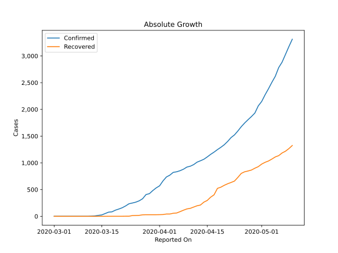
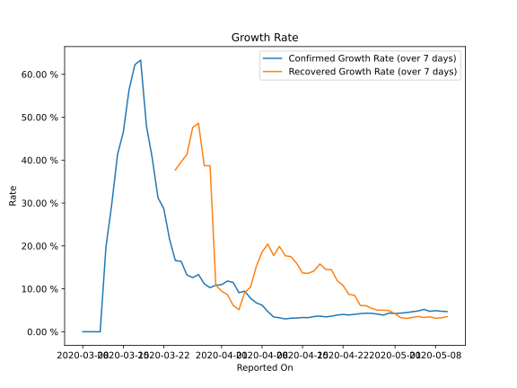

# Country Figures: Growth Rate for Armenia 

The growth rates below are calculated based on
* an exponential growth assumption
* for time difference of past seven (7) days.
The growth rate is to be understood as on "growth per day".

The first growth rate indicates the increase of confirmed (infected) cases.

The second growth rate indicates the increase of recovered (healed) cases.

| Reported On | Confirmed | Growth Rate (Confirmed) | Recovered | Growth Rate (Recovered) |
|-------------|-----------|-------------------------|-----------|-------------------------|
| 2020-05-10 | 3313 |  4.69 %  | 1325 |  3.529 %  | 
| 2020-05-09 | 3175 |  4.77 %  | 1267 |  3.239 %  | 
| 2020-05-08 | 3029 |  4.91 %  | 1218 |  3.150 %  | 
| 2020-05-07 | 2884 |  4.77 %  | 1185 |  3.477 %  | 
| 2020-05-06 | 2782 |  5.21 %  | 1135 |  3.314 %  | 
| 2020-05-05 | 2619 |  4.84 %  | 1111 |  3.559 %  | 
| 2020-05-04 | 2507 |  4.67 %  | 1071 |  3.335 %  | 
| 2020-05-03 | 2386 |  4.46 %  | 1035 |  3.102 %  | 
| 2020-05-02 | 2273 |  4.34 %  | 1010 |  3.276 %  | 
| 2020-05-01 | 2148 |  4.24 %  | 977 |  4.203 %  | 
| 2020-04-30 | 2066 |  4.36 %  | 929 |  4.906 %  | 
| 2020-04-29 | 1932 |  3.88 %  | 900 |  5.027 %  | 
| 2020-04-28 | 1867 |  4.10 %  | 866 |  5.030 %  | 
| 2020-04-27 | 1808 |  4.29 %  | 848 |  5.426 %  | 
| 2020-04-26 | 1746 |  4.31 %  | 833 |  6.061 %  | 
| 2020-04-25 | 1677 |  4.22 %  | 803 |  6.125 %  | 
| 2020-04-24 | 1596 |  4.06 %  | 728 |  8.484 %  | 
| 2020-04-23 | 1523 |  3.90 %  | 659 |  8.717 %  | 
| 2020-04-22 | 1473 |  4.03 %  | 633 |  10.811 %  | 
| 2020-04-21 | 1401 |  3.89 %  | 609 |  11.887 %  | 
| 2020-04-20 | 1339 |  3.62 %  | 580 |  14.445 %  | 
| 2020-04-19 | 1291 |  3.46 %  | 545 |  14.537 %  | 
| 2020-04-18 | 1248 |  3.64 %  | 523 |  15.804 %  | 
| 2020-04-17 | 1201 |  3.55 %  | 402 |  14.179 %  | 
| 2020-04-16 | 1159 |  3.28 %  | 358 |  13.618 %  | 
| 2020-04-15 | 1111 |  3.31 %  | 297 |  13.679 %  | 
| 2020-04-14 | 1067 |  3.20 %  | 265 |  15.912 %  | 
| 2020-04-13 | 1039 |  3.16 %  | 211 |  17.496 %  | 
| 2020-04-12 | 1013 |  2.98 %  | 197 |  17.716 %  | 
| 2020-04-11 | 967 |  3.25 %  | 173 |  19.887 %  | 
| 2020-04-10 | 937 |  3.45 %  | 149 |  17.754 %  | 
| 2020-04-09 | 921 |  4.70 %  | 138 |  20.439 %  | 
| 2020-04-08 | 881 |  6.20 %  | 114 |  18.603 %  | 
| 2020-04-07 | 853 |  6.74 %  | 87 |  15.210 %  | 
| 2020-04-06 | 833 |  7.82 %  | 62 |  10.371 %  | 
| 2020-04-05 | 822 |  9.46 %  | 57 |  9.169 %  | 
| 2020-04-04 | 770 |  9.11 %  | 43 |  5.143 %  | 
| 2020-04-03 | 736 |  11.50 %  | 43 |  6.129 %  | 
| 2020-04-02 | 663 |  11.81 %  | 33 |  8.659 %  | 
| 2020-04-01 | 571 |  10.97 %  | 31 |  9.449 %  | 
| 2020-03-31 | 532 |  10.85 %  | 30 |  10.888 %  | 
| 2020-03-30 | 482 |  10.26 %  | 30 |  38.686 %  | 
| 2020-03-29 | 424 |  11.17 %  | 30 |  38.686 %  | 
| 2020-03-28 | 407 |  13.34 %  | 30 |  48.589 %  | 
| 2020-03-27 | 329 |  12.62 %  | 28 |  47.603 %  | 
| 2020-03-26 | 290 |  13.21 %  | 18 |  41.291 %  | 
| 2020-03-25 | 265 |  16.41 %  | 16 |  39.608 %  | 
| 2020-03-24 | 249 |  16.58 %  | 14 |  37.701 %  | 
| 2020-03-23 | 235 |  21.55 %  | 2 |  None  | 
| 2020-03-22 | 194 |  28.71 %  | 2 |  None  | 
| 2020-03-21 | 160 |  31.21 %  | 1 |  None  | 
| 2020-03-20 | 136 |  40.47 %  | 1 |  None  | 
| 2020-03-19 | 115 |  47.98 %  | 1 |  None  | 
| 2020-03-18 | 84 |  63.30 %  | 1 |  None  | 
| 2020-03-17 | 78 |  62.24 %  | 1 |  None  | 
| 2020-03-16 | 52 |  56.45 %  | 0 |  None  | 
| 2020-03-15 | 26 |  46.54 %  | 0 |  None  | 
| 2020-03-14 | 18 |  41.29 %  | 0 |  None  | 
| 2020-03-13 | 8 |  29.71 %  | 0 |  None  | 
| 2020-03-12 | 4 |  19.80 %  | 0 |  None  | 
| 2020-03-11 | 1 |  None  | 0 |  None  | 
| 2020-03-10 | 1 |  None  | 0 |  None  | 
| 2020-03-09 | 1 |  None  | 0 |  None  | 
| 2020-03-08 | 1 |  None  | 0 |  None  | 
| 2020-03-07 | 1 |  None  | 0 |  None  | 
| 2020-03-06 | 1 |  None  | 0 |  None  | 
| 2020-03-05 | 1 |  None  | 0 |  None  | 
| 2020-03-04 | 1 |  None  | 0 |  None  | 
| 2020-03-03 | 1 |  None  | 0 |  None  | 
| 2020-03-02 | 1 |  None  | 0 |  None  | 
| 2020-03-01 | 1 |  None  | 0 |  None  | 

