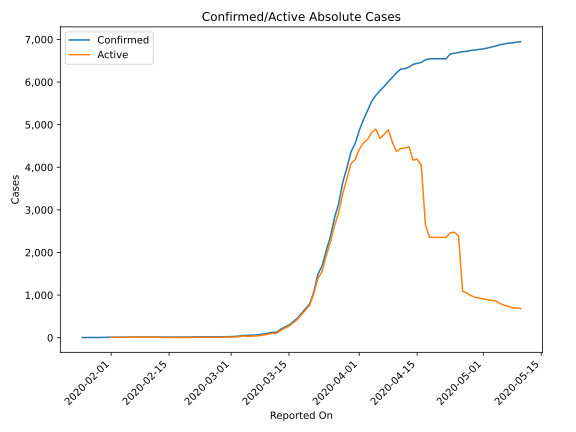
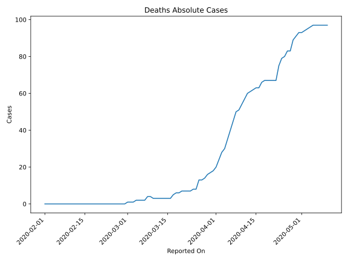
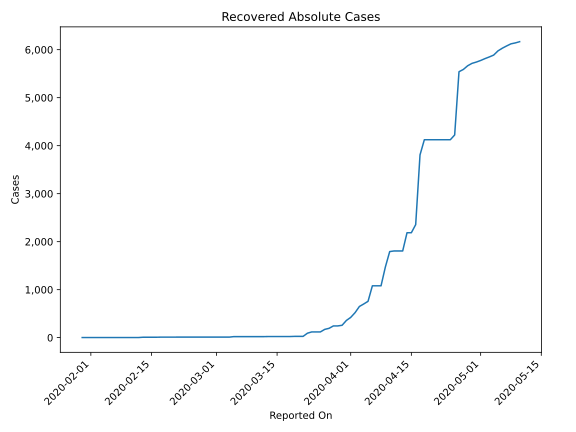
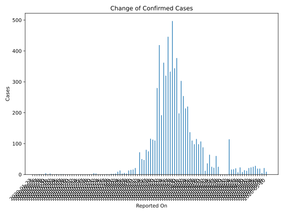
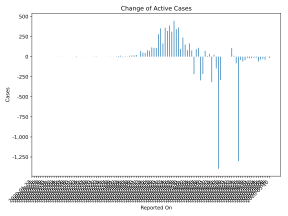
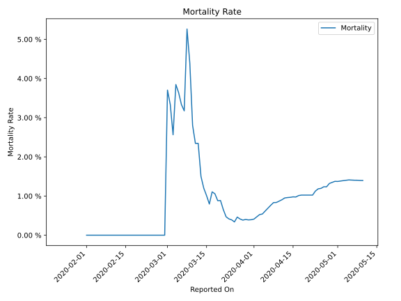

# Country Figures: Time Series for Australia 

| Reported On | Confirmed | Deaths | Recovered | Active | Mortality | &Delta; Confirmed | &Delta; Deaths | &Delta; Recovered | &Delta; Active | % Active of Population |
|-------------|-----------|--------|-----------|--------|-----------|-------------------|----------------|-------------------|----------------|------------------------|
| 2020-05-10 | 6948 | 97 | 6167 | 684 |  1.40 %  | 9 | 0 | 26 | -17 |  0.003 %  | 
| 2020-05-09 | 6939 | 97 | 6141 | 701 |  1.40 %  | 21 | 0 | 19 | 2 |  0.003 %  | 
| 2020-05-08 | 6918 | 97 | 6122 | 699 |  1.40 %  | 5 | 0 | 44 | -39 |  0.003 %  | 
| 2020-05-07 | 6913 | 97 | 6078 | 738 |  1.40 %  | 19 | 0 | 47 | -28 |  0.003 %  | 
| 2020-05-06 | 6894 | 97 | 6031 | 766 |  1.41 %  | 19 | 0 | 56 | -37 |  0.003 %  | 
| 2020-05-05 | 6875 | 97 | 5975 | 803 |  1.41 %  | 28 | 1 | 88 | -61 |  0.003 %  | 
| 2020-05-04 | 6847 | 96 | 5887 | 864 |  1.40 %  | 25 | 1 | 38 | -14 |  0.003 %  | 
| 2020-05-03 | 6822 | 95 | 5849 | 878 |  1.39 %  | 23 | 1 | 35 | -13 |  0.004 %  | 
| 2020-05-02 | 6799 | 94 | 5814 | 891 |  1.38 %  | 21 | 1 | 39 | -19 |  0.004 %  | 
| 2020-05-01 | 6778 | 93 | 5775 | 910 |  1.37 %  | 12 | 0 | 33 | -21 |  0.004 %  | 
| 2020-04-30 | 6766 | 93 | 5742 | 931 |  1.37 %  | 14 | 2 | 27 | -15 |  0.004 %  | 
| 2020-04-29 | 6752 | 91 | 5715 | 946 |  1.35 %  | 8 | 2 | 50 | -44 |  0.004 %  | 
| 2020-04-28 | 6744 | 89 | 5665 | 990 |  1.32 %  | 23 | 6 | 77 | -60 |  0.004 %  | 
| 2020-04-27 | 6721 | 83 | 5588 | 1050 |  1.23 %  | 7 | 0 | 47 | -40 |  0.004 %  | 
| 2020-04-26 | 6714 | 83 | 5541 | 1090 |  1.24 %  | 20 | 3 | 1318 | -1301 |  0.004 %  | 
| 2020-04-25 | 6694 | 80 | 4223 | 2391 |  1.20 %  | 17 | 1 | 99 | -83 |  0.010 %  | 
| 2020-04-24 | 6677 | 79 | 4124 | 2474 |  1.18 %  | 16 | 4 | 0 | 12 |  0.010 %  | 
| 2020-04-23 | 6661 | 75 | 4124 | 2462 |  1.13 %  | 114 | 8 | 0 | 106 |  0.010 %  | 
| 2020-04-22 | 6547 | 67 | 4124 | 2356 |  1.02 %  | 0 | 0 | 0 | 0 |  0.009 %  | 
| 2020-04-21 | 6547 | 67 | 4124 | 2356 |  1.02 %  | 0 | 0 | 0 | 0 |  0.009 %  | 
| 2020-04-20 | 6547 | 67 | 4124 | 2356 |  1.02 %  | 0 | 0 | 0 | 0 |  0.009 %  | 
| 2020-04-19 | 6547 | 67 | 4124 | 2356 |  1.02 %  | 0 | 0 | 0 | 0 |  0.009 %  | 
| 2020-04-18 | 6547 | 67 | 4124 | 2356 |  1.02 %  | 25 | 1 | 316 | -292 |  0.009 %  | 
| 2020-04-17 | 6522 | 66 | 3808 | 2648 |  1.01 %  | 60 | 3 | 1453 | -1396 |  0.011 %  | 
| 2020-04-16 | 6462 | 63 | 2355 | 4044 |  0.97 %  | 22 | 0 | 169 | -147 |  0.016 %  | 
| 2020-04-15 | 6440 | 63 | 2186 | 4191 |  0.98 %  | 25 | 1 | 0 | 24 |  0.017 %  | 
| 2020-04-14 | 6415 | 62 | 2186 | 4167 |  0.97 %  | 64 | 1 | 380 | -317 |  0.017 %  | 
| 2020-04-13 | 6351 | 61 | 1806 | 4484 |  0.96 %  | 36 | 1 | 0 | 35 |  0.018 %  | 
| 2020-04-12 | 6315 | 60 | 1806 | 4449 |  0.95 %  | 12 | 3 | 0 | 9 |  0.018 %  | 
| 2020-04-11 | 6303 | 57 | 1806 | 4440 |  0.90 %  | 88 | 3 | 13 | 72 |  0.018 %  | 
| 2020-04-10 | 6215 | 54 | 1793 | 4368 |  0.87 %  | 107 | 3 | 321 | -217 |  0.017 %  | 
| 2020-04-09 | 6108 | 51 | 1472 | 4585 |  0.83 %  | 98 | 1 | 392 | -295 |  0.018 %  | 
| 2020-04-08 | 6010 | 50 | 1080 | 4880 |  0.83 %  | 115 | 5 | 0 | 110 |  0.020 %  | 
| 2020-04-07 | 5895 | 45 | 1080 | 4770 |  0.76 %  | 98 | 5 | 0 | 93 |  0.019 %  | 
| 2020-04-06 | 5797 | 40 | 1080 | 4677 |  0.69 %  | 110 | 5 | 323 | -218 |  0.019 %  | 
| 2020-04-05 | 5687 | 35 | 757 | 4895 |  0.62 %  | 137 | 5 | 56 | 76 |  0.020 %  | 
| 2020-04-04 | 5550 | 30 | 701 | 4819 |  0.54 %  | 220 | 2 | 52 | 166 |  0.019 %  | 
| 2020-04-03 | 5330 | 28 | 649 | 4653 |  0.53 %  | 214 | 4 | 129 | 81 |  0.019 %  | 
| 2020-04-02 | 5116 | 24 | 520 | 4572 |  0.47 %  | 254 | 4 | 98 | 152 |  0.018 %  | 
| 2020-04-01 | 4862 | 20 | 422 | 4420 |  0.41 %  | 303 | 2 | 64 | 237 |  0.018 %  | 
| 2020-03-31 | 4559 | 18 | 358 | 4183 |  0.39 %  | 198 | 1 | 101 | 96 |  0.017 %  | 
| 2020-03-30 | 4361 | 17 | 257 | 4087 |  0.39 %  | 377 | 1 | 13 | 363 |  0.016 %  | 
| 2020-03-29 | 3984 | 16 | 244 | 3724 |  0.40 %  | 344 | 2 | 0 | 342 |  0.015 %  | 
| 2020-03-28 | 3640 | 14 | 244 | 3382 |  0.38 %  | 497 | 1 | 50 | 446 |  0.014 %  | 
| 2020-03-27 | 3143 | 13 | 194 | 2936 |  0.41 %  | 333 | 0 | 22 | 311 |  0.012 %  | 
| 2020-03-26 | 2810 | 13 | 172 | 2625 |  0.46 %  | 446 | 5 | 53 | 388 |  0.011 %  | 
| 2020-03-25 | 2364 | 8 | 119 | 2237 |  0.34 %  | 320 | 0 | 0 | 320 |  0.009 %  | 
| 2020-03-24 | 2044 | 8 | 119 | 1917 |  0.39 %  | 362 | 1 | 0 | 361 |  0.008 %  | 
| 2020-03-23 | 1682 | 7 | 119 | 1556 |  0.42 %  | 192 | 0 | 27 | 165 |  0.006 %  | 
| 2020-03-22 | 1490 | 7 | 92 | 1391 |  0.47 %  | 419 | 0 | 66 | 353 |  0.006 %  | 
| 2020-03-21 | 1071 | 7 | 26 | 1038 |  0.65 %  | 280 | 0 | 0 | 280 |  0.004 %  | 
| 2020-03-20 | 791 | 7 | 26 | 758 |  0.88 %  | 110 | 1 | 0 | 109 |  0.003 %  | 
| 2020-03-19 | 681 | 6 | 26 | 649 |  0.88 %  | 113 | 0 | 3 | 110 |  0.003 %  | 
| 2020-03-18 | 568 | 6 | 23 | 539 |  1.06 %  | 116 | 1 | 0 | 115 |  0.002 %  | 
| 2020-03-17 | 452 | 5 | 23 | 424 |  1.11 %  | 75 | 2 | 0 | 73 |  0.002 %  | 
| 2020-03-16 | 377 | 3 | 23 | 351 |  0.80 %  | 80 | 0 | 0 | 80 |  0.001 %  | 
| 2020-03-15 | 297 | 3 | 23 | 271 |  1.01 %  | 47 | 0 | 0 | 47 |  0.001 %  | 
| 2020-03-14 | 250 | 3 | 23 | 224 |  1.20 %  | 50 | 0 | 0 | 50 |  0.001 %  | 
| 2020-03-13 | 200 | 3 | 23 | 174 |  1.50 %  | 72 | 0 | 2 | 70 |  0.001 %  | 
| 2020-03-12 | 128 | 3 | 21 | 104 |  2.34 %  | 0 | 0 | 0 | 0 |  0.000 %  | 
| 2020-03-11 | 128 | 3 | 21 | 104 |  2.34 %  | 21 | 0 | 0 | 21 |  0.000 %  | 
| 2020-03-10 | 107 | 3 | 21 | 83 |  2.80 %  | 16 | -1 | 0 | 17 |  0.000 %  | 
| 2020-03-09 | 91 | 4 | 21 | 66 |  4.40 %  | 15 | 0 | 0 | 15 |  0.000 %  | 
| 2020-03-08 | 76 | 4 | 21 | 51 |  5.26 %  | 13 | 2 | 0 | 11 |  0.000 %  | 
| 2020-03-07 | 63 | 2 | 21 | 40 |  3.17 %  | 3 | 0 | 0 | 3 |  0.000 %  | 
| 2020-03-06 | 60 | 2 | 21 | 37 |  3.33 %  | 5 | 0 | 0 | 5 |  0.000 %  | 
| 2020-03-05 | 55 | 2 | 21 | 32 |  3.64 %  | 3 | 0 | 10 | -7 |  0.000 %  | 
| 2020-03-04 | 52 | 2 | 11 | 39 |  3.85 %  | 13 | 1 | 0 | 12 |  0.000 %  | 
| 2020-03-03 | 39 | 1 | 11 | 27 |  2.56 %  | 9 | 0 | 0 | 9 |  0.000 %  | 
| 2020-03-02 | 30 | 1 | 11 | 18 |  3.33 %  | 3 | 0 | 0 | 3 |  0.000 %  | 
| 2020-03-01 | 27 | 1 | 11 | 15 |  3.70 %  | 2 | 1 | 0 | 1 |  0.000 %  | 
| 2020-02-29 | 25 | 0 | 11 | 14 |  None  | 2 | 0 | 0 | 2 |  0.000 %  | 
| 2020-02-28 | 23 | 0 | 11 | 12 |  None  | 0 | 0 | 0 | 0 |  0.000 %  | 
| 2020-02-27 | 23 | 0 | 11 | 12 |  None  | 1 | 0 | 0 | 1 |  0.000 %  | 
| 2020-02-26 | 22 | 0 | 11 | 11 |  None  | 0 | 0 | 0 | 0 |  0.000 %  | 
| 2020-02-25 | 22 | 0 | 11 | 11 |  None  | 0 | 0 | 0 | 0 |  0.000 %  | 
| 2020-02-24 | 22 | 0 | 11 | 11 |  None  | 0 | 0 | 0 | 0 |  0.000 %  | 
| 2020-02-23 | 22 | 0 | 11 | 11 |  None  | 0 | 0 | 0 | 0 |  0.000 %  | 
| 2020-02-22 | 22 | 0 | 11 | 11 |  None  | 3 | 0 | 0 | 3 |  0.000 %  | 
| 2020-02-21 | 19 | 0 | 11 | 8 |  None  | 4 | 0 | 1 | 3 |  0.000 %  | 
| 2020-02-20 | 15 | 0 | 10 | 5 |  None  | 0 | 0 | 0 | 0 |  0.000 %  | 
| 2020-02-19 | 15 | 0 | 10 | 5 |  None  | 0 | 0 | 0 | 0 |  0.000 %  | 
| 2020-02-18 | 15 | 0 | 10 | 5 |  None  | 0 | 0 | 0 | 0 |  0.000 %  | 
| 2020-02-17 | 15 | 0 | 10 | 5 |  None  | 0 | 0 | 2 | -2 |  0.000 %  | 
| 2020-02-16 | 15 | 0 | 8 | 7 |  None  | 0 | 0 | 0 | 0 |  0.000 %  | 
| 2020-02-15 | 15 | 0 | 8 | 7 |  None  | 0 | 0 | 0 | 0 |  0.000 %  | 
| 2020-02-14 | 15 | 0 | 8 | 7 |  None  | 0 | 0 | 0 | 0 |  0.000 %  | 
| 2020-02-13 | 15 | 0 | 8 | 7 |  None  | 0 | 0 | 6 | -6 |  0.000 %  | 
| 2020-02-12 | 15 | 0 | 2 | 13 |  None  | 0 | 0 | 0 | 0 |  0.000 %  | 
| 2020-02-11 | 15 | 0 | 2 | 13 |  None  | 0 | 0 | 0 | 0 |  0.000 %  | 
| 2020-02-10 | 15 | 0 | 2 | 13 |  None  | 0 | 0 | 0 | 0 |  0.000 %  | 
| 2020-02-09 | 15 | 0 | 2 | 13 |  None  | 0 | 0 | 0 | 0 |  0.000 %  | 
| 2020-02-08 | 15 | 0 | 2 | 13 |  None  | 0 | 0 | 0 | 0 |  0.000 %  | 
| 2020-02-07 | 15 | 0 | 2 | 13 |  None  | 1 | 0 | 0 | 1 |  0.000 %  | 
| 2020-02-06 | 14 | 0 | 2 | 12 |  None  | 1 | 0 | 0 | 1 |  0.000 %  | 
| 2020-02-05 | 13 | 0 | 2 | 11 |  None  | 0 | 0 | 0 | 0 |  0.000 %  | 
| 2020-02-04 | 13 | 0 | 2 | 11 |  None  | 1 | 0 | 0 | 1 |  0.000 %  | 
| 2020-02-03 | 12 | 0 | 2 | 10 |  None  | 0 | 0 | 0 | 0 |  0.000 %  | 
| 2020-02-02 | 12 | 0 | 2 | 10 |  None  | 0 | 0 | 0 | 0 |  0.000 %  | 
| 2020-02-01 | 12 | 0 | 2 | 10 |  None  | 3 | None | 0 | None |  0.000 %  | 
| 2020-01-31 | 9 | None | 2 | None |  None  | 0 | None | 0 | None |  n/a  | 
| 2020-01-30 | 9 | None | 2 | None |  None  | 4 | None | None | None |  n/a  | 
| 2020-01-29 | 5 | None | None | None |  None  | 0 | None | None | None |  n/a  | 
| 2020-01-28 | 5 | None | None | None |  None  | 0 | None | None | None |  n/a  | 
| 2020-01-27 | 5 | None | None | None |  None  | 1 | None | None | None |  n/a  | 
| 2020-01-26 | 4 | None | None | None |  None  | 0 | None | None | None |  n/a  | 
| 2020-01-25 | 4 | None | None | None |  None  | None | None | None | None |  n/a  | 
| 2020-01-23 | None | None | None | None |  None  | None | None | None | None |  n/a  | 

