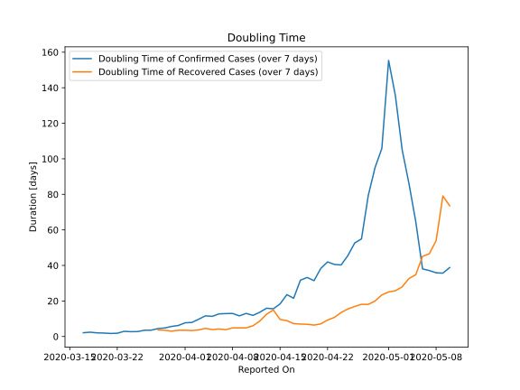

# Country Figures: New Infections in Previous 7 Days per 100,000 Population for BurkinaFaso 

<!--  --> 

| Reported On | &Delta; Confirmed (on the day) | &Delta; Confirmed (last 7 days) | New Cases in Previous 7 Days per 100,000 Population |
|-------------|--------------------------------|---------------------------------|-----------------------------------------------------|
| 2020-05-10 |  3  |  89  |  0.451  |
| 2020-05-09 |  4  |  96  |  0.486  |
| 2020-05-08 |  8  |  95  |  0.481  |
| 2020-05-07 |  7  |  91  |  0.461  |
| 2020-05-06 |  41  |  88  |  0.446  |
| 2020-05-05 |  16  |  50  |  0.253  |
| 2020-05-04 |  10  |  37  |  0.187  |
| 2020-05-03 |  10  |  30  |  0.152  |
| 2020-05-02 |  3  |  23  |  0.116  |
| 2020-05-01 |  4  |  20  |  0.101  |
| 2020-04-30 |  4  |  29  |  0.147  |
| 2020-04-29 |  3  |  32  |  0.162  |
| 2020-04-28 |  3  |  38  |  0.192  |
| 2020-04-27 |  3  |  54  |  0.273  |
| 2020-04-26 |  3  |  56  |  0.284  |
| 2020-04-25 |  None  |  64  |  0.324  |
| 2020-04-24 |  13  |  72  |  0.365  |
| 2020-04-23 |  7  |  70  |  0.354  |
| 2020-04-22 |  9  |  67  |  0.339  |
| 2020-04-21 |  19  |  72  |  0.365  |
| 2020-04-20 |  5  |  84  |  0.425  |
| 2020-04-19 |  11  |  79  |  0.400  |
| 2020-04-18 |  8  |  81  |  0.410  |
| 2020-04-17 |  11  |  114  |  0.577  |
| 2020-04-16 |  4  |  103  |  0.521  |
| 2020-04-15 |  14  |  128  |  0.648  |
| 2020-04-14 |  31  |  144  |  0.729  |
| 2020-04-13 |  None  |  133  |  0.673  |
| 2020-04-12 |  13  |  152  |  0.770  |
| 2020-04-11 |  41  |  166  |  0.840  |
| 2020-04-10 |  None  |  141  |  0.714  |
| 2020-04-09 |  29  |  155  |  0.785  |
| 2020-04-08 |  30  |  132  |  0.668  |
| 2020-04-07 |  20  |  123  |  0.623  |
| 2020-04-06 |  19  |  118  |  0.597  |
| 2020-04-05 |  27  |  123  |  0.623  |
| 2020-04-04 |  16  |  111  |  0.562  |
| 2020-04-03 |  14  |  122  |  0.618  |
| 2020-04-02 |  6  |  136  |  0.689  |
| 2020-04-01 |  21  |  136  |  0.689  |
| 2020-03-31 |  15  |  147  |  0.744  |
| 2020-03-30 |  24  |  147  |  0.744  |
| 2020-03-29 |  15  |  147  |  0.744  |
| 2020-03-28 |  27  |  143  |  0.724  |
| 2020-03-27 |  28  |  140  |  0.709  |
| 2020-03-26 |  6  |  119  |  0.602  |
| 2020-03-25 |  32  |  126  |  0.638  |
| 2020-03-24 |  15  |  99  |  0.501  |
| 2020-03-23 |  24  |  84  |  0.425  |
| 2020-03-22 |  11  |  72  |  0.365  |
| 2020-03-21 |  24  |  62  |  0.314  |
| 2020-03-20 |  7  |  38  |  0.192  |
| 2020-03-19 |  13  |  31  |  0.157  |
| 2020-03-18 |  5  |  18  |  0.091  |
| 2020-03-17 |  None  |  14  |  0.071  |
| 2020-03-16 |  12  |  14  |  0.071  |
| 2020-03-15 |  1  |  2  |  0.010  |
| 2020-03-14 |  None  |  1  |  0.005  |
| 2020-03-13 |  None  |  1  |  0.005  |
| 2020-03-12 |  None  |  1  |  0.005  |
| 2020-03-11 |  1  |  1  |  0.005  |
| 2020-03-10 |  None  |  None  |  None  |

