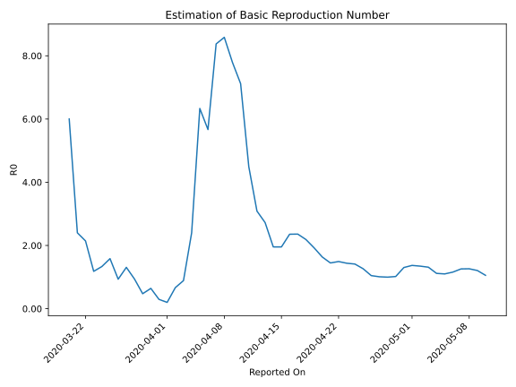

# Country Figures: Time Series for Basic Reproduction Number of Bangladesh 

| Reported On | &Delta; Confirmed | Total &Delta; Confirmed First Interval | Total &Delta; Confirmed Second Interval | Estimated Basic Reproduction Number R0 | 
|-------------|-------------------|----------------------------------------|-----------------------------------------|---------------------------------------------------|
| 2020-05-10 | 887 |  2841  |  2691  |  1.06  | 
| 2020-05-09 | 636 |  2991  |  2476  |  1.21  | 
| 2020-05-08 | 709 |  2970  |  2352  |  1.26  | 
| 2020-05-07 | 706 |  2929  |  2328  |  1.26  | 
| 2020-05-06 | 790 |  2691  |  2325  |  1.16  | 
| 2020-05-05 | 786 |  2476  |  2251  |  1.10  | 
| 2020-05-04 | 688 |  2352  |  2105  |  1.12  | 
| 2020-05-03 | 665 |  2328  |  1773  |  1.31  | 
| 2020-05-02 | 552 |  2325  |  1727  |  1.35  | 
| 2020-05-01 | 571 |  2251  |  1644  |  1.37  | 
| 2020-04-30 | 564 |  2105  |  1616  |  1.30  | 
| 2020-04-29 | 641 |  1773  |  1741  |  1.02  | 
| 2020-04-28 | 549 |  1727  |  1730  |  1.00  | 
| 2020-04-27 | 497 |  1644  |  1628  |  1.01  | 
| 2020-04-26 | 418 |  1616  |  1544  |  1.05  | 
| 2020-04-25 | 309 |  1741  |  1376  |  1.27  | 
| 2020-04-24 | 503 |  1730  |  1225  |  1.41  | 
| 2020-04-23 | 414 |  1628  |  1132  |  1.44  | 
| 2020-04-22 | 390 |  1544  |  1035  |  1.49  | 
| 2020-04-21 | 434 |  1376  |  951  |  1.45  | 
| 2020-04-20 | 492 |  1225  |  749  |  1.64  | 
| 2020-04-19 | 312 |  1132  |  588  |  1.93  | 
| 2020-04-18 | 306 |  1035  |  473  |  2.19  | 
| 2020-04-17 | 266 |  951  |  403  |  2.36  | 
| 2020-04-16 | 341 |  749  |  318  |  2.36  | 
| 2020-04-15 | 219 |  588  |  301  |  1.95  | 
| 2020-04-14 | 209 |  473  |  242  |  1.95  | 
| 2020-04-13 | 182 |  403  |  148  |  2.72  | 
| 2020-04-12 | 139 |  318  |  103  |  3.09  | 
| 2020-04-11 | 58 |  301  |  67  |  4.49  | 
| 2020-04-10 | 94 |  242  |  34  |  7.12  | 
| 2020-04-09 | 112 |  148  |  19  |  7.79  | 
| 2020-04-08 | 54 |  103  |  12  |  8.58  | 
| 2020-04-07 | 41 |  67  |  8  |  8.38  | 
| 2020-04-06 | 35 |  34  |  6  |  5.67  | 
| 2020-04-05 | 18 |  19  |  3  |  6.33  | 
| 2020-04-04 | 9 |  12  |  5  |  2.40  | 
| 2020-04-03 | 5 |  8  |  9  |  0.89  | 
| 2020-04-02 | 2 |  6  |  9  |  0.67  | 
| 2020-04-01 | 3 |  3  |  15  |  0.20  | 
| 2020-03-31 | 2 |  5  |  17  |  0.29  | 
| 2020-03-30 | 1 |  9  |  14  |  0.64  | 
| 2020-03-29 | 0 |  9  |  19  |  0.47  | 
| 2020-03-28 | 0 |  15  |  16  |  0.94  | 
| 2020-03-27 | 4 |  17  |  13  |  1.31  | 
| 2020-03-26 | 5 |  14  |  15  |  0.93  | 
| 2020-03-25 | 0 |  19  |  12  |  1.58  | 
| 2020-03-24 | 6 |  16  |  12  |  1.33  | 
| 2020-03-23 | 6 |  13  |  11  |  1.18  | 
| 2020-03-22 | 2 |  15  |  7  |  2.14  | 
| 2020-03-21 | 5 |  12  |  5  |  2.40  | 
| 2020-03-20 | 3 |  12  |  2  |  6.00  | 
| 2020-03-19 | 3 |  11  |  None  |  None  | 
| 2020-03-18 | 4 |  7  |  None  |  None  | 
| 2020-03-17 | 2 |  5  |  None  |  None  | 
| 2020-03-16 | 3 |  2  |  None  |  None  | 
| 2020-03-15 | 2 |  None  |  None  |  None  | 
| 2020-03-14 | 0 |  None  |  None  |  None  | 
| 2020-03-13 | 0 |  None  |  None  |  None  | 
| 2020-03-12 | 0 |  None  |  None  |  None  | 
| 2020-03-11 | 0 |  None  |  None  |  None  | 
| 2020-03-10 | 0 |  None  |  None  |  None  | 
| 2020-03-09 | 0 |  None  |  None  |  None  | 
| 2020-03-08 | None |  None  |  None  |  None  | 

