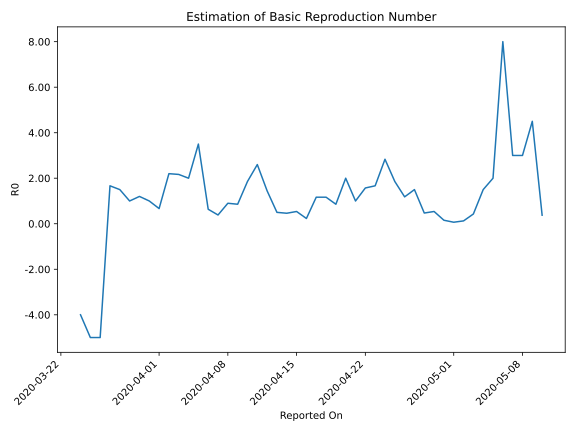

# Country Figures: Time Series for Basic Reproduction Number of Bahamas 

| Reported On | &Delta; Confirmed | Total &Delta; Confirmed First Interval | Total &Delta; Confirmed Second Interval | Estimated Basic Reproduction Number R0 | 
|-------------|-------------------|----------------------------------------|-----------------------------------------|---------------------------------------------------|
| 2020-05-10 | 0 |  3  |  8  |  0.38  | 
| 2020-05-09 | 0 |  9  |  2  |  4.50  | 
| 2020-05-08 | 0 |  9  |  3  |  3.00  | 
| 2020-05-07 | 0 |  9  |  3  |  3.00  | 
| 2020-05-06 | 3 |  8  |  1  |  8.00  | 
| 2020-05-05 | 6 |  2  |  1  |  2.00  | 
| 2020-05-04 | 0 |  3  |  2  |  1.50  | 
| 2020-05-03 | 0 |  3  |  7  |  0.43  | 
| 2020-05-02 | 2 |  1  |  8  |  0.12  | 
| 2020-05-01 | 0 |  1  |  15  |  0.07  | 
| 2020-04-30 | 1 |  2  |  13  |  0.15  | 
| 2020-04-29 | 0 |  7  |  13  |  0.54  | 
| 2020-04-28 | 0 |  8  |  17  |  0.47  | 
| 2020-04-27 | 0 |  15  |  10  |  1.50  | 
| 2020-04-26 | 2 |  13  |  11  |  1.18  | 
| 2020-04-25 | 5 |  13  |  7  |  1.86  | 
| 2020-04-24 | 1 |  17  |  6  |  2.83  | 
| 2020-04-23 | 7 |  10  |  6  |  1.67  | 
| 2020-04-22 | 0 |  11  |  7  |  1.57  | 
| 2020-04-21 | 5 |  7  |  7  |  1.00  | 
| 2020-04-20 | 5 |  6  |  3  |  2.00  | 
| 2020-04-19 | 0 |  6  |  7  |  0.86  | 
| 2020-04-18 | 1 |  7  |  6  |  1.17  | 
| 2020-04-17 | 1 |  7  |  6  |  1.17  | 
| 2020-04-16 | 4 |  3  |  13  |  0.23  | 
| 2020-04-15 | 0 |  7  |  13  |  0.54  | 
| 2020-04-14 | 2 |  6  |  13  |  0.46  | 
| 2020-04-13 | 1 |  6  |  12  |  0.50  | 
| 2020-04-12 | 0 |  13  |  9  |  1.44  | 
| 2020-04-11 | 4 |  13  |  5  |  2.60  | 
| 2020-04-10 | 1 |  13  |  7  |  1.86  | 
| 2020-04-09 | 1 |  12  |  14  |  0.86  | 
| 2020-04-08 | 7 |  9  |  10  |  0.90  | 
| 2020-04-07 | 4 |  5  |  13  |  0.38  | 
| 2020-04-06 | 1 |  7  |  11  |  0.64  | 
| 2020-04-05 | 0 |  14  |  4  |  3.50  | 
| 2020-04-04 | 4 |  10  |  5  |  2.00  | 
| 2020-04-03 | 0 |  13  |  6  |  2.17  | 
| 2020-04-02 | 3 |  11  |  5  |  2.20  | 
| 2020-04-01 | 7 |  4  |  6  |  0.67  | 
| 2020-03-31 | 0 |  5  |  5  |  1.00  | 
| 2020-03-30 | 3 |  6  |  5  |  1.20  | 
| 2020-03-29 | 1 |  5  |  5  |  1.00  | 
| 2020-03-28 | 0 |  6  |  4  |  1.50  | 
| 2020-03-27 | 1 |  5  |  3  |  1.67  | 
| 2020-03-26 | 4 |  5  |  -1  |  -5.00  | 
| 2020-03-25 | 0 |  5  |  -1  |  -5.00  | 
| 2020-03-24 | 1 |  4  |  -1  |  -4.00  | 
| 2020-03-23 | 0 |  3  |  None  |  None  | 
| 2020-03-22 | 4 |  -1  |  None  |  None  | 
| 2020-03-21 | 0 |  -1  |  None  |  None  | 
| 2020-03-20 | 0 |  -1  |  None  |  None  | 
| 2020-03-19 | -1 |  None  |  None  |  None  | 
| 2020-03-18 | 0 |  None  |  None  |  None  | 
| 2020-03-17 | 0 |  None  |  None  |  None  | 
| 2020-03-16 | None |  None  |  None  |  None  | 

