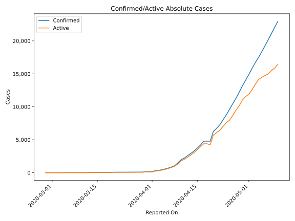
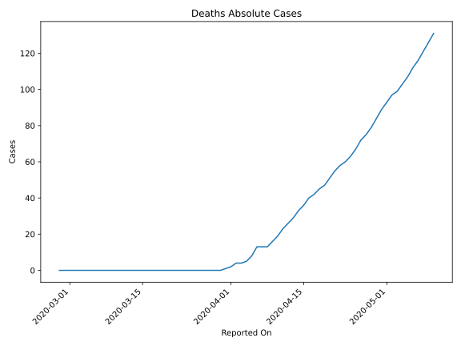
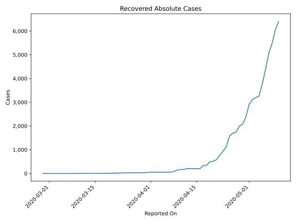
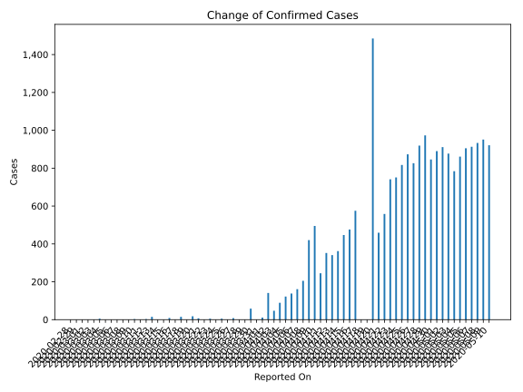
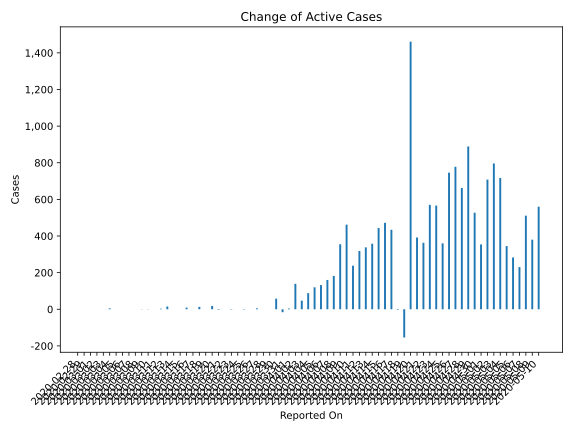
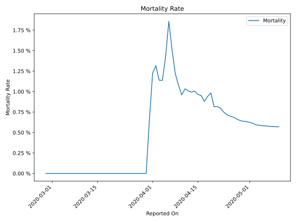

# Country Figures: Time Series for Belarus 

| Reported On | Confirmed | Deaths | Recovered | Active | Mortality | &Delta; Confirmed | &Delta; Deaths | &Delta; Recovered | &Delta; Active | % Active of Population |
|-------------|-----------|--------|-----------|--------|-----------|-------------------|----------------|-------------------|----------------|------------------------|
| 2020-05-10 | 22973 | 131 | 6406 | 16436 |  0.57 %  | 921 | 5 | 356 | 560 |  0.173 %  | 
| 2020-05-09 | 22052 | 126 | 6050 | 15876 |  0.57 %  | 951 | 5 | 566 | 380 |  0.167 %  | 
| 2020-05-08 | 21101 | 121 | 5484 | 15496 |  0.57 %  | 933 | 5 | 417 | 511 |  0.163 %  | 
| 2020-05-07 | 20168 | 116 | 5067 | 14985 |  0.58 %  | 913 | 4 | 679 | 230 |  0.158 %  | 
| 2020-05-06 | 19255 | 112 | 4388 | 14755 |  0.58 %  | 905 | 5 | 617 | 283 |  0.156 %  | 
| 2020-05-05 | 18350 | 107 | 3771 | 14472 |  0.58 %  | 861 | 4 | 512 | 345 |  0.153 %  | 
| 2020-05-04 | 17489 | 103 | 3259 | 14127 |  0.59 %  | 784 | 4 | 63 | 717 |  0.149 %  | 
| 2020-05-03 | 16705 | 99 | 3196 | 13410 |  0.59 %  | 877 | 2 | 79 | 796 |  0.141 %  | 
| 2020-05-02 | 15828 | 97 | 3117 | 12614 |  0.61 %  | 911 | 4 | 199 | 708 |  0.133 %  | 
| 2020-05-01 | 14917 | 93 | 2918 | 11906 |  0.62 %  | 890 | 4 | 532 | 354 |  0.126 %  | 
| 2020-04-30 | 14027 | 89 | 2386 | 11552 |  0.63 %  | 846 | 5 | 314 | 527 |  0.122 %  | 
| 2020-04-29 | 13181 | 84 | 2072 | 11025 |  0.64 %  | 973 | 5 | 79 | 889 |  0.116 %  | 
| 2020-04-28 | 12208 | 79 | 1993 | 10136 |  0.65 %  | 919 | 4 | 253 | 662 |  0.107 %  | 
| 2020-04-27 | 11289 | 75 | 1740 | 9474 |  0.66 %  | 826 | 3 | 45 | 778 |  0.100 %  | 
| 2020-04-26 | 10463 | 72 | 1695 | 8696 |  0.69 %  | 873 | 5 | 122 | 746 |  0.092 %  | 
| 2020-04-25 | 9590 | 67 | 1573 | 7950 |  0.70 %  | 817 | 4 | 453 | 360 |  0.084 %  | 
| 2020-04-24 | 8773 | 63 | 1120 | 7590 |  0.72 %  | 751 | 3 | 182 | 566 |  0.080 %  | 
| 2020-04-23 | 8022 | 60 | 938 | 7024 |  0.75 %  | 741 | 2 | 169 | 570 |  0.074 %  | 
| 2020-04-22 | 7281 | 58 | 769 | 6454 |  0.80 %  | 558 | 3 | 192 | 363 |  0.068 %  | 
| 2020-04-21 | 6723 | 55 | 577 | 6091 |  0.82 %  | 459 | 4 | 63 | 392 |  0.064 %  | 
| 2020-04-20 | 6264 | 51 | 514 | 5699 |  0.81 %  | 1485 | 4 | 20 | 1461 |  0.060 %  | 
| 2020-04-19 | 4779 | 47 | 494 | 4238 |  0.98 %  | 0 | 2 | 152 | -154 |  0.045 %  | 
| 2020-04-18 | 4779 | 45 | 342 | 4392 |  0.94 %  | 0 | 3 | 0 | -3 |  0.046 %  | 
| 2020-04-17 | 4779 | 42 | 342 | 4395 |  0.88 %  | 575 | 2 | 139 | 434 |  0.046 %  | 
| 2020-04-16 | 4204 | 40 | 203 | 3961 |  0.95 %  | 476 | 4 | 0 | 472 |  0.042 %  | 
| 2020-04-15 | 3728 | 36 | 203 | 3489 |  0.97 %  | 447 | 3 | 0 | 444 |  0.037 %  | 
| 2020-04-14 | 3281 | 33 | 203 | 3045 |  1.01 %  | 362 | 4 | 0 | 358 |  0.032 %  | 
| 2020-04-13 | 2919 | 29 | 203 | 2687 |  0.99 %  | 341 | 3 | 0 | 338 |  0.028 %  | 
| 2020-04-12 | 2578 | 26 | 203 | 2349 |  1.01 %  | 352 | 3 | 31 | 318 |  0.025 %  | 
| 2020-04-11 | 2226 | 23 | 172 | 2031 |  1.03 %  | 245 | 4 | 3 | 238 |  0.021 %  | 
| 2020-04-10 | 1981 | 19 | 169 | 1793 |  0.96 %  | 495 | 3 | 30 | 462 |  0.019 %  | 
| 2020-04-09 | 1486 | 16 | 139 | 1331 |  1.08 %  | 420 | 3 | 62 | 355 |  0.014 %  | 
| 2020-04-08 | 1066 | 13 | 77 | 976 |  1.22 %  | 205 | 0 | 23 | 182 |  0.010 %  | 
| 2020-04-07 | 861 | 13 | 54 | 794 |  1.51 %  | 161 | 0 | 1 | 160 |  0.008 %  | 
| 2020-04-06 | 700 | 13 | 53 | 634 |  1.86 %  | 138 | 5 | 1 | 132 |  0.007 %  | 
| 2020-04-05 | 562 | 8 | 52 | 502 |  1.42 %  | 122 | 3 | -1 | 120 |  0.005 %  | 
| 2020-04-04 | 440 | 5 | 53 | 382 |  1.14 %  | 89 | 1 | 0 | 88 |  0.004 %  | 
| 2020-04-03 | 351 | 4 | 53 | 294 |  1.14 %  | 47 | 0 | 0 | 47 |  0.003 %  | 
| 2020-04-02 | 304 | 4 | 53 | 247 |  1.32 %  | 141 | 2 | 0 | 139 |  0.003 %  | 
| 2020-04-01 | 163 | 2 | 53 | 108 |  1.23 %  | 11 | 1 | 6 | 4 |  0.001 %  | 
| 2020-03-31 | 152 | 1 | 47 | 104 |  0.66 %  | 0 | 1 | 15 | -16 |  0.001 %  | 
| 2020-03-30 | 152 | 0 | 32 | 120 |  None  | 58 | 0 | 0 | 58 |  0.001 %  | 
| 2020-03-29 | 94 | 0 | 32 | 62 |  None  | 0 | 0 | 0 | 0 |  0.001 %  | 
| 2020-03-28 | 94 | 0 | 32 | 62 |  None  | 0 | 0 | 0 | 0 |  0.001 %  | 
| 2020-03-27 | 94 | 0 | 32 | 62 |  None  | 8 | 0 | 3 | 5 |  0.001 %  | 
| 2020-03-26 | 86 | 0 | 29 | 57 |  None  | 0 | 0 | 0 | 0 |  0.001 %  | 
| 2020-03-25 | 86 | 0 | 29 | 57 |  None  | 5 | 0 | 7 | -2 |  0.001 %  | 
| 2020-03-24 | 81 | 0 | 22 | 59 |  None  | 0 | 0 | 0 | 0 |  0.001 %  | 
| 2020-03-23 | 81 | 0 | 22 | 59 |  None  | 5 | 0 | 7 | -2 |  0.001 %  | 
| 2020-03-22 | 76 | 0 | 15 | 61 |  None  | 0 | 0 | 0 | 0 |  0.001 %  | 
| 2020-03-21 | 76 | 0 | 15 | 61 |  None  | 7 | 0 | 10 | -3 |  0.001 %  | 
| 2020-03-20 | 69 | 0 | 5 | 64 |  None  | 18 | 0 | 0 | 18 |  0.001 %  | 
| 2020-03-19 | 51 | 0 | 5 | 46 |  None  | 0 | 0 | 0 | 0 |  0.000 %  | 
| 2020-03-18 | 51 | 0 | 5 | 46 |  None  | 15 | 0 | 2 | 13 |  0.000 %  | 
| 2020-03-17 | 36 | 0 | 3 | 33 |  None  | 0 | 0 | 0 | 0 |  0.000 %  | 
| 2020-03-16 | 36 | 0 | 3 | 33 |  None  | 9 | 0 | 0 | 9 |  0.000 %  | 
| 2020-03-15 | 27 | 0 | 3 | 24 |  None  | 0 | 0 | 0 | 0 |  0.000 %  | 
| 2020-03-14 | 27 | 0 | 3 | 24 |  None  | 0 | 0 | 0 | 0 |  0.000 %  | 
| 2020-03-13 | 27 | 0 | 3 | 24 |  None  | 15 | 0 | 0 | 15 |  0.000 %  | 
| 2020-03-12 | 12 | 0 | 3 | 9 |  None  | 3 | 0 | 0 | 3 |  0.000 %  | 
| 2020-03-11 | 9 | 0 | 3 | 6 |  None  | 0 | 0 | 0 | 0 |  0.000 %  | 
| 2020-03-10 | 9 | 0 | 3 | 6 |  None  | 3 | 0 | 2 | 1 |  0.000 %  | 
| 2020-03-09 | 6 | 0 | 1 | 5 |  None  | 0 | 0 | 1 | -1 |  0.000 %  | 
| 2020-03-08 | 6 | 0 | 0 | 6 |  None  | 0 | 0 | 0 | 0 |  0.000 %  | 
| 2020-03-07 | 6 | 0 | 0 | 6 |  None  | 0 | 0 | 0 | 0 |  0.000 %  | 
| 2020-03-06 | 6 | 0 | 0 | 6 |  None  | 0 | 0 | 0 | 0 |  0.000 %  | 
| 2020-03-05 | 6 | 0 | 0 | 6 |  None  | 0 | 0 | 0 | 0 |  0.000 %  | 
| 2020-03-04 | 6 | 0 | 0 | 6 |  None  | 5 | 0 | 0 | 5 |  0.000 %  | 
| 2020-03-03 | 1 | 0 | 0 | 1 |  None  | 0 | 0 | 0 | 0 |  0.000 %  | 
| 2020-03-02 | 1 | 0 | 0 | 1 |  None  | 0 | 0 | 0 | 0 |  0.000 %  | 
| 2020-03-01 | 1 | 0 | 0 | 1 |  None  | 0 | 0 | 0 | 0 |  0.000 %  | 
| 2020-02-29 | 1 | 0 | 0 | 1 |  None  | 0 | 0 | 0 | 0 |  0.000 %  | 
| 2020-02-28 | 1 | 0 | 0 | 1 |  None  | None | None | None | None |  0.000 %  | 

