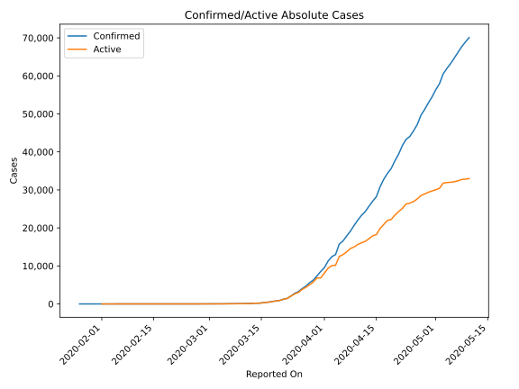
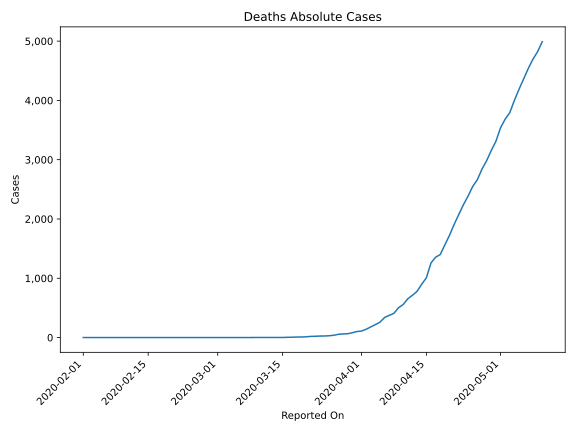
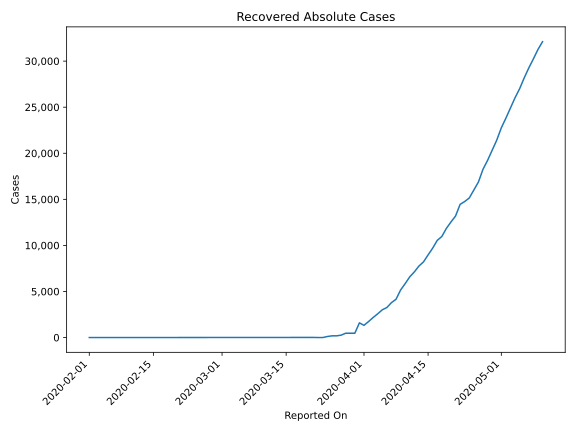
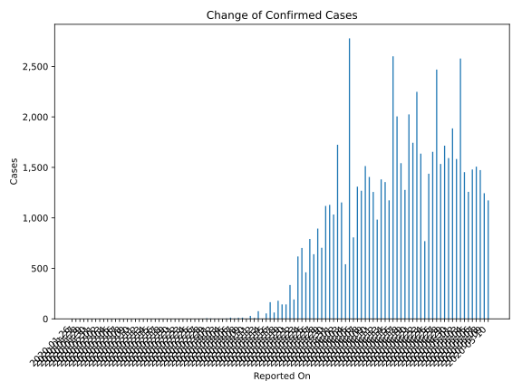
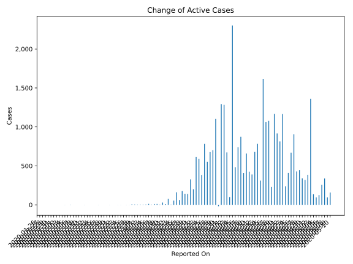
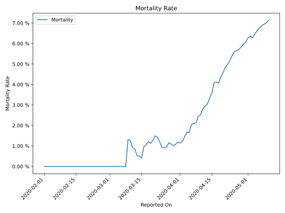

# Country Figures: Time Series for Canada 

| Reported On | Confirmed | Deaths | Recovered | Active | Mortality | &Delta; Confirmed | &Delta; Deaths | &Delta; Recovered | &Delta; Active | % Active of Population |
|-------------|-----------|--------|-----------|--------|-----------|-------------------|----------------|-------------------|----------------|------------------------|
| 2020-05-10 | 70091 | 4991 | 32109 | 32991 |  7.12 %  | 1173 | 168 | 847 | 158 |  0.089 %  | 
| 2020-05-09 | 68918 | 4823 | 31262 | 32833 |  7.00 %  | 1244 | 126 | 1023 | 95 |  0.089 %  | 
| 2020-05-08 | 67674 | 4697 | 30239 | 32738 |  6.94 %  | 1473 | 156 | 979 | 338 |  0.088 %  | 
| 2020-05-07 | 66201 | 4541 | 29260 | 32400 |  6.86 %  | 1507 | 175 | 1076 | 256 |  0.087 %  | 
| 2020-05-06 | 64694 | 4366 | 28184 | 32144 |  6.75 %  | 1479 | 176 | 1178 | 125 |  0.087 %  | 
| 2020-05-05 | 63215 | 4190 | 27006 | 32019 |  6.63 %  | 1258 | 187 | 976 | 95 |  0.086 %  | 
| 2020-05-04 | 61957 | 4003 | 26030 | 31924 |  6.46 %  | 1453 | 208 | 1109 | 136 |  0.086 %  | 
| 2020-05-03 | 60504 | 3795 | 24921 | 31788 |  6.27 %  | 2578 | 111 | 1107 | 1360 |  0.086 %  | 
| 2020-05-02 | 57926 | 3684 | 23814 | 30428 |  6.36 %  | 1583 | 147 | 1050 | 386 |  0.082 %  | 
| 2020-05-01 | 56343 | 3537 | 22764 | 30042 |  6.28 %  | 1886 | 227 | 1340 | 319 |  0.081 %  | 
| 2020-04-30 | 54457 | 3310 | 21424 | 29723 |  6.08 %  | 1592 | 155 | 1097 | 340 |  0.080 %  | 
| 2020-04-29 | 52865 | 3155 | 20327 | 29383 |  5.97 %  | 1715 | 172 | 1096 | 447 |  0.079 %  | 
| 2020-04-28 | 51150 | 2983 | 19231 | 28936 |  5.83 %  | 1534 | 142 | 963 | 429 |  0.078 %  | 
| 2020-04-27 | 49616 | 2841 | 18268 | 28507 |  5.73 %  | 2469 | 178 | 1385 | 906 |  0.077 %  | 
| 2020-04-26 | 47147 | 2663 | 16883 | 27601 |  5.65 %  | 1654 | 114 | 870 | 670 |  0.074 %  | 
| 2020-04-25 | 45493 | 2549 | 16013 | 26931 |  5.60 %  | 1437 | 163 | 864 | 410 |  0.073 %  | 
| 2020-04-24 | 44056 | 2386 | 15149 | 26521 |  5.42 %  | 770 | 145 | 388 | 237 |  0.072 %  | 
| 2020-04-23 | 43286 | 2241 | 14761 | 26284 |  5.18 %  | 1636 | 164 | 307 | 1165 |  0.071 %  | 
| 2020-04-22 | 41650 | 2077 | 14454 | 25119 |  4.99 %  | 2248 | 168 | 1266 | 814 |  0.068 %  | 
| 2020-04-21 | 39402 | 1909 | 13188 | 24305 |  4.84 %  | 1744 | 183 | 645 | 916 |  0.066 %  | 
| 2020-04-20 | 37658 | 1726 | 12543 | 23389 |  4.58 %  | 2025 | 162 | 696 | 1167 |  0.063 %  | 
| 2020-04-19 | 35633 | 1564 | 11847 | 22222 |  4.39 %  | 1277 | 164 | 883 | 230 |  0.060 %  | 
| 2020-04-18 | 34356 | 1400 | 10964 | 21992 |  4.07 %  | 1542 | 45 | 419 | 1078 |  0.059 %  | 
| 2020-04-17 | 32814 | 1355 | 10545 | 20914 |  4.13 %  | 2005 | 97 | 847 | 1061 |  0.056 %  | 
| 2020-04-16 | 30809 | 1258 | 9698 | 19853 |  4.08 %  | 2600 | 251 | 732 | 1617 |  0.054 %  | 
| 2020-04-15 | 28209 | 1007 | 8966 | 18236 |  3.57 %  | 1174 | 107 | 756 | 311 |  0.049 %  | 
| 2020-04-14 | 27035 | 900 | 8210 | 17925 |  3.33 %  | 1355 | 120 | 452 | 783 |  0.048 %  | 
| 2020-04-13 | 25680 | 780 | 7758 | 17142 |  3.04 %  | 1381 | 67 | 635 | 679 |  0.046 %  | 
| 2020-04-12 | 24299 | 713 | 7123 | 16463 |  2.93 %  | 983 | 59 | 534 | 390 |  0.044 %  | 
| 2020-04-11 | 23316 | 654 | 6589 | 16073 |  2.80 %  | 1257 | 97 | 734 | 426 |  0.043 %  | 
| 2020-04-10 | 22059 | 557 | 5855 | 15647 |  2.53 %  | 1405 | 54 | 693 | 658 |  0.042 %  | 
| 2020-04-09 | 20654 | 503 | 5162 | 14989 |  2.44 %  | 1513 | 96 | 1008 | 409 |  0.040 %  | 
| 2020-04-08 | 19141 | 407 | 4154 | 14580 |  2.13 %  | 1269 | 32 | 363 | 874 |  0.039 %  | 
| 2020-04-07 | 17872 | 375 | 3791 | 13706 |  2.10 %  | 1309 | 36 | 535 | 738 |  0.037 %  | 
| 2020-04-06 | 16563 | 339 | 3256 | 12968 |  2.05 %  | 807 | 80 | 244 | 483 |  0.035 %  | 
| 2020-04-05 | 15756 | 259 | 3012 | 12485 |  1.64 %  | 2778 | 41 | 435 | 2302 |  0.034 %  | 
| 2020-04-04 | 12978 | 218 | 2577 | 10183 |  1.68 %  | 541 | 39 | 402 | 100 |  0.027 %  | 
| 2020-04-03 | 12437 | 179 | 2175 | 10083 |  1.44 %  | 1153 | 40 | 440 | 673 |  0.027 %  | 
| 2020-04-02 | 11284 | 139 | 1735 | 9410 |  1.23 %  | 1724 | 30 | 411 | 1283 |  0.025 %  | 
| 2020-04-01 | 9560 | 109 | 1324 | 8127 |  1.14 %  | 1033 | 8 | -268 | 1293 |  0.022 %  | 
| 2020-03-31 | 8527 | 101 | 1592 | 6834 |  1.18 %  | 1129 | 21 | 1126 | -18 |  0.018 %  | 
| 2020-03-30 | 7398 | 80 | 466 | 6852 |  1.08 %  | 1118 | 16 | 0 | 1102 |  0.018 %  | 
| 2020-03-29 | 6280 | 64 | 466 | 5750 |  1.02 %  | 704 | 3 | 0 | 701 |  0.016 %  | 
| 2020-03-28 | 5576 | 61 | 466 | 5049 |  1.09 %  | 894 | 7 | 210 | 677 |  0.014 %  | 
| 2020-03-27 | 4682 | 54 | 256 | 4372 |  1.15 %  | 640 | 16 | 72 | 552 |  0.012 %  | 
| 2020-03-26 | 4042 | 38 | 184 | 3820 |  0.94 %  | 791 | 8 | 1 | 782 |  0.010 %  | 
| 2020-03-25 | 3251 | 30 | 183 | 3038 |  0.92 %  | 461 | 4 | 73 | 384 |  0.008 %  | 
| 2020-03-24 | 2790 | 26 | 110 | 2654 |  0.93 %  | 702 | 1 | 110 | 591 |  0.007 %  | 
| 2020-03-23 | 2088 | 25 | 0 | 2063 |  1.20 %  | 618 | 4 | 0 | 614 |  0.006 %  | 
| 2020-03-22 | 1470 | 21 | 0 | 1449 |  1.43 %  | 192 | 2 | -10 | 200 |  0.004 %  | 
| 2020-03-21 | 1278 | 19 | 10 | 1249 |  1.49 %  | 335 | 7 | 1 | 327 |  0.003 %  | 
| 2020-03-20 | 943 | 12 | 9 | 922 |  1.27 %  | 143 | 3 | 0 | 140 |  0.002 %  | 
| 2020-03-19 | 800 | 9 | 9 | 782 |  1.12 %  | 143 | 1 | 0 | 142 |  0.002 %  | 
| 2020-03-18 | 657 | 8 | 9 | 640 |  1.22 %  | 179 | 3 | 0 | 176 |  0.002 %  | 
| 2020-03-17 | 478 | 5 | 9 | 464 |  1.05 %  | 63 | 1 | 0 | 62 |  0.001 %  | 
| 2020-03-16 | 415 | 4 | 9 | 402 |  0.96 %  | 165 | 3 | 1 | 161 |  0.001 %  | 
| 2020-03-15 | 250 | 1 | 8 | 241 |  0.40 %  | 54 | 0 | 0 | 54 |  0.001 %  | 
| 2020-03-14 | 196 | 1 | 8 | 187 |  0.51 %  | 3 | 0 | 0 | 3 |  0.001 %  | 
| 2020-03-13 | 193 | 1 | 8 | 184 |  0.52 %  | 76 | 0 | 0 | 76 |  0.000 %  | 
| 2020-03-12 | 117 | 1 | 8 | 108 |  0.85 %  | 9 | 0 | 0 | 9 |  0.000 %  | 
| 2020-03-11 | 108 | 1 | 8 | 99 |  0.93 %  | 29 | 0 | 0 | 29 |  0.000 %  | 
| 2020-03-10 | 79 | 1 | 8 | 70 |  1.27 %  | 3 | 0 | 0 | 3 |  0.000 %  | 
| 2020-03-09 | 76 | 1 | 8 | 67 |  1.32 %  | 12 | 1 | 0 | 11 |  0.000 %  | 
| 2020-03-08 | 64 | 0 | 8 | 56 |  None  | 10 | 0 | 0 | 10 |  0.000 %  | 
| 2020-03-07 | 54 | 0 | 8 | 46 |  None  | 5 | 0 | 2 | 3 |  0.000 %  | 
| 2020-03-06 | 49 | 0 | 6 | 43 |  None  | 12 | 0 | 0 | 12 |  0.000 %  | 
| 2020-03-05 | 37 | 0 | 6 | 31 |  None  | 4 | 0 | 0 | 4 |  0.000 %  | 
| 2020-03-04 | 33 | 0 | 6 | 27 |  None  | 3 | 0 | 0 | 3 |  0.000 %  | 
| 2020-03-03 | 30 | 0 | 6 | 24 |  None  | 3 | 0 | 0 | 3 |  0.000 %  | 
| 2020-03-02 | 27 | 0 | 6 | 21 |  None  | 3 | 0 | 0 | 3 |  0.000 %  | 
| 2020-03-01 | 24 | 0 | 6 | 18 |  None  | 4 | 0 | 0 | 4 |  0.000 %  | 
| 2020-02-29 | 20 | 0 | 6 | 14 |  None  | 6 | 0 | 0 | 6 |  0.000 %  | 
| 2020-02-28 | 14 | 0 | 6 | 8 |  None  | 1 | 0 | 0 | 1 |  0.000 %  | 
| 2020-02-27 | 13 | 0 | 6 | 7 |  None  | 2 | 0 | 3 | -1 |  0.000 %  | 
| 2020-02-26 | 11 | 0 | 3 | 8 |  None  | 0 | 0 | 0 | 0 |  0.000 %  | 
| 2020-02-25 | 11 | 0 | 3 | 8 |  None  | 1 | 0 | 0 | 1 |  0.000 %  | 
| 2020-02-24 | 10 | 0 | 3 | 7 |  None  | 1 | 0 | 0 | 1 |  0.000 %  | 
| 2020-02-23 | 9 | 0 | 3 | 6 |  None  | 0 | 0 | 0 | 0 |  0.000 %  | 
| 2020-02-22 | 9 | 0 | 3 | 6 |  None  | 0 | 0 | 0 | 0 |  0.000 %  | 
| 2020-02-21 | 9 | 0 | 3 | 6 |  None  | 1 | 0 | 2 | -1 |  0.000 %  | 
| 2020-02-20 | 8 | 0 | 1 | 7 |  None  | 0 | 0 | 0 | 0 |  0.000 %  | 
| 2020-02-19 | 8 | 0 | 1 | 7 |  None  | 0 | 0 | 0 | 0 |  0.000 %  | 
| 2020-02-18 | 8 | 0 | 1 | 7 |  None  | 0 | 0 | 0 | 0 |  0.000 %  | 
| 2020-02-17 | 8 | 0 | 1 | 7 |  None  | 1 | 0 | 0 | 1 |  0.000 %  | 
| 2020-02-16 | 7 | 0 | 1 | 6 |  None  | 0 | 0 | 0 | 0 |  0.000 %  | 
| 2020-02-15 | 7 | 0 | 1 | 6 |  None  | 0 | 0 | 0 | 0 |  0.000 %  | 
| 2020-02-14 | 7 | 0 | 1 | 6 |  None  | 0 | 0 | 0 | 0 |  0.000 %  | 
| 2020-02-13 | 7 | 0 | 1 | 6 |  None  | 0 | 0 | 0 | 0 |  0.000 %  | 
| 2020-02-12 | 7 | 0 | 1 | 6 |  None  | 0 | 0 | 1 | -1 |  0.000 %  | 
| 2020-02-11 | 7 | 0 | 0 | 7 |  None  | 0 | 0 | 0 | 0 |  0.000 %  | 
| 2020-02-10 | 7 | 0 | 0 | 7 |  None  | 0 | 0 | 0 | 0 |  0.000 %  | 
| 2020-02-09 | 7 | 0 | 0 | 7 |  None  | 0 | 0 | 0 | 0 |  0.000 %  | 
| 2020-02-08 | 7 | 0 | 0 | 7 |  None  | 0 | 0 | 0 | 0 |  0.000 %  | 
| 2020-02-07 | 7 | 0 | 0 | 7 |  None  | 2 | 0 | 0 | 2 |  0.000 %  | 
| 2020-02-06 | 5 | 0 | 0 | 5 |  None  | 0 | 0 | 0 | 0 |  0.000 %  | 
| 2020-02-05 | 5 | 0 | 0 | 5 |  None  | 1 | 0 | 0 | 1 |  0.000 %  | 
| 2020-02-04 | 4 | 0 | 0 | 4 |  None  | 0 | 0 | 0 | 0 |  0.000 %  | 
| 2020-02-03 | 4 | 0 | 0 | 4 |  None  | 0 | 0 | 0 | 0 |  0.000 %  | 
| 2020-02-02 | 4 | 0 | 0 | 4 |  None  | 0 | 0 | 0 | 0 |  0.000 %  | 
| 2020-02-01 | 4 | 0 | 0 | 4 |  None  | 1 | None | None | None |  0.000 %  | 
| 2020-01-31 | 3 | None | None | None |  None  | 0 | None | None | None |  n/a  | 
| 2020-01-30 | 3 | None | None | None |  None  | 1 | None | None | None |  n/a  | 
| 2020-01-29 | 2 | None | None | None |  None  | 0 | None | None | None |  n/a  | 
| 2020-01-28 | 2 | None | None | None |  None  | 1 | None | None | None |  n/a  | 
| 2020-01-27 | 1 | None | None | None |  None  | 0 | None | None | None |  n/a  | 
| 2020-01-26 | 1 | None | None | None |  None  | None | None | None | None |  n/a  | 

