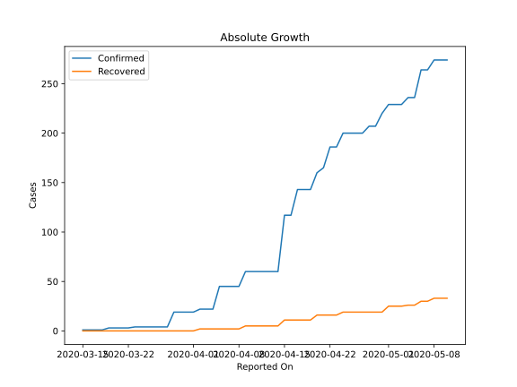
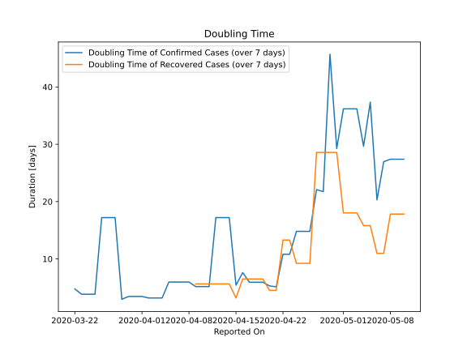

# Country Figures: Doubling Time of Infections for Congo(Brazzaville) 

The doubling time below are calculated based on
* an exponential growth assumption
* for time difference of past seven (7) days.
The doubling time's unit is "days".

The first doubling time indicates the increase of confirmed (infected)
cases. There, the *higher* the number is, the better is to take control
of the disease.

The second doubling time indicates the increase of recovered (healed)
cases. There, the *lower* the number is, the better it is to take
control of the disease.

| Reported On | Confirmed | Doubling Time (Confirmed) | Recovered | Doubling Time (Recovered) |
|-------------|-----------|---------------------------|-----------|---------------------------|
| 2020-05-10 | 274 |  27.4 days  | 33 |  17.8 days  | 
| 2020-05-09 | 274 |  27.4 days  | 33 |  17.8 days  | 
| 2020-05-08 | 274 |  27.4 days  | 33 |  17.8 days  | 
| 2020-05-07 | 264 |  27.0 days  | 30 |  11.0 days  | 
| 2020-05-06 | 264 |  20.3 days  | 30 |  11.0 days  | 
| 2020-05-05 | 236 |  37.4 days  | 26 |  15.8 days  | 
| 2020-05-04 | 236 |  29.7 days  | 26 |  15.8 days  | 
| 2020-05-03 | 229 |  36.2 days  | 25 |  18.0 days  | 
| 2020-05-02 | 229 |  36.2 days  | 25 |  18.0 days  | 
| 2020-05-01 | 229 |  36.2 days  | 25 |  18.0 days  | 
| 2020-04-30 | 220 |  29.2 days  | 19 |  28.6 days  | 
| 2020-04-29 | 207 |  45.7 days  | 19 |  28.6 days  | 
| 2020-04-28 | 207 |  21.7 days  | 19 |  28.6 days  | 
| 2020-04-27 | 200 |  22.1 days  | 19 |  28.6 days  | 
| 2020-04-26 | 200 |  14.8 days  | 19 |  9.2 days  | 
| 2020-04-25 | 200 |  14.8 days  | 19 |  9.2 days  | 
| 2020-04-24 | 200 |  14.8 days  | 19 |  9.2 days  | 
| 2020-04-23 | 186 |  10.8 days  | 16 |  13.3 days  | 
| 2020-04-22 | 186 |  10.8 days  | 16 |  13.3 days  | 
| 2020-04-21 | 165 |  5.1 days  | 16 |  4.5 days  | 
| 2020-04-20 | 160 |  5.3 days  | 16 |  4.5 days  | 
| 2020-04-19 | 143 |  5.9 days  | 11 |  6.5 days  | 
| 2020-04-18 | 143 |  5.9 days  | 11 |  6.5 days  | 
| 2020-04-17 | 143 |  5.9 days  | 11 |  6.5 days  | 
| 2020-04-16 | 117 |  7.6 days  | 11 |  6.5 days  | 
| 2020-04-15 | 117 |  5.4 days  | 11 |  3.2 days  | 
| 2020-04-14 | 60 |  17.2 days  | 5 |  5.6 days  | 
| 2020-04-13 | 60 |  17.2 days  | 5 |  5.6 days  | 
| 2020-04-12 | 60 |  17.2 days  | 5 |  5.6 days  | 
| 2020-04-11 | 60 |  5.2 days  | 5 |  5.6 days  | 
| 2020-04-10 | 60 |  5.2 days  | 5 |  5.6 days  | 
| 2020-04-09 | 60 |  5.2 days  | 5 |  5.6 days  | 
| 2020-04-08 | 45 |  6.0 days  | 2 |  None  | 
| 2020-04-07 | 45 |  6.0 days  | 2 |  None  | 
| 2020-04-06 | 45 |  6.0 days  | 2 |  None  | 
| 2020-04-05 | 45 |  6.0 days  | 2 |  None  | 
| 2020-04-04 | 22 |  3.2 days  | 2 |  None  | 
| 2020-04-03 | 22 |  3.2 days  | 2 |  None  | 
| 2020-04-02 | 22 |  3.2 days  | 2 |  None  | 
| 2020-04-01 | 19 |  3.4 days  | 0 |  None  | 
| 2020-03-31 | 19 |  3.4 days  | 0 |  None  | 
| 2020-03-30 | 19 |  3.4 days  | 0 |  None  | 
| 2020-03-29 | 19 |  3.0 days  | 0 |  None  | 
| 2020-03-28 | 4 |  17.2 days  | 0 |  None  | 
| 2020-03-27 | 4 |  17.2 days  | 0 |  None  | 
| 2020-03-26 | 4 |  17.2 days  | 0 |  None  | 
| 2020-03-25 | 4 |  3.8 days  | 0 |  None  | 
| 2020-03-24 | 4 |  3.8 days  | 0 |  None  | 
| 2020-03-23 | 4 |  3.8 days  | 0 |  None  | 
| 2020-03-22 | 3 |  4.8 days  | 0 |  None  | 
| 2020-03-21 | 3 |  None  | 0 |  None  | 
| 2020-03-20 | 3 |  None  | 0 |  None  | 
| 2020-03-19 | 3 |  None  | 0 |  None  | 
| 2020-03-18 | 1 |  None  | 0 |  None  | 
| 2020-03-17 | 1 |  None  | 0 |  None  | 
| 2020-03-16 | 1 |  None  | 0 |  None  | 
| 2020-03-15 | 1 |  None  | 0 |  None  | 

