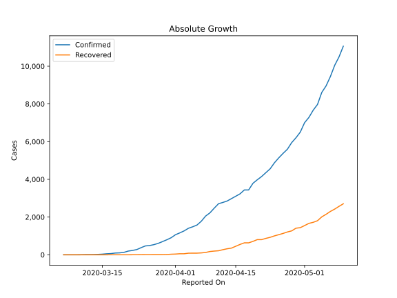
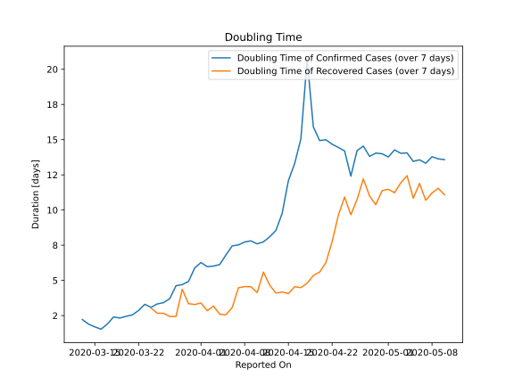

# Country Figures: Doubling Time of Infections for Colombia 

The doubling time below are calculated based on
* an exponential growth assumption
* for time difference of past seven (7) days.
The doubling time's unit is "days".

The first doubling time indicates the increase of confirmed (infected)
cases. There, the *higher* the number is, the better is to take control
of the disease.

The second doubling time indicates the increase of recovered (healed)
cases. There, the *lower* the number is, the better it is to take
control of the disease.

| Reported On | Confirmed | Doubling Time (Confirmed) | Recovered | Doubling Time (Recovered) |
|-------------|-----------|---------------------------|-----------|---------------------------|
| 2020-05-10 | 11063 |  13.6 days  | 2705 |  11.1 days  | 
| 2020-05-09 | 10495 |  13.6 days  | 2569 |  11.5 days  | 
| 2020-05-08 | 10051 |  13.8 days  | 2424 |  11.2 days  | 
| 2020-05-07 | 9456 |  13.3 days  | 2300 |  10.7 days  | 
| 2020-05-06 | 8959 |  13.6 days  | 2148 |  11.9 days  | 
| 2020-05-05 | 8613 |  13.5 days  | 2013 |  10.8 days  | 
| 2020-05-04 | 7973 |  14.1 days  | 1807 |  12.4 days  | 
| 2020-05-03 | 7668 |  14.0 days  | 1722 |  11.9 days  | 
| 2020-05-02 | 7285 |  14.3 days  | 1666 |  11.2 days  | 
| 2020-05-01 | 7006 |  13.8 days  | 1551 |  11.5 days  | 
| 2020-04-30 | 6507 |  14.0 days  | 1439 |  11.4 days  | 
| 2020-04-29 | 6207 |  14.0 days  | 1411 |  10.4 days  | 
| 2020-04-28 | 5949 |  13.8 days  | 1268 |  11.0 days  | 
| 2020-04-27 | 5597 |  14.5 days  | 1210 |  12.2 days  | 
| 2020-04-26 | 5379 |  14.2 days  | 1133 |  10.8 days  | 
| 2020-04-25 | 5142 |  12.4 days  | 1067 |  9.7 days  | 
| 2020-04-24 | 4881 |  14.2 days  | 1003 |  10.9 days  | 
| 2020-04-23 | 4561 |  14.4 days  | 927 |  9.6 days  | 
| 2020-04-22 | 4356 |  14.7 days  | 870 |  7.8 days  | 
| 2020-04-21 | 4149 |  15.0 days  | 804 |  6.3 days  | 
| 2020-04-20 | 3977 |  14.9 days  | 804 |  5.6 days  | 
| 2020-04-19 | 3792 |  15.9 days  | 711 |  5.4 days  | 
| 2020-04-18 | 3439 |  20.7 days  | 634 |  4.8 days  | 
| 2020-04-17 | 3439 |  15.1 days  | 634 |  4.5 days  | 
| 2020-04-16 | 3233 |  13.3 days  | 550 |  4.6 days  | 
| 2020-04-15 | 3105 |  12.1 days  | 452 |  4.1 days  | 
| 2020-04-14 | 2979 |  9.8 days  | 354 |  4.2 days  | 
| 2020-04-13 | 2852 |  8.5 days  | 319 |  4.1 days  | 
| 2020-04-12 | 2776 |  8.1 days  | 270 |  4.7 days  | 
| 2020-04-11 | 2709 |  7.7 days  | 214 |  5.6 days  | 
| 2020-04-10 | 2473 |  7.6 days  | 197 |  4.1 days  | 
| 2020-04-09 | 2223 |  7.8 days  | 174 |  4.6 days  | 
| 2020-04-08 | 2054 |  7.7 days  | 123 |  4.6 days  | 
| 2020-04-07 | 1780 |  7.5 days  | 100 |  4.5 days  | 
| 2020-04-06 | 1579 |  7.5 days  | 88 |  3.1 days  | 
| 2020-04-05 | 1485 |  6.8 days  | 88 |  2.6 days  | 
| 2020-04-04 | 1406 |  6.1 days  | 85 |  2.6 days  | 
| 2020-04-03 | 1267 |  6.0 days  | 55 |  3.2 days  | 
| 2020-04-02 | 1161 |  6.0 days  | 55 |  2.8 days  | 
| 2020-04-01 | 1065 |  6.3 days  | 39 |  3.4 days  | 
| 2020-03-31 | 906 |  5.9 days  | 31 |  3.3 days  | 
| 2020-03-30 | 798 |  4.9 days  | 15 |  3.3 days  | 
| 2020-03-29 | 702 |  4.7 days  | 10 |  4.4 days  | 
| 2020-03-28 | 608 |  4.6 days  | 10 |  2.4 days  | 
| 2020-03-27 | 539 |  3.7 days  | 10 |  2.4 days  | 
| 2020-03-26 | 491 |  3.4 days  | 8 |  2.7 days  | 
| 2020-03-25 | 470 |  3.3 days  | 8 |  2.7 days  | 
| 2020-03-24 | 378 |  3.1 days  | 6 |  3.0 days  | 
| 2020-03-23 | 277 |  3.3 days  | 3 |  None  | 
| 2020-03-22 | 231 |  2.9 days  | 3 |  None  | 
| 2020-03-21 | 196 |  2.5 days  | 1 |  None  | 
| 2020-03-20 | 128 |  2.5 days  | 1 |  None  | 
| 2020-03-19 | 102 |  2.3 days  | 1 |  None  | 
| 2020-03-18 | 93 |  2.4 days  | 1 |  None  | 
| 2020-03-17 | 65 |  1.9 days  | 1 |  None  | 
| 2020-03-16 | 54 |  1.5 days  | 0 |  None  | 
| 2020-03-15 | 34 |  1.7 days  | 0 |  None  | 
| 2020-03-14 | 22 |  1.9 days  | 0 |  None  | 
| 2020-03-13 | 13 |  2.2 days  | 0 |  None  | 
| 2020-03-12 | 9 |  None  | 0 |  None  | 
| 2020-03-11 | 9 |  None  | 0 |  None  | 
| 2020-03-10 | 3 |  None  | 0 |  None  | 
| 2020-03-09 | 1 |  None  | 0 |  None  | 
| 2020-03-08 | 1 |  None  | 0 |  None  | 
| 2020-03-07 | 1 |  None  | 0 |  None  | 
| 2020-03-06 | 1 |  None  | 0 |  None  | 

