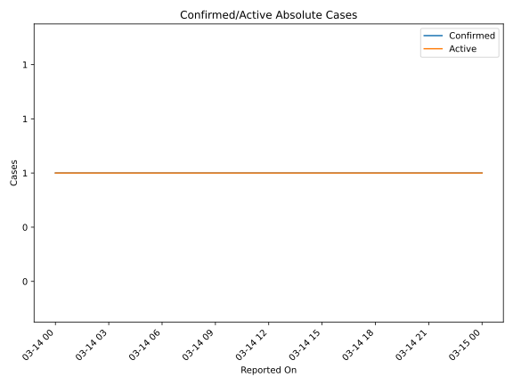
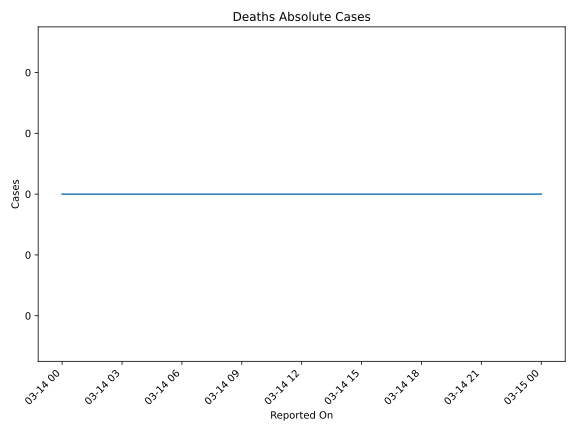
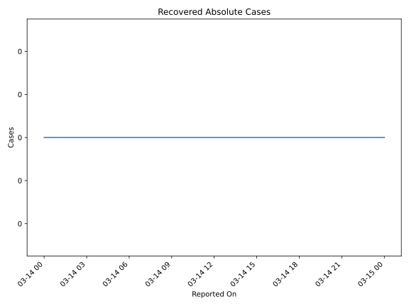
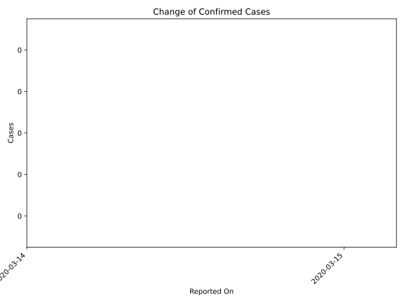
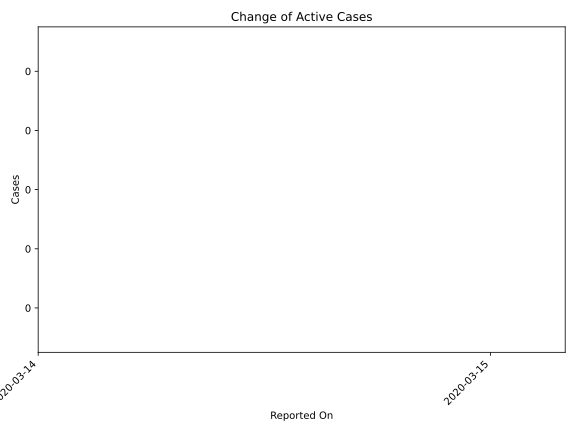
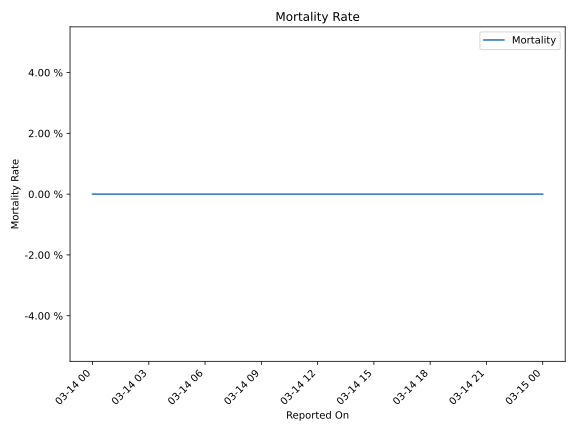

# Country Figures: Time Series for Curacao 

| Reported On | Confirmed | Deaths | Recovered | Active | Mortality | &Delta; Confirmed | &Delta; Deaths | &Delta; Recovered | &Delta; Active | % Active of Population |
|-------------|-----------|--------|-----------|--------|-----------|-------------------|----------------|-------------------|----------------|------------------------|
| 2020-03-15 | 1 | 0 | 0 | 1 |  None  | 0 | 0 | 0 | 0 |  0.001 %  | 
| 2020-03-14 | 1 | 0 | 0 | 1 |  None  | None | None | None | None |  0.001 %  | 

