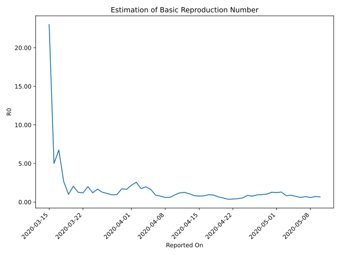

# Country Figures: Time Series for Basic Reproduction Number of Cyprus 

| Reported On | &Delta; Confirmed | Total &Delta; Confirmed First Interval | Total &Delta; Confirmed Second Interval | Estimated Basic Reproduction Number R0 | 
|-------------|-------------------|----------------------------------------|-----------------------------------------|---------------------------------------------------|
| 2020-05-10 | 6 |  14  |  21  |  0.67  | 
| 2020-05-09 | 1 |  17  |  24  |  0.71  | 
| 2020-05-08 | 2 |  17  |  29  |  0.59  | 
| 2020-05-07 | 6 |  19  |  27  |  0.70  | 
| 2020-05-06 | 5 |  21  |  35  |  0.60  | 
| 2020-05-05 | 4 |  24  |  33  |  0.73  | 
| 2020-05-04 | 2 |  29  |  33  |  0.88  | 
| 2020-05-03 | 8 |  27  |  33  |  0.82  | 
| 2020-05-02 | 7 |  35  |  27  |  1.30  | 
| 2020-05-01 | 7 |  33  |  27  |  1.22  | 
| 2020-04-30 | 7 |  33  |  26  |  1.27  | 
| 2020-04-29 | 6 |  33  |  32  |  1.03  | 
| 2020-04-28 | 15 |  27  |  28  |  0.96  | 
| 2020-04-27 | 5 |  27  |  29  |  0.93  | 
| 2020-04-26 | 7 |  26  |  34  |  0.76  | 
| 2020-04-25 | 6 |  32  |  37  |  0.86  | 
| 2020-04-24 | 9 |  28  |  52  |  0.54  | 
| 2020-04-23 | 5 |  29  |  66  |  0.44  | 
| 2020-04-22 | 6 |  34  |  88  |  0.39  | 
| 2020-04-21 | 12 |  37  |  102  |  0.36  | 
| 2020-04-20 | 5 |  52  |  99  |  0.53  | 
| 2020-04-19 | 6 |  66  |  100  |  0.66  | 
| 2020-04-18 | 11 |  88  |  98  |  0.90  | 
| 2020-04-17 | 15 |  102  |  107  |  0.95  | 
| 2020-04-16 | 20 |  99  |  122  |  0.81  | 
| 2020-04-15 | 20 |  100  |  130  |  0.77  | 
| 2020-04-14 | 33 |  98  |  118  |  0.83  | 
| 2020-04-13 | 29 |  107  |  100  |  1.07  | 
| 2020-04-12 | 17 |  122  |  98  |  1.24  | 
| 2020-04-11 | 21 |  130  |  109  |  1.19  | 
| 2020-04-10 | 31 |  118  |  126  |  0.94  | 
| 2020-04-09 | 38 |  100  |  164  |  0.61  | 
| 2020-04-08 | 32 |  98  |  166  |  0.59  | 
| 2020-04-07 | 29 |  109  |  142  |  0.77  | 
| 2020-04-06 | 19 |  126  |  141  |  0.89  | 
| 2020-04-05 | 20 |  164  |  100  |  1.64  | 
| 2020-04-04 | 30 |  166  |  84  |  1.98  | 
| 2020-04-03 | 40 |  142  |  82  |  1.73  | 
| 2020-04-02 | 36 |  141  |  55  |  2.56  | 
| 2020-04-01 | 58 |  100  |  46  |  2.17  | 
| 2020-03-31 | 32 |  84  |  51  |  1.65  | 
| 2020-03-30 | 16 |  82  |  48  |  1.71  | 
| 2020-03-29 | 35 |  55  |  57  |  0.96  | 
| 2020-03-28 | 17 |  46  |  49  |  0.94  | 
| 2020-03-27 | 16 |  51  |  46  |  1.11  | 
| 2020-03-26 | 14 |  48  |  38  |  1.26  | 
| 2020-03-25 | 8 |  57  |  34  |  1.68  | 
| 2020-03-24 | 8 |  49  |  41  |  1.20  | 
| 2020-03-23 | 21 |  46  |  23  |  2.00  | 
| 2020-03-22 | 11 |  38  |  32  |  1.19  | 
| 2020-03-21 | 17 |  34  |  27  |  1.26  | 
| 2020-03-20 | 0 |  41  |  20  |  2.05  | 
| 2020-03-19 | 18 |  23  |  23  |  1.00  | 
| 2020-03-18 | 3 |  32  |  12  |  2.67  | 
| 2020-03-17 | 13 |  27  |  4  |  6.75  | 
| 2020-03-16 | 7 |  20  |  4  |  5.00  | 
| 2020-03-15 | 0 |  23  |  1  |  23.00  | 
| 2020-03-14 | 12 |  12  |  None  |  None  | 
| 2020-03-13 | 8 |  4  |  None  |  None  | 
| 2020-03-12 | 0 |  4  |  None  |  None  | 
| 2020-03-11 | 3 |  1  |  None  |  None  | 
| 2020-03-10 | 1 |  None  |  None  |  None  | 
| 2020-03-09 | None |  None  |  None  |  None  | 

