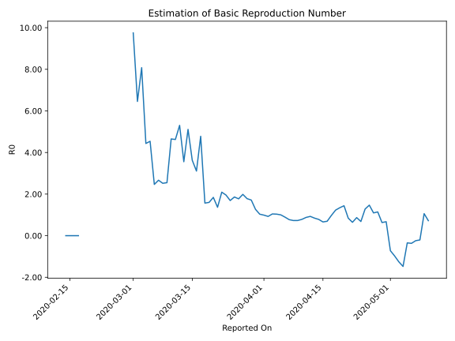

# Country Figures: Time Series for Basic Reproduction Number of Spain 

| Reported On | &Delta; Confirmed | Total &Delta; Confirmed First Interval | Total &Delta; Confirmed Second Interval | Estimated Basic Reproduction Number R0 | 
|-------------|-------------------|----------------------------------------|-----------------------------------------|---------------------------------------------------|
| 2020-05-10 | 772 |  4249  |  5894  |  0.72  | 
| 2020-05-09 | 721 |  4846  |  4576  |  1.06  | 
| 2020-05-08 | 1410 |  3981  |  -19433  |  -0.20  | 
| 2020-05-07 | 1122 |  3743  |  -15546  |  -0.24  | 
| 2020-05-06 | 996 |  5894  |  -15987  |  -0.37  | 
| 2020-05-05 | 1318 |  4576  |  -13194  |  -0.35  | 
| 2020-05-04 | 545 |  -19433  |  13140  |  -1.48  | 
| 2020-05-03 | 884 |  -15546  |  12364  |  -1.26  | 
| 2020-05-02 | 3147 |  -15987  |  16398  |  -0.97  | 
| 2020-05-01 | 0 |  -13194  |  18240  |  -0.72  | 
| 2020-04-30 | -23464 |  13140  |  19581  |  0.67  | 
| 2020-04-29 | 4771 |  12364  |  19554  |  0.63  | 
| 2020-04-28 | 2706 |  16398  |  14350  |  1.14  | 
| 2020-04-27 | 2793 |  18240  |  16663  |  1.09  | 
| 2020-04-26 | 2870 |  19581  |  13339  |  1.47  | 
| 2020-04-25 | 3995 |  19554  |  15262  |  1.28  | 
| 2020-04-24 | 6740 |  14350  |  21030  |  0.68  | 
| 2020-04-23 | 4635 |  16663  |  19185  |  0.87  | 
| 2020-04-22 | 4211 |  13339  |  20740  |  0.64  | 
| 2020-04-21 | 3968 |  15262  |  18117  |  0.84  | 
| 2020-04-20 | 1536 |  21030  |  14617  |  1.44  | 
| 2020-04-19 | 6948 |  19185  |  14268  |  1.34  | 
| 2020-04-18 | 887 |  20740  |  16877  |  1.23  | 
| 2020-04-17 | 5891 |  18117  |  18611  |  0.97  | 
| 2020-04-16 | 7304 |  14617  |  21085  |  0.69  | 
| 2020-04-15 | 5103 |  14268  |  21598  |  0.66  | 
| 2020-04-14 | 2442 |  16877  |  21576  |  0.78  | 
| 2020-04-13 | 3268 |  18611  |  22052  |  0.84  | 
| 2020-04-12 | 3804 |  21085  |  22743  |  0.93  | 
| 2020-04-11 | 4754 |  21598  |  24610  |  0.88  | 
| 2020-04-10 | 5051 |  21576  |  27528  |  0.78  | 
| 2020-04-09 | 5002 |  22052  |  30245  |  0.73  | 
| 2020-04-08 | 6278 |  22743  |  31243  |  0.73  | 
| 2020-04-07 | 5267 |  24610  |  31955  |  0.77  | 
| 2020-04-06 | 5029 |  27528  |  30883  |  0.89  | 
| 2020-04-05 | 5478 |  30245  |  30204  |  1.00  | 
| 2020-04-04 | 6969 |  31243  |  30170  |  1.04  | 
| 2020-04-03 | 7134 |  31955  |  30595  |  1.04  | 
| 2020-04-02 | 7947 |  30883  |  33350  |  0.93  | 
| 2020-04-01 | 8195 |  30204  |  30583  |  0.99  | 
| 2020-03-31 | 7967 |  30170  |  29183  |  1.03  | 
| 2020-03-30 | 7846 |  30595  |  24141  |  1.27  | 
| 2020-03-29 | 6875 |  33350  |  19475  |  1.71  | 
| 2020-03-28 | 7516 |  30583  |  17173  |  1.78  | 
| 2020-03-27 | 7933 |  29183  |  14693  |  1.99  | 
| 2020-03-26 | 8271 |  24141  |  13626  |  1.77  | 
| 2020-03-25 | 9630 |  19475  |  10468  |  1.86  | 
| 2020-03-24 | 4749 |  17173  |  10165  |  1.69  | 
| 2020-03-23 | 6533 |  14693  |  7519  |  1.95  | 
| 2020-03-22 | 3229 |  13626  |  6516  |  2.09  | 
| 2020-03-21 | 4964 |  10468  |  7665  |  1.37  | 
| 2020-03-20 | 2447 |  10165  |  5521  |  1.84  | 
| 2020-03-19 | 4053 |  7519  |  4696  |  1.60  | 
| 2020-03-18 | 2162 |  6516  |  4159  |  1.57  | 
| 2020-03-17 | 1806 |  7665  |  1604  |  4.78  | 
| 2020-03-16 | 2144 |  5521  |  1777  |  3.11  | 
| 2020-03-15 | 1407 |  4696  |  1295  |  3.63  | 
| 2020-03-14 | 1159 |  4159  |  814  |  5.11  | 
| 2020-03-13 | 2955 |  1604  |  451  |  3.56  | 
| 2020-03-12 | 0 |  1777  |  335  |  5.30  | 
| 2020-03-11 | 582 |  1295  |  280  |  4.62  | 
| 2020-03-10 | 622 |  814  |  175  |  4.65  | 
| 2020-03-09 | 400 |  451  |  177  |  2.55  | 
| 2020-03-08 | 173 |  335  |  133  |  2.52  | 
| 2020-03-07 | 100 |  280  |  105  |  2.67  | 
| 2020-03-06 | 141 |  175  |  71  |  2.46  | 
| 2020-03-05 | 37 |  177  |  39  |  4.54  | 
| 2020-03-04 | 57 |  133  |  30  |  4.43  | 
| 2020-03-03 | 45 |  105  |  13  |  8.08  | 
| 2020-03-02 | 36 |  71  |  11  |  6.45  | 
| 2020-03-01 | 39 |  39  |  4  |  9.75  | 
| 2020-02-29 | 13 |  30  |  None  |  None  | 
| 2020-02-28 | 17 |  13  |  None  |  None  | 
| 2020-02-27 | 2 |  11  |  None  |  None  | 
| 2020-02-26 | 7 |  4  |  None  |  None  | 
| 2020-02-25 | 4 |  None  |  None  |  None  | 
| 2020-02-24 | 0 |  None  |  None  |  None  | 
| 2020-02-23 | 0 |  None  |  None  |  None  | 
| 2020-02-22 | 0 |  None  |  None  |  None  | 
| 2020-02-21 | 0 |  None  |  None  |  None  | 
| 2020-02-20 | 0 |  None  |  None  |  None  | 
| 2020-02-19 | 0 |  None  |  None  |  None  | 
| 2020-02-18 | 0 |  None  |  None  |  None  | 
| 2020-02-17 | 0 |  None  |  1  |  None  | 
| 2020-02-16 | 0 |  None  |  1  |  None  | 
| 2020-02-15 | 0 |  None  |  1  |  None  | 
| 2020-02-14 | 0 |  None  |  1  |  None  | 
| 2020-02-13 | 0 |  1  |  None  |  None  | 
| 2020-02-12 | 0 |  1  |  None  |  None  | 
| 2020-02-11 | 0 |  1  |  None  |  None  | 
| 2020-02-10 | 0 |  1  |  None  |  None  | 
| 2020-02-09 | 1 |  None  |  None  |  None  | 
| 2020-02-08 | 0 |  None  |  None  |  None  | 
| 2020-02-07 | 0 |  None  |  None  |  None  | 
| 2020-02-06 | 0 |  None  |  None  |  None  | 
| 2020-02-05 | 0 |  None  |  None  |  None  | 
| 2020-02-04 | 0 |  None  |  None  |  None  | 
| 2020-02-03 | 0 |  None  |  None  |  None  | 
| 2020-02-02 | 0 |  None  |  None  |  None  | 
| 2020-02-01 | None |  None  |  None  |  None  | 

