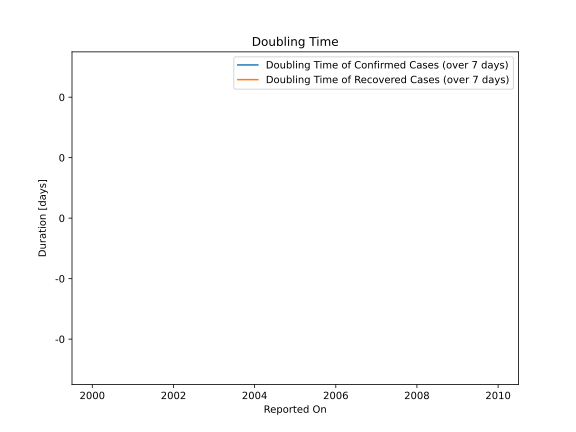

# Country Figures: New Infections in Previous 7 Days per 100,000 Population for Gibraltar 

<!--  --> 

| Reported On | &Delta; Confirmed (on the day) | &Delta; Confirmed (last 7 days) | New Cases in Previous 7 Days per 100,000 Population |
|-------------|--------------------------------|---------------------------------|-----------------------------------------------------|
| 2020-03-10 |  None  |  None  |  None  |
| 2020-03-09 |  None  |  None  |  None  |
| 2020-03-08 |  None  |  None  |  None  |
| 2020-03-07 |  None  |  None  |  None  |
| 2020-03-06 |  None  |  None  |  None  |
| 2020-03-05 |  None  |  None  |  None  |
| 2020-03-04 |  None  |  None  |  None  |

