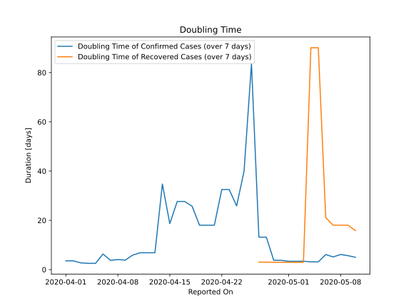

# Country Figures: New Infections in Previous 7 Days per 100,000 Population for Guinea-Bissau 

<!--  --> 

| Reported On | &Delta; Confirmed (on the day) | &Delta; Confirmed (last 7 days) | New Cases in Previous 7 Days per 100,000 Population |
|-------------|--------------------------------|---------------------------------|-----------------------------------------------------|
| 2020-05-10 |  85  |  469  |  25.023  |
| 2020-05-09 |  47  |  384  |  20.488  |
| 2020-05-08 |  30  |  337  |  17.980  |
| 2020-05-07 |  89  |  359  |  19.154  |
| 2020-05-06 |  62  |  270  |  14.405  |
| 2020-05-05 |  None  |  340  |  18.140  |
| 2020-05-04 |  156  |  340  |  18.140  |
| 2020-05-03 |  None  |  204  |  10.884  |
| 2020-05-02 |  None  |  205  |  10.937  |
| 2020-05-01 |  52  |  205  |  10.937  |
| 2020-04-30 |  None  |  155  |  8.270  |
| 2020-04-29 |  132  |  155  |  8.270  |
| 2020-04-28 |  None  |  23  |  1.227  |
| 2020-04-27 |  20  |  23  |  1.227  |
| 2020-04-26 |  1  |  3  |  0.160  |
| 2020-04-25 |  None  |  6  |  0.320  |
| 2020-04-24 |  2  |  9  |  0.480  |
| 2020-04-23 |  None  |  7  |  0.373  |
| 2020-04-22 |  None  |  7  |  0.373  |
| 2020-04-21 |  None  |  12  |  0.640  |
| 2020-04-20 |  None  |  12  |  0.640  |
| 2020-04-19 |  4  |  12  |  0.640  |
| 2020-04-18 |  3  |  8  |  0.427  |
| 2020-04-17 |  None  |  7  |  0.373  |
| 2020-04-16 |  None  |  7  |  0.373  |
| 2020-04-15 |  5  |  10  |  0.534  |
| 2020-04-14 |  None  |  5  |  0.267  |
| 2020-04-13 |  None  |  20  |  1.067  |
| 2020-04-12 |  None  |  20  |  1.067  |
| 2020-04-11 |  2  |  20  |  1.067  |
| 2020-04-10 |  None  |  21  |  1.120  |
| 2020-04-09 |  3  |  27  |  1.441  |
| 2020-04-08 |  None  |  24  |  1.280  |
| 2020-04-07 |  15  |  25  |  1.334  |
| 2020-04-06 |  None  |  10  |  0.534  |
| 2020-04-05 |  None  |  16  |  0.854  |
| 2020-04-04 |  3  |  16  |  0.854  |
| 2020-04-03 |  6  |  13  |  0.694  |
| 2020-04-02 |  None  |  7  |  0.373  |
| 2020-04-01 |  1  |  7  |  0.373  |
| 2020-03-31 |  None  |  6  |  0.320  |
| 2020-03-30 |  6  |  6  |  0.320  |
| 2020-03-29 |  None  |  None  |  None  |
| 2020-03-28 |  None  |  None  |  None  |
| 2020-03-27 |  None  |  None  |  None  |
| 2020-03-26 |  None  |  None  |  None  |
| 2020-03-25 |  None  |  None  |  None  |

