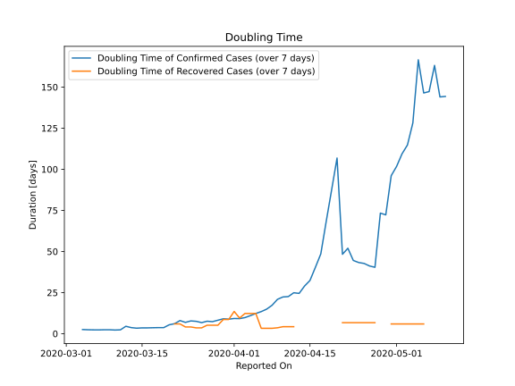

# Country Figures: New Infections in Previous 7 Days per 100,000 Population for Greece 

<!--  --> 

| Reported On | &Delta; Confirmed (on the day) | &Delta; Confirmed (last 7 days) | New Cases in Previous 7 Days per 100,000 Population |
|-------------|--------------------------------|---------------------------------|-----------------------------------------------------|
| 2020-05-10 |  6  |  90  |  0.839  |
| 2020-05-09 |  19  |  90  |  0.839  |
| 2020-05-08 |  13  |  79  |  0.736  |
| 2020-05-07 |  15  |  87  |  0.811  |
| 2020-05-06 |  21  |  87  |  0.811  |
| 2020-05-05 |  10  |  76  |  0.708  |
| 2020-05-04 |  6  |  98  |  0.914  |
| 2020-05-03 |  6  |  109  |  1.016  |
| 2020-05-02 |  8  |  114  |  1.063  |
| 2020-05-01 |  21  |  122  |  1.137  |
| 2020-04-30 |  15  |  128  |  1.193  |
| 2020-04-29 |  10  |  168  |  1.566  |
| 2020-04-28 |  32  |  165  |  1.538  |
| 2020-04-27 |  17  |  289  |  2.694  |
| 2020-04-26 |  11  |  282  |  2.629  |
| 2020-04-25 |  16  |  271  |  2.526  |
| 2020-04-24 |  27  |  266  |  2.480  |
| 2020-04-23 |  55  |  256  |  2.386  |
| 2020-04-22 |  7  |  216  |  2.013  |
| 2020-04-21 |  156  |  231  |  2.153  |
| 2020-04-20 |  10  |  100  |  0.932  |
| 2020-04-19 |  None  |  121  |  1.128  |
| 2020-04-18 |  11  |  154  |  1.436  |
| 2020-04-17 |  17  |  213  |  1.986  |
| 2020-04-16 |  15  |  252  |  2.349  |
| 2020-04-15 |  22  |  308  |  2.871  |
| 2020-04-14 |  25  |  338  |  3.151  |
| 2020-04-13 |  31  |  390  |  3.635  |
| 2020-04-12 |  33  |  379  |  3.533  |
| 2020-04-11 |  70  |  408  |  3.803  |
| 2020-04-10 |  56  |  398  |  3.710  |
| 2020-04-09 |  71  |  411  |  3.831  |
| 2020-04-08 |  52  |  469  |  4.372  |
| 2020-04-07 |  77  |  518  |  4.829  |
| 2020-04-06 |  20  |  543  |  5.062  |
| 2020-04-05 |  62  |  579  |  5.397  |
| 2020-04-04 |  60  |  612  |  5.705  |
| 2020-04-03 |  69  |  647  |  6.031  |
| 2020-04-02 |  129  |  652  |  6.078  |
| 2020-04-01 |  101  |  594  |  5.537  |
| 2020-03-31 |  102  |  571  |  5.323  |
| 2020-03-30 |  56  |  517  |  4.819  |
| 2020-03-29 |  95  |  532  |  4.959  |
| 2020-03-28 |  95  |  531  |  4.950  |
| 2020-03-27 |  74  |  471  |  4.391  |
| 2020-03-26 |  71  |  474  |  4.418  |
| 2020-03-25 |  78  |  403  |  3.757  |
| 2020-03-24 |  48  |  356  |  3.319  |
| 2020-03-23 |  71  |  364  |  3.393  |
| 2020-03-22 |  94  |  293  |  2.731  |
| 2020-03-21 |  35  |  302  |  2.815  |
| 2020-03-20 |  77  |  305  |  2.843  |
| 2020-03-19 |  None  |  319  |  2.974  |
| 2020-03-18 |  31  |  319  |  2.974  |
| 2020-03-17 |  56  |  298  |  2.778  |
| 2020-03-16 |  None  |  258  |  2.405  |
| 2020-03-15 |  103  |  258  |  2.405  |
| 2020-03-14 |  38  |  182  |  1.697  |
| 2020-03-13 |  91  |  145  |  1.352  |
| 2020-03-12 |  None  |  68  |  0.634  |
| 2020-03-11 |  10  |  90  |  0.839  |
| 2020-03-10 |  16  |  82  |  0.764  |
| 2020-03-09 |  None  |  66  |  0.615  |
| 2020-03-08 |  27  |  66  |  0.615  |
| 2020-03-07 |  1  |  42  |  0.392  |
| 2020-03-06 |  14  |  41  |  0.382  |
| 2020-03-05 |  22  |  28  |  0.261  |
| 2020-03-04 |  2  |  8  |  0.075  |
| 2020-03-03 |  None  |  6  |  0.056  |
| 2020-03-02 |  None  |  6  |  0.056  |
| 2020-03-01 |  3  |  6  |  0.056  |
| 2020-02-29 |  None  |  3  |  0.028  |
| 2020-02-28 |  1  |  3  |  0.028  |
| 2020-02-27 |  2  |  2  |  0.019  |
| 2020-02-26 |  None  |  None  |  None  |

