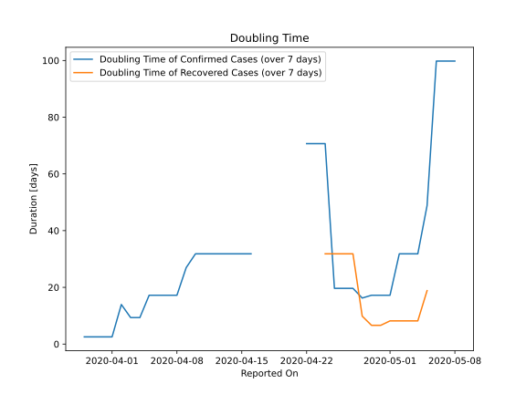

# Country Figures: New Infections in Previous 7 Days per 100,000 Population for Grenada 

<!--  --> 

| Reported On | &Delta; Confirmed (on the day) | &Delta; Confirmed (last 7 days) | New Cases in Previous 7 Days per 100,000 Population |
|-------------|--------------------------------|---------------------------------|-----------------------------------------------------|
| 2020-05-10 |  None  |  None  |  None  |
| 2020-05-09 |  None  |  None  |  None  |
| 2020-05-08 |  None  |  1  |  0.897  |
| 2020-05-07 |  None  |  1  |  0.897  |
| 2020-05-06 |  None  |  1  |  0.897  |
| 2020-05-05 |  None  |  2  |  1.794  |
| 2020-05-04 |  None  |  3  |  2.692  |
| 2020-05-03 |  None  |  3  |  2.692  |
| 2020-05-02 |  1  |  3  |  2.692  |
| 2020-05-01 |  None  |  5  |  4.486  |
| 2020-04-30 |  None  |  5  |  4.486  |
| 2020-04-29 |  1  |  5  |  4.486  |
| 2020-04-28 |  1  |  5  |  4.486  |
| 2020-04-27 |  None  |  4  |  3.589  |
| 2020-04-26 |  None  |  4  |  3.589  |
| 2020-04-25 |  3  |  4  |  3.589  |
| 2020-04-24 |  None  |  1  |  0.897  |
| 2020-04-23 |  None  |  1  |  0.897  |
| 2020-04-22 |  1  |  1  |  0.897  |
| 2020-04-21 |  None  |  None  |  None  |
| 2020-04-20 |  None  |  None  |  None  |
| 2020-04-19 |  None  |  None  |  None  |
| 2020-04-18 |  None  |  None  |  None  |
| 2020-04-17 |  None  |  None  |  None  |
| 2020-04-16 |  None  |  2  |  1.794  |
| 2020-04-15 |  None  |  2  |  1.794  |
| 2020-04-14 |  None  |  2  |  1.794  |
| 2020-04-13 |  None  |  2  |  1.794  |
| 2020-04-12 |  None  |  2  |  1.794  |
| 2020-04-11 |  None  |  2  |  1.794  |
| 2020-04-10 |  2  |  2  |  1.794  |
| 2020-04-09 |  None  |  2  |  1.794  |
| 2020-04-08 |  None  |  3  |  2.692  |
| 2020-04-07 |  None  |  3  |  2.692  |
| 2020-04-06 |  None  |  3  |  2.692  |
| 2020-04-05 |  None  |  3  |  2.692  |
| 2020-04-04 |  None  |  5  |  4.486  |
| 2020-04-03 |  2  |  5  |  4.486  |
| 2020-04-02 |  1  |  3  |  2.692  |
| 2020-04-01 |  None  |  8  |  7.178  |
| 2020-03-31 |  None  |  8  |  7.178  |
| 2020-03-30 |  None  |  8  |  7.178  |
| 2020-03-29 |  2  |  8  |  7.178  |
| 2020-03-28 |  None  |  6  |  5.383  |
| 2020-03-27 |  None  |  6  |  5.383  |
| 2020-03-26 |  6  |  6  |  5.383  |
| 2020-03-25 |  None  |  None  |  None  |
| 2020-03-24 |  None  |  None  |  None  |
| 2020-03-23 |  None  |  None  |  None  |
| 2020-03-22 |  None  |  None  |  None  |

