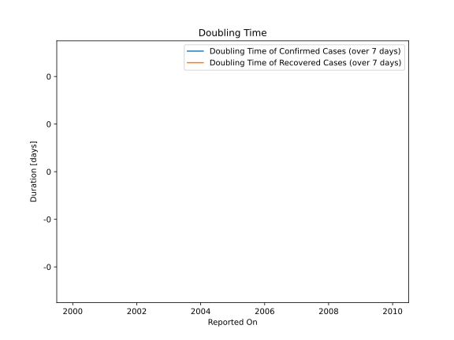

# Country Figures: New Infections in Previous 7 Days per 100,000 Population for Guam 

<!--  --> 

| Reported On | &Delta; Confirmed (on the day) | &Delta; Confirmed (last 7 days) | New Cases in Previous 7 Days per 100,000 Population |
|-------------|--------------------------------|---------------------------------|-----------------------------------------------------|
| 2020-03-21 |  None  |  -3  |  -1.810  |
| 2020-03-20 |  None  |  -3  |  -1.810  |
| 2020-03-19 |  None  |  -3  |  -1.810  |
| 2020-03-18 |  -3  |  -3  |  -1.810  |
| 2020-03-17 |  None  |  None  |  None  |
| 2020-03-16 |  None  |  None  |  None  |

