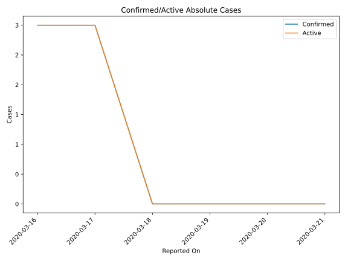
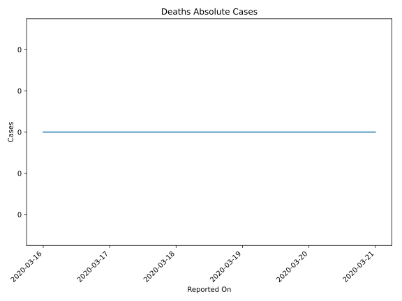
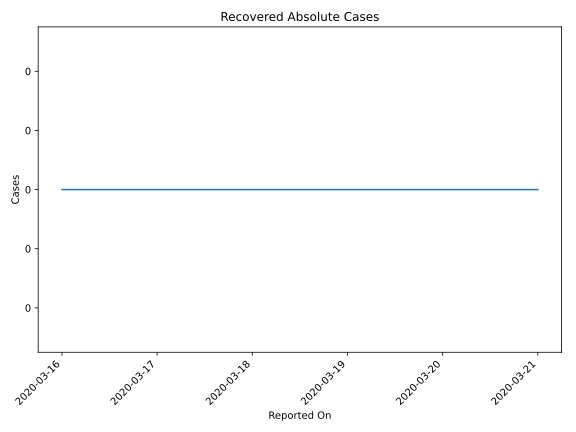
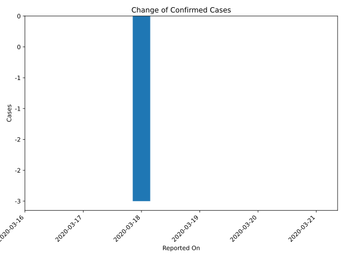
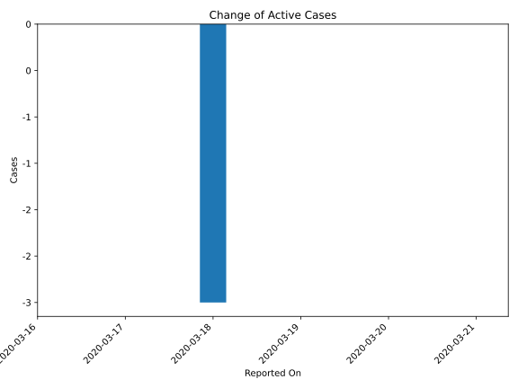
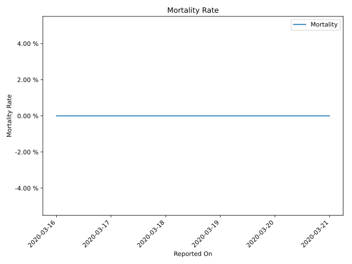

# Country Figures: Time Series for Guam 

| Reported On | Confirmed | Deaths | Recovered | Active | Mortality | &Delta; Confirmed | &Delta; Deaths | &Delta; Recovered | &Delta; Active | % Active of Population |
|-------------|-----------|--------|-----------|--------|-----------|-------------------|----------------|-------------------|----------------|------------------------|
| 2020-03-21 | 0 | 0 | 0 | 0 |  None  | 0 | 0 | 0 | 0 |  n/a  | 
| 2020-03-20 | 0 | 0 | 0 | 0 |  None  | 0 | 0 | 0 | 0 |  n/a  | 
| 2020-03-19 | 0 | 0 | 0 | 0 |  None  | 0 | 0 | 0 | 0 |  n/a  | 
| 2020-03-18 | 0 | 0 | 0 | 0 |  None  | -3 | 0 | 0 | -3 |  n/a  | 
| 2020-03-17 | 3 | 0 | 0 | 3 |  None  | 0 | 0 | 0 | 0 |  0.002 %  | 
| 2020-03-16 | 3 | 0 | 0 | 3 |  None  | None | None | None | None |  0.002 %  | 

