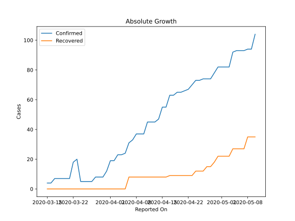
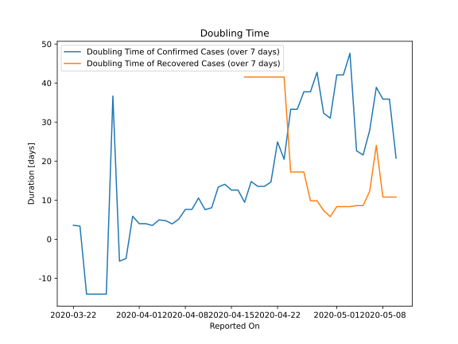

# Country Figures: Doubling Time of Infections for Guyana 

The doubling time below are calculated based on
* an exponential growth assumption
* for time difference of past seven (7) days.
The doubling time's unit is "days".

The first doubling time indicates the increase of confirmed (infected)
cases. There, the *higher* the number is, the better is to take control
of the disease.

The second doubling time indicates the increase of recovered (healed)
cases. There, the *lower* the number is, the better it is to take
control of the disease.

| Reported On | Confirmed | Doubling Time (Confirmed) | Recovered | Doubling Time (Recovered) |
|-------------|-----------|---------------------------|-----------|---------------------------|
| 2020-05-10 | 104 |  20.8 days  | 35 |  10.8 days  | 
| 2020-05-09 | 94 |  35.9 days  | 35 |  10.8 days  | 
| 2020-05-08 | 94 |  35.9 days  | 35 |  10.8 days  | 
| 2020-05-07 | 93 |  38.9 days  | 27 |  24.0 days  | 
| 2020-05-06 | 93 |  27.9 days  | 27 |  12.3 days  | 
| 2020-05-05 | 93 |  21.6 days  | 27 |  8.6 days  | 
| 2020-05-04 | 92 |  22.6 days  | 27 |  8.6 days  | 
| 2020-05-03 | 82 |  47.6 days  | 22 |  8.3 days  | 
| 2020-05-02 | 82 |  42.1 days  | 22 |  8.3 days  | 
| 2020-05-01 | 82 |  42.1 days  | 22 |  8.3 days  | 
| 2020-04-30 | 82 |  31.0 days  | 22 |  5.8 days  | 
| 2020-04-29 | 78 |  32.3 days  | 18 |  7.3 days  | 
| 2020-04-28 | 74 |  42.8 days  | 15 |  9.8 days  | 
| 2020-04-27 | 74 |  37.8 days  | 15 |  9.8 days  | 
| 2020-04-26 | 74 |  37.8 days  | 12 |  17.2 days  | 
| 2020-04-25 | 73 |  33.3 days  | 12 |  17.2 days  | 
| 2020-04-24 | 73 |  33.3 days  | 12 |  17.2 days  | 
| 2020-04-23 | 70 |  20.5 days  | 9 |  41.5 days  | 
| 2020-04-22 | 67 |  24.9 days  | 9 |  41.5 days  | 
| 2020-04-21 | 66 |  14.6 days  | 9 |  41.5 days  | 
| 2020-04-20 | 65 |  13.5 days  | 9 |  41.5 days  | 
| 2020-04-19 | 65 |  13.5 days  | 9 |  41.5 days  | 
| 2020-04-18 | 63 |  14.8 days  | 9 |  41.5 days  | 
| 2020-04-17 | 63 |  9.5 days  | 9 |  41.5 days  | 
| 2020-04-16 | 55 |  12.6 days  | 8 |  None  | 
| 2020-04-15 | 55 |  12.6 days  | 8 |  None  | 
| 2020-04-14 | 47 |  14.1 days  | 8 |  None  | 
| 2020-04-13 | 45 |  13.4 days  | 8 |  None  | 
| 2020-04-12 | 45 |  8.1 days  | 8 |  None  | 
| 2020-04-11 | 45 |  7.6 days  | 8 |  None  | 
| 2020-04-10 | 37 |  10.5 days  | 8 |  None  | 
| 2020-04-09 | 37 |  7.6 days  | 8 |  None  | 
| 2020-04-08 | 37 |  7.6 days  | 8 |  None  | 
| 2020-04-07 | 33 |  5.1 days  | 8 |  None  | 
| 2020-04-06 | 31 |  3.9 days  | 8 |  None  | 
| 2020-04-05 | 24 |  4.8 days  | 0 |  None  | 
| 2020-04-04 | 23 |  4.9 days  | 0 |  None  | 
| 2020-04-03 | 23 |  3.5 days  | 0 |  None  | 
| 2020-04-02 | 19 |  4.0 days  | 0 |  None  | 
| 2020-04-01 | 19 |  4.0 days  | 0 |  None  | 
| 2020-03-31 | 12 |  5.9 days  | 0 |  None  | 
| 2020-03-30 | 8 |  -4.9 days  | 0 |  None  | 
| 2020-03-29 | 8 |  -5.6 days  | 0 |  None  | 
| 2020-03-28 | 8 |  36.7 days  | 0 |  None  | 
| 2020-03-27 | 5 |  -14.1 days  | 0 |  None  | 
| 2020-03-26 | 5 |  -14.1 days  | 0 |  None  | 
| 2020-03-25 | 5 |  -14.1 days  | 0 |  None  | 
| 2020-03-24 | 5 |  -14.1 days  | 0 |  None  | 
| 2020-03-23 | 20 |  3.3 days  | 0 |  None  | 
| 2020-03-22 | 18 |  3.6 days  | 0 |  None  | 
| 2020-03-21 | 7 |  None  | 0 |  None  | 
| 2020-03-20 | 7 |  None  | 0 |  None  | 
| 2020-03-19 | 7 |  None  | 0 |  None  | 
| 2020-03-18 | 7 |  None  | 0 |  None  | 
| 2020-03-17 | 7 |  None  | 0 |  None  | 
| 2020-03-16 | 4 |  None  | 0 |  None  | 
| 2020-03-15 | 4 |  None  | 0 |  None  | 

