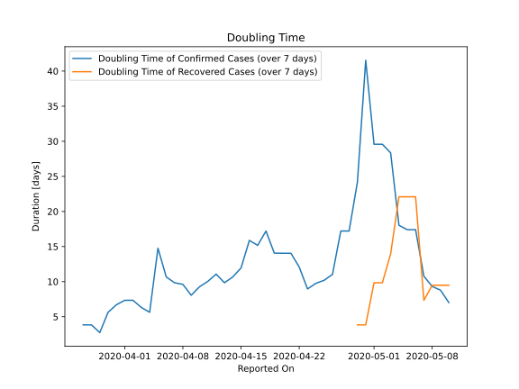

# Country Figures: New Infections in Previous 7 Days per 100,000 Population for Haiti 

<!--  --> 

| Reported On | &Delta; Confirmed (on the day) | &Delta; Confirmed (last 7 days) | New Cases in Previous 7 Days per 100,000 Population |
|-------------|--------------------------------|---------------------------------|-----------------------------------------------------|
| 2020-05-10 |  31  |  94  |  0.845  |
| 2020-05-09 |  5  |  66  |  0.593  |
| 2020-05-08 |  17  |  61  |  0.548  |
| 2020-05-07 |  28  |  48  |  0.432  |
| 2020-05-06 |  None  |  25  |  0.225  |
| 2020-05-05 |  1  |  25  |  0.225  |
| 2020-05-04 |  12  |  24  |  0.216  |
| 2020-05-03 |  3  |  14  |  0.126  |
| 2020-05-02 |  None  |  13  |  0.117  |
| 2020-05-01 |  4  |  13  |  0.117  |
| 2020-04-30 |  5  |  9  |  0.081  |
| 2020-04-29 |  None  |  14  |  0.126  |
| 2020-04-28 |  None  |  19  |  0.171  |
| 2020-04-27 |  2  |  19  |  0.171  |
| 2020-04-26 |  2  |  27  |  0.243  |
| 2020-04-25 |  None  |  28  |  0.252  |
| 2020-04-24 |  None  |  29  |  0.261  |
| 2020-04-23 |  10  |  31  |  0.279  |
| 2020-04-22 |  5  |  21  |  0.189  |
| 2020-04-21 |  None  |  17  |  0.153  |
| 2020-04-20 |  10  |  17  |  0.153  |
| 2020-04-19 |  3  |  14  |  0.126  |
| 2020-04-18 |  1  |  11  |  0.099  |
| 2020-04-17 |  2  |  12  |  0.108  |
| 2020-04-16 |  None  |  11  |  0.099  |
| 2020-04-15 |  1  |  14  |  0.126  |
| 2020-04-14 |  None  |  15  |  0.135  |
| 2020-04-13 |  7  |  16  |  0.144  |
| 2020-04-12 |  None  |  12  |  0.108  |
| 2020-04-11 |  2  |  13  |  0.117  |
| 2020-04-10 |  1  |  13  |  0.117  |
| 2020-04-09 |  3  |  14  |  0.126  |
| 2020-04-08 |  2  |  11  |  0.099  |
| 2020-04-07 |  1  |  10  |  0.090  |
| 2020-04-06 |  3  |  9  |  0.081  |
| 2020-04-05 |  1  |  6  |  0.054  |
| 2020-04-04 |  2  |  12  |  0.108  |
| 2020-04-03 |  2  |  10  |  0.090  |
| 2020-04-02 |  None  |  8  |  0.072  |
| 2020-04-01 |  1  |  8  |  0.072  |
| 2020-03-31 |  None  |  8  |  0.072  |
| 2020-03-30 |  None  |  9  |  0.081  |
| 2020-03-29 |  7  |  13  |  0.117  |
| 2020-03-28 |  None  |  6  |  0.054  |
| 2020-03-27 |  None  |  6  |  0.054  |
| 2020-03-26 |  None  |  6  |  0.054  |
| 2020-03-25 |  1  |  6  |  0.054  |
| 2020-03-24 |  1  |  5  |  0.045  |
| 2020-03-23 |  4  |  4  |  0.036  |
| 2020-03-22 |  None  |  None  |  None  |
| 2020-03-21 |  None  |  None  |  None  |
| 2020-03-20 |  None  |  None  |  None  |

