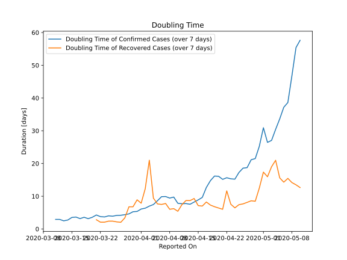

# Country Figures: New Infections in Previous 7 Days per 100,000 Population for Hungary 

<!--  --> 

| Reported On | &Delta; Confirmed (on the day) | &Delta; Confirmed (last 7 days) | New Cases in Previous 7 Days per 100,000 Population |
|-------------|--------------------------------|---------------------------------|-----------------------------------------------------|
| 2020-05-10 |  50  |  265  |  2.713  |
| 2020-05-09 |  35  |  271  |  2.774  |
| 2020-05-08 |  28  |  315  |  3.225  |
| 2020-05-07 |  39  |  375  |  3.839  |
| 2020-05-06 |  46  |  384  |  3.931  |
| 2020-05-05 |  30  |  416  |  4.258  |
| 2020-05-04 |  37  |  452  |  4.627  |
| 2020-05-03 |  56  |  498  |  5.098  |
| 2020-05-02 |  79  |  499  |  5.108  |
| 2020-05-01 |  88  |  420  |  4.299  |
| 2020-04-30 |  48  |  491  |  5.026  |
| 2020-04-29 |  78  |  559  |  5.722  |
| 2020-04-28 |  66  |  551  |  5.640  |
| 2020-04-27 |  83  |  599  |  6.132  |
| 2020-04-26 |  57  |  584  |  5.978  |
| 2020-04-25 |  None  |  609  |  6.234  |
| 2020-04-24 |  159  |  680  |  6.961  |
| 2020-04-23 |  116  |  632  |  6.470  |
| 2020-04-22 |  70  |  589  |  6.029  |
| 2020-04-21 |  114  |  586  |  5.999  |
| 2020-04-20 |  68  |  526  |  5.384  |
| 2020-04-19 |  82  |  506  |  5.180  |
| 2020-04-18 |  71  |  524  |  5.364  |
| 2020-04-17 |  111  |  573  |  5.866  |
| 2020-04-16 |  73  |  672  |  6.879  |
| 2020-04-15 |  67  |  684  |  7.002  |
| 2020-04-14 |  54  |  695  |  7.114  |
| 2020-04-13 |  48  |  714  |  7.309  |
| 2020-04-12 |  100  |  677  |  6.930  |
| 2020-04-11 |  120  |  632  |  6.470  |
| 2020-04-10 |  210  |  567  |  5.804  |
| 2020-04-09 |  85  |  395  |  4.043  |
| 2020-04-08 |  78  |  370  |  3.788  |
| 2020-04-07 |  73  |  325  |  3.327  |
| 2020-04-06 |  11  |  297  |  3.040  |
| 2020-04-05 |  55  |  325  |  3.327  |
| 2020-04-04 |  55  |  335  |  3.429  |
| 2020-04-03 |  38  |  323  |  3.306  |
| 2020-04-02 |  60  |  324  |  3.317  |
| 2020-04-01 |  33  |  299  |  3.061  |
| 2020-03-31 |  45  |  305  |  3.122  |
| 2020-03-30 |  39  |  280  |  2.866  |
| 2020-03-29 |  65  |  277  |  2.836  |
| 2020-03-28 |  43  |  240  |  2.457  |
| 2020-03-27 |  39  |  215  |  2.201  |
| 2020-03-26 |  35  |  188  |  1.924  |
| 2020-03-25 |  39  |  168  |  1.720  |
| 2020-03-24 |  20  |  137  |  1.402  |
| 2020-03-23 |  36  |  128  |  1.310  |
| 2020-03-22 |  28  |  99  |  1.013  |
| 2020-03-21 |  18  |  73  |  0.747  |
| 2020-03-20 |  12  |  66  |  0.676  |
| 2020-03-19 |  15  |  60  |  0.614  |
| 2020-03-18 |  8  |  45  |  0.461  |
| 2020-03-17 |  11  |  41  |  0.420  |
| 2020-03-16 |  7  |  30  |  0.307  |
| 2020-03-15 |  2  |  25  |  0.256  |
| 2020-03-14 |  11  |  26  |  0.266  |
| 2020-03-13 |  6  |  17  |  0.174  |
| 2020-03-12 |  None  |  11  |  0.113  |
| 2020-03-11 |  4  |  11  |  0.113  |
| 2020-03-10 |  None  |  7  |  0.072  |
| 2020-03-09 |  2  |  7  |  0.072  |
| 2020-03-08 |  3  |  5  |  0.051  |
| 2020-03-07 |  2  |  2  |  0.020  |
| 2020-03-06 |  None  |  None  |  None  |
| 2020-03-05 |  None  |  None  |  None  |
| 2020-03-04 |  None  |  None  |  None  |

