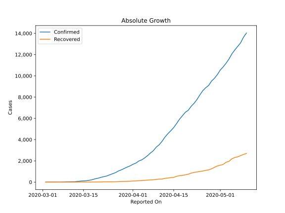
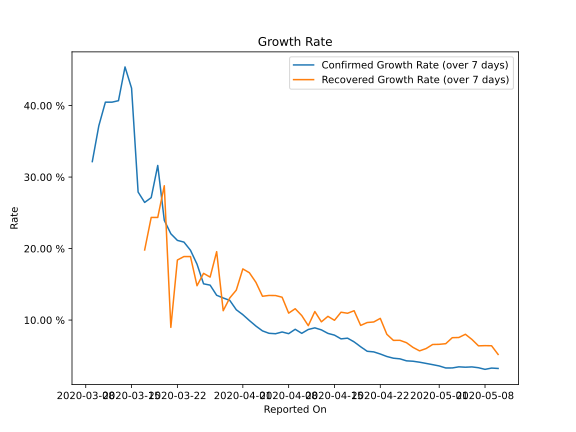

# Country Figures: Growth Rate for Indonesia 

The growth rates below are calculated based on
* an exponential growth assumption
* for time difference of past seven (7) days.
The growth rate is to be understood as on "growth per day".

The first growth rate indicates the increase of confirmed (infected) cases.

The second growth rate indicates the increase of recovered (healed) cases.

| Reported On | Confirmed | Growth Rate (Confirmed) | Recovered | Growth Rate (Recovered) |
|-------------|-----------|-------------------------|-----------|-------------------------|
| 2020-05-10 | 14032 |  3.23 %  | 2698 |  5.191 %  | 
| 2020-05-09 | 13645 |  3.28 %  | 2607 |  6.405 %  | 
| 2020-05-08 | 13112 |  3.10 %  | 2494 |  6.422 %  | 
| 2020-05-07 | 12776 |  3.33 %  | 2381 |  6.393 %  | 
| 2020-05-06 | 12438 |  3.45 %  | 2317 |  7.289 %  | 
| 2020-05-05 | 12071 |  3.41 %  | 2197 |  8.011 %  | 
| 2020-05-04 | 11587 |  3.46 %  | 1954 |  7.561 %  | 
| 2020-05-03 | 11192 |  3.30 %  | 1876 |  7.536 %  | 
| 2020-05-02 | 10843 |  3.30 %  | 1665 |  6.695 %  | 
| 2020-05-01 | 10551 |  3.58 %  | 1591 |  6.605 %  | 
| 2020-04-30 | 10118 |  3.76 %  | 1522 |  6.584 %  | 
| 2020-04-29 | 9771 |  3.94 %  | 1391 |  6.015 %  | 
| 2020-04-28 | 9511 |  4.11 %  | 1254 |  5.690 %  | 
| 2020-04-27 | 9096 |  4.24 %  | 1151 |  6.176 %  | 
| 2020-04-26 | 8882 |  4.30 %  | 1107 |  6.836 %  | 
| 2020-04-25 | 8607 |  4.58 %  | 1042 |  7.166 %  | 
| 2020-04-24 | 8211 |  4.67 %  | 1002 |  7.160 %  | 
| 2020-04-23 | 7775 |  4.90 %  | 960 |  8.009 %  | 
| 2020-04-22 | 7418 |  5.25 %  | 913 |  10.235 %  | 
| 2020-04-21 | 7135 |  5.55 %  | 842 |  9.733 %  | 
| 2020-04-20 | 6760 |  5.63 %  | 747 |  9.656 %  | 
| 2020-04-19 | 6575 |  6.26 %  | 686 |  9.251 %  | 
| 2020-04-18 | 6248 |  6.95 %  | 631 |  11.304 %  | 
| 2020-04-17 | 5923 |  7.47 %  | 607 |  10.952 %  | 
| 2020-04-16 | 5516 |  7.37 %  | 548 |  11.098 %  | 
| 2020-04-15 | 5136 |  7.89 %  | 446 |  9.966 %  | 
| 2020-04-14 | 4839 |  8.14 %  | 426 |  10.519 %  | 
| 2020-04-13 | 4557 |  8.63 %  | 380 |  9.753 %  | 
| 2020-04-12 | 4241 |  8.91 %  | 359 |  11.192 %  | 
| 2020-04-11 | 3842 |  8.68 %  | 286 |  9.219 %  | 
| 2020-04-10 | 3512 |  8.14 %  | 282 |  10.630 %  | 
| 2020-04-09 | 3293 |  8.71 %  | 252 |  11.585 %  | 
| 2020-04-08 | 2956 |  8.10 %  | 222 |  10.971 %  | 
| 2020-04-07 | 2738 |  8.33 %  | 204 |  13.195 %  | 
| 2020-04-06 | 2491 |  8.09 %  | 192 |  13.429 %  | 
| 2020-04-05 | 2273 |  8.15 %  | 164 |  13.443 %  | 
| 2020-04-04 | 2092 |  8.49 %  | 150 |  13.330 %  | 
| 2020-04-03 | 1986 |  9.16 %  | 134 |  15.274 %  | 
| 2020-04-02 | 1790 |  9.93 %  | 112 |  16.616 %  | 
| 2020-04-01 | 1677 |  10.75 %  | 103 |  17.153 %  | 
| 2020-03-31 | 1528 |  11.44 %  | 81 |  14.189 %  | 
| 2020-03-30 | 1414 |  12.76 %  | 75 |  13.090 %  | 
| 2020-03-29 | 1285 |  13.09 %  | 64 |  11.308 %  | 
| 2020-03-28 | 1155 |  13.47 %  | 59 |  19.564 %  | 
| 2020-03-27 | 1046 |  14.88 %  | 46 |  16.008 %  | 
| 2020-03-26 | 893 |  15.07 %  | 35 |  16.535 %  | 
| 2020-03-25 | 790 |  17.82 %  | 31 |  14.801 %  | 
| 2020-03-24 | 686 |  19.76 %  | 30 |  18.882 %  | 
| 2020-03-23 | 579 |  20.91 %  | 30 |  18.882 %  | 
| 2020-03-22 | 514 |  21.14 %  | 29 |  18.398 %  | 
| 2020-03-21 | 450 |  22.07 %  | 15 |  8.980 %  | 
| 2020-03-20 | 369 |  23.95 %  | 15 |  28.784 %  | 
| 2020-03-19 | 311 |  31.62 %  | 11 |  24.354 %  | 
| 2020-03-18 | 227 |  27.12 %  | 11 |  24.354 %  | 
| 2020-03-17 | 172 |  26.45 %  | 8 |  19.804 %  | 
| 2020-03-16 | 134 |  27.91 %  | 8 |  None  | 
| 2020-03-15 | 117 |  42.43 %  | 8 |  None  | 
| 2020-03-14 | 96 |  45.40 %  | 8 |  None  | 
| 2020-03-13 | 69 |  40.68 %  | 2 |  None  | 
| 2020-03-12 | 34 |  40.47 %  | 2 |  None  | 
| 2020-03-11 | 34 |  40.47 %  | 2 |  None  | 
| 2020-03-10 | 27 |  37.18 %  | 2 |  None  | 
| 2020-03-09 | 19 |  32.16 %  | 0 |  None  | 
| 2020-03-08 | 6 |  None  | 0 |  None  | 
| 2020-03-07 | 4 |  None  | 0 |  None  | 
| 2020-03-06 | 4 |  None  | 0 |  None  | 
| 2020-03-05 | 2 |  None  | 0 |  None  | 
| 2020-03-04 | 2 |  None  | 0 |  None  | 
| 2020-03-03 | 2 |  None  | 0 |  None  | 
| 2020-03-02 | 2 |  None  | 0 |  None  | 

