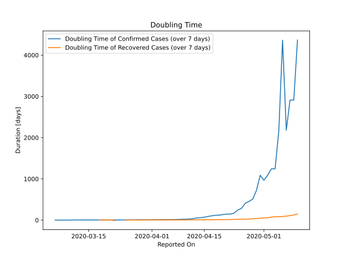

# Country Figures: New Infections in Previous 7 Days per 100,000 Population for Iceland 

<!--  --> 

| Reported On | &Delta; Confirmed (on the day) | &Delta; Confirmed (last 7 days) | New Cases in Previous 7 Days per 100,000 Population |
|-------------|--------------------------------|---------------------------------|-----------------------------------------------------|
| 2020-05-10 |  None  |  2  |  0.566  |
| 2020-05-09 |  None  |  3  |  0.848  |
| 2020-05-08 |  None  |  3  |  0.848  |
| 2020-05-07 |  2  |  4  |  1.131  |
| 2020-05-06 |  None  |  2  |  0.566  |
| 2020-05-05 |  None  |  4  |  1.131  |
| 2020-05-04 |  None  |  7  |  1.980  |
| 2020-05-03 |  1  |  7  |  1.980  |
| 2020-05-02 |  None  |  8  |  2.263  |
| 2020-05-01 |  1  |  9  |  2.545  |
| 2020-04-30 |  None  |  8  |  2.263  |
| 2020-04-29 |  2  |  12  |  3.394  |
| 2020-04-28 |  3  |  17  |  4.808  |
| 2020-04-27 |  None  |  19  |  5.374  |
| 2020-04-26 |  2  |  21  |  5.939  |
| 2020-04-25 |  1  |  30  |  8.485  |
| 2020-04-24 |  None  |  35  |  9.899  |
| 2020-04-23 |  4  |  50  |  14.141  |
| 2020-04-22 |  7  |  58  |  16.404  |
| 2020-04-21 |  5  |  58  |  16.404  |
| 2020-04-20 |  2  |  62  |  17.535  |
| 2020-04-19 |  11  |  70  |  19.798  |
| 2020-04-18 |  6  |  71  |  20.081  |
| 2020-04-17 |  15  |  79  |  22.343  |
| 2020-04-16 |  12  |  91  |  25.737  |
| 2020-04-15 |  7  |  111  |  31.394  |
| 2020-04-14 |  9  |  134  |  37.899  |
| 2020-04-13 |  10  |  149  |  42.141  |
| 2020-04-12 |  12  |  215  |  60.808  |
| 2020-04-11 |  14  |  272  |  76.929  |
| 2020-04-10 |  27  |  311  |  87.959  |
| 2020-04-09 |  32  |  329  |  93.050  |
| 2020-04-08 |  30  |  396  |  111.999  |
| 2020-04-07 |  24  |  451  |  127.555  |
| 2020-04-06 |  76  |  476  |  134.625  |
| 2020-04-05 |  69  |  466  |  131.797  |
| 2020-04-04 |  53  |  454  |  128.403  |
| 2020-04-03 |  45  |  474  |  134.060  |
| 2020-04-02 |  99  |  517  |  146.221  |
| 2020-04-01 |  85  |  483  |  136.605  |
| 2020-03-31 |  49  |  487  |  137.736  |
| 2020-03-30 |  66  |  498  |  140.847  |
| 2020-03-29 |  57  |  452  |  127.837  |
| 2020-03-28 |  73  |  490  |  138.585  |
| 2020-03-27 |  88  |  481  |  136.039  |
| 2020-03-26 |  65  |  472  |  133.494  |
| 2020-03-25 |  89  |  487  |  137.736  |
| 2020-03-24 |  60  |  428  |  121.050  |
| 2020-03-23 |  20  |  408  |  115.393  |
| 2020-03-22 |  95  |  397  |  112.282  |
| 2020-03-21 |  64  |  317  |  89.656  |
| 2020-03-20 |  79  |  275  |  77.777  |
| 2020-03-19 |  80  |  227  |  64.202  |
| 2020-03-18 |  30  |  165  |  46.666  |
| 2020-03-17 |  40  |  151  |  42.707  |
| 2020-03-16 |  9  |  122  |  34.505  |
| 2020-03-15 |  15  |  121  |  34.222  |
| 2020-03-14 |  22  |  106  |  29.980  |
| 2020-03-13 |  31  |  91  |  25.737  |
| 2020-03-12 |  18  |  69  |  19.515  |
| 2020-03-11 |  16  |  59  |  16.687  |
| 2020-03-10 |  11  |  58  |  16.404  |
| 2020-03-09 |  8  |  52  |  14.707  |
| 2020-03-08 |  None  |  47  |  13.293  |
| 2020-03-07 |  7  |  49  |  13.858  |
| 2020-03-06 |  9  |  42  |  11.879  |
| 2020-03-05 |  8  |  33  |  9.333  |
| 2020-03-04 |  15  |  25  |  7.071  |
| 2020-03-03 |  5  |  10  |  2.828  |
| 2020-03-02 |  3  |  5  |  1.414  |
| 2020-03-01 |  2  |  2  |  0.566  |
| 2020-02-29 |  None  |  None  |  None  |
| 2020-02-28 |  None  |  None  |  None  |

