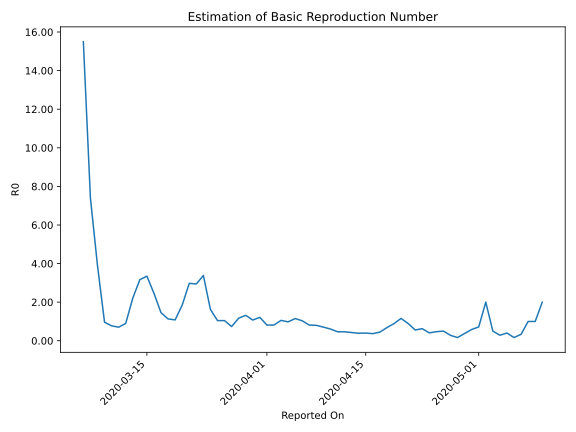

# Country Figures: Time Series for Basic Reproduction Number of Iceland 

| Reported On | &Delta; Confirmed | Total &Delta; Confirmed First Interval | Total &Delta; Confirmed Second Interval | Estimated Basic Reproduction Number R0 | 
|-------------|-------------------|----------------------------------------|-----------------------------------------|---------------------------------------------------|
| 2020-05-10 | 0 |  2  |  1  |  2.00  | 
| 2020-05-09 | 0 |  2  |  2  |  1.00  | 
| 2020-05-08 | 0 |  2  |  2  |  1.00  | 
| 2020-05-07 | 2 |  1  |  3  |  0.33  | 
| 2020-05-06 | 0 |  1  |  6  |  0.17  | 
| 2020-05-05 | 0 |  2  |  5  |  0.40  | 
| 2020-05-04 | 0 |  2  |  7  |  0.29  | 
| 2020-05-03 | 1 |  3  |  6  |  0.50  | 
| 2020-05-02 | 0 |  6  |  3  |  2.00  | 
| 2020-05-01 | 1 |  5  |  7  |  0.71  | 
| 2020-04-30 | 0 |  7  |  12  |  0.58  | 
| 2020-04-29 | 2 |  6  |  16  |  0.38  | 
| 2020-04-28 | 3 |  3  |  18  |  0.17  | 
| 2020-04-27 | 0 |  7  |  25  |  0.28  | 
| 2020-04-26 | 2 |  12  |  24  |  0.50  | 
| 2020-04-25 | 1 |  16  |  34  |  0.47  | 
| 2020-04-24 | 0 |  18  |  44  |  0.41  | 
| 2020-04-23 | 4 |  25  |  40  |  0.62  | 
| 2020-04-22 | 7 |  24  |  43  |  0.56  | 
| 2020-04-21 | 5 |  34  |  38  |  0.89  | 
| 2020-04-20 | 2 |  44  |  38  |  1.16  | 
| 2020-04-19 | 11 |  40  |  45  |  0.89  | 
| 2020-04-18 | 6 |  43  |  63  |  0.68  | 
| 2020-04-17 | 15 |  38  |  85  |  0.45  | 
| 2020-04-16 | 12 |  38  |  103  |  0.37  | 
| 2020-04-15 | 7 |  45  |  113  |  0.40  | 
| 2020-04-14 | 9 |  63  |  162  |  0.39  | 
| 2020-04-13 | 10 |  85  |  199  |  0.43  | 
| 2020-04-12 | 12 |  103  |  222  |  0.46  | 
| 2020-04-11 | 14 |  113  |  243  |  0.47  | 
| 2020-04-10 | 27 |  162  |  266  |  0.61  | 
| 2020-04-09 | 32 |  199  |  282  |  0.71  | 
| 2020-04-08 | 30 |  222  |  278  |  0.80  | 
| 2020-04-07 | 24 |  243  |  299  |  0.81  | 
| 2020-04-06 | 76 |  266  |  257  |  1.04  | 
| 2020-04-05 | 69 |  282  |  245  |  1.15  | 
| 2020-04-04 | 53 |  278  |  284  |  0.98  | 
| 2020-04-03 | 45 |  299  |  283  |  1.06  | 
| 2020-04-02 | 99 |  257  |  315  |  0.82  | 
| 2020-04-01 | 85 |  245  |  302  |  0.81  | 
| 2020-03-31 | 49 |  284  |  234  |  1.21  | 
| 2020-03-30 | 66 |  283  |  264  |  1.07  | 
| 2020-03-29 | 57 |  315  |  239  |  1.32  | 
| 2020-03-28 | 73 |  302  |  258  |  1.17  | 
| 2020-03-27 | 88 |  234  |  318  |  0.74  | 
| 2020-03-26 | 65 |  264  |  253  |  1.04  | 
| 2020-03-25 | 89 |  239  |  229  |  1.04  | 
| 2020-03-24 | 60 |  258  |  159  |  1.62  | 
| 2020-03-23 | 20 |  318  |  94  |  3.38  | 
| 2020-03-22 | 95 |  253  |  86  |  2.94  | 
| 2020-03-21 | 64 |  229  |  77  |  2.97  | 
| 2020-03-20 | 79 |  159  |  86  |  1.85  | 
| 2020-03-19 | 80 |  94  |  87  |  1.08  | 
| 2020-03-18 | 30 |  86  |  76  |  1.13  | 
| 2020-03-17 | 40 |  77  |  53  |  1.45  | 
| 2020-03-16 | 9 |  86  |  35  |  2.46  | 
| 2020-03-15 | 15 |  87  |  26  |  3.35  | 
| 2020-03-14 | 22 |  76  |  24  |  3.17  | 
| 2020-03-13 | 31 |  53  |  24  |  2.21  | 
| 2020-03-12 | 18 |  35  |  39  |  0.90  | 
| 2020-03-11 | 16 |  26  |  37  |  0.70  | 
| 2020-03-10 | 11 |  24  |  31  |  0.77  | 
| 2020-03-09 | 8 |  24  |  25  |  0.96  | 
| 2020-03-08 | 0 |  39  |  10  |  3.90  | 
| 2020-03-07 | 7 |  37  |  5  |  7.40  | 
| 2020-03-06 | 9 |  31  |  2  |  15.50  | 
| 2020-03-05 | 8 |  25  |  None  |  None  | 
| 2020-03-04 | 15 |  10  |  None  |  None  | 
| 2020-03-03 | 5 |  5  |  None  |  None  | 
| 2020-03-02 | 3 |  2  |  None  |  None  | 
| 2020-03-01 | 2 |  None  |  None  |  None  | 
| 2020-02-29 | 0 |  None  |  None  |  None  | 
| 2020-02-28 | None |  None  |  None  |  None  | 

