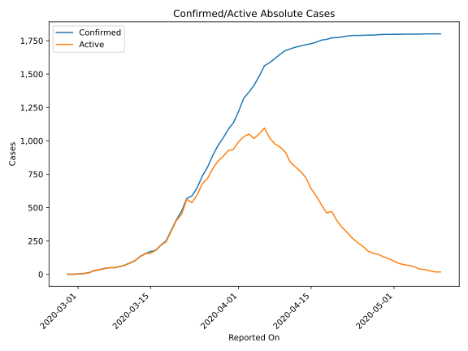
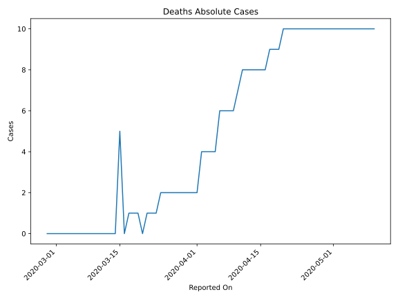
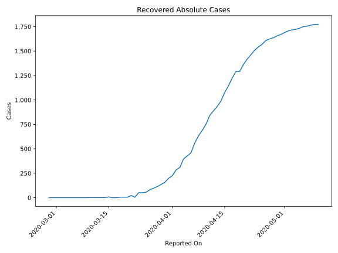
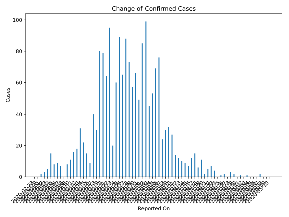
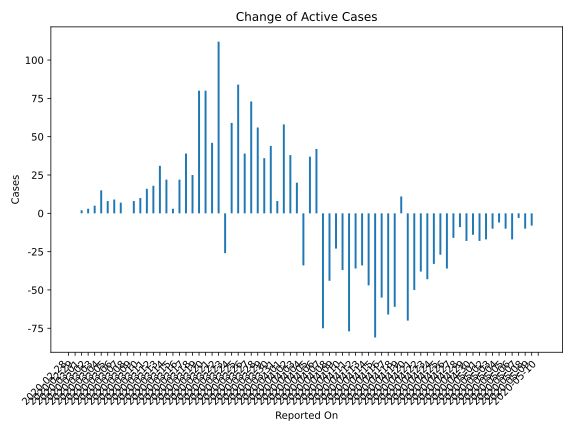
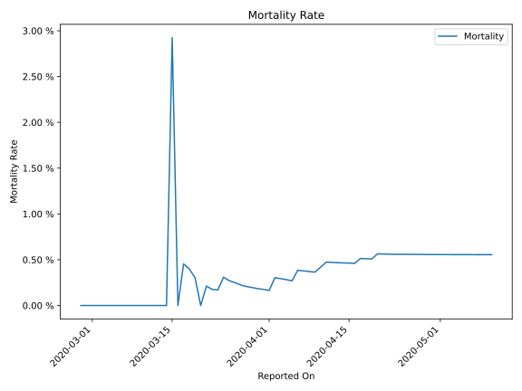

# Country Figures: Time Series for Iceland 

| Reported On | Confirmed | Deaths | Recovered | Active | Mortality | &Delta; Confirmed | &Delta; Deaths | &Delta; Recovered | &Delta; Active | % Active of Population |
|-------------|-----------|--------|-----------|--------|-----------|-------------------|----------------|-------------------|----------------|------------------------|
| 2020-05-10 | 1801 | 10 | 1773 | 18 |  0.56 %  | 0 | 0 | 0 | 0 |  0.005 %  | 
| 2020-05-09 | 1801 | 10 | 1773 | 18 |  0.56 %  | 0 | 0 | 8 | -8 |  0.005 %  | 
| 2020-05-08 | 1801 | 10 | 1765 | 26 |  0.56 %  | 0 | 0 | 10 | -10 |  0.007 %  | 
| 2020-05-07 | 1801 | 10 | 1755 | 36 |  0.56 %  | 2 | 0 | 5 | -3 |  0.010 %  | 
| 2020-05-06 | 1799 | 10 | 1750 | 39 |  0.56 %  | 0 | 0 | 17 | -17 |  0.011 %  | 
| 2020-05-05 | 1799 | 10 | 1733 | 56 |  0.56 %  | 0 | 0 | 10 | -10 |  0.016 %  | 
| 2020-05-04 | 1799 | 10 | 1723 | 66 |  0.56 %  | 0 | 0 | 6 | -6 |  0.019 %  | 
| 2020-05-03 | 1799 | 10 | 1717 | 72 |  0.56 %  | 1 | 0 | 11 | -10 |  0.020 %  | 
| 2020-05-02 | 1798 | 10 | 1706 | 82 |  0.56 %  | 0 | 0 | 17 | -17 |  0.023 %  | 
| 2020-05-01 | 1798 | 10 | 1689 | 99 |  0.56 %  | 1 | 0 | 19 | -18 |  0.028 %  | 
| 2020-04-30 | 1797 | 10 | 1670 | 117 |  0.56 %  | 0 | 0 | 14 | -14 |  0.033 %  | 
| 2020-04-29 | 1797 | 10 | 1656 | 131 |  0.56 %  | 2 | 0 | 20 | -18 |  0.037 %  | 
| 2020-04-28 | 1795 | 10 | 1636 | 149 |  0.56 %  | 3 | 0 | 12 | -9 |  0.042 %  | 
| 2020-04-27 | 1792 | 10 | 1624 | 158 |  0.56 %  | 0 | 0 | 16 | -16 |  0.045 %  | 
| 2020-04-26 | 1792 | 10 | 1608 | 174 |  0.56 %  | 2 | 0 | 38 | -36 |  0.049 %  | 
| 2020-04-25 | 1790 | 10 | 1570 | 210 |  0.56 %  | 1 | 0 | 28 | -27 |  0.059 %  | 
| 2020-04-24 | 1789 | 10 | 1542 | 237 |  0.56 %  | 0 | 0 | 33 | -33 |  0.067 %  | 
| 2020-04-23 | 1789 | 10 | 1509 | 270 |  0.56 %  | 4 | 0 | 47 | -43 |  0.076 %  | 
| 2020-04-22 | 1785 | 10 | 1462 | 313 |  0.56 %  | 7 | 0 | 45 | -38 |  0.089 %  | 
| 2020-04-21 | 1778 | 10 | 1417 | 351 |  0.56 %  | 5 | 0 | 55 | -50 |  0.099 %  | 
| 2020-04-20 | 1773 | 10 | 1362 | 401 |  0.56 %  | 2 | 1 | 71 | -70 |  0.113 %  | 
| 2020-04-19 | 1771 | 9 | 1291 | 471 |  0.51 %  | 11 | 0 | 0 | 11 |  0.133 %  | 
| 2020-04-18 | 1760 | 9 | 1291 | 460 |  0.51 %  | 6 | 0 | 67 | -61 |  0.130 %  | 
| 2020-04-17 | 1754 | 9 | 1224 | 521 |  0.51 %  | 15 | 1 | 80 | -66 |  0.147 %  | 
| 2020-04-16 | 1739 | 8 | 1144 | 587 |  0.46 %  | 12 | 0 | 67 | -55 |  0.166 %  | 
| 2020-04-15 | 1727 | 8 | 1077 | 642 |  0.46 %  | 7 | 0 | 88 | -81 |  0.182 %  | 
| 2020-04-14 | 1720 | 8 | 989 | 723 |  0.47 %  | 9 | 0 | 56 | -47 |  0.204 %  | 
| 2020-04-13 | 1711 | 8 | 933 | 770 |  0.47 %  | 10 | 0 | 44 | -34 |  0.218 %  | 
| 2020-04-12 | 1701 | 8 | 889 | 804 |  0.47 %  | 12 | 0 | 48 | -36 |  0.227 %  | 
| 2020-04-11 | 1689 | 8 | 841 | 840 |  0.47 %  | 14 | 1 | 90 | -77 |  0.238 %  | 
| 2020-04-10 | 1675 | 7 | 751 | 917 |  0.42 %  | 27 | 1 | 63 | -37 |  0.259 %  | 
| 2020-04-09 | 1648 | 6 | 688 | 954 |  0.36 %  | 32 | 0 | 55 | -23 |  0.270 %  | 
| 2020-04-08 | 1616 | 6 | 633 | 977 |  0.37 %  | 30 | 0 | 74 | -44 |  0.276 %  | 
| 2020-04-07 | 1586 | 6 | 559 | 1021 |  0.38 %  | 24 | 0 | 99 | -75 |  0.289 %  | 
| 2020-04-06 | 1562 | 6 | 460 | 1096 |  0.38 %  | 76 | 2 | 32 | 42 |  0.310 %  | 
| 2020-04-05 | 1486 | 4 | 428 | 1054 |  0.27 %  | 69 | 0 | 32 | 37 |  0.298 %  | 
| 2020-04-04 | 1417 | 4 | 396 | 1017 |  0.28 %  | 53 | 0 | 87 | -34 |  0.288 %  | 
| 2020-04-03 | 1364 | 4 | 309 | 1051 |  0.29 %  | 45 | 0 | 25 | 20 |  0.297 %  | 
| 2020-04-02 | 1319 | 4 | 284 | 1031 |  0.30 %  | 99 | 2 | 59 | 38 |  0.292 %  | 
| 2020-04-01 | 1220 | 2 | 225 | 993 |  0.16 %  | 85 | 0 | 27 | 58 |  0.281 %  | 
| 2020-03-31 | 1135 | 2 | 198 | 935 |  0.18 %  | 49 | 0 | 41 | 8 |  0.264 %  | 
| 2020-03-30 | 1086 | 2 | 157 | 927 |  0.18 %  | 66 | 0 | 22 | 44 |  0.262 %  | 
| 2020-03-29 | 1020 | 2 | 135 | 883 |  0.20 %  | 57 | 0 | 21 | 36 |  0.250 %  | 
| 2020-03-28 | 963 | 2 | 114 | 847 |  0.21 %  | 73 | 0 | 17 | 56 |  0.240 %  | 
| 2020-03-27 | 890 | 2 | 97 | 791 |  0.22 %  | 88 | 0 | 15 | 73 |  0.224 %  | 
| 2020-03-26 | 802 | 2 | 82 | 718 |  0.25 %  | 65 | 0 | 26 | 39 |  0.203 %  | 
| 2020-03-25 | 737 | 2 | 56 | 679 |  0.27 %  | 89 | 0 | 5 | 84 |  0.192 %  | 
| 2020-03-24 | 648 | 2 | 51 | 595 |  0.31 %  | 60 | 1 | 0 | 59 |  0.168 %  | 
| 2020-03-23 | 588 | 1 | 51 | 536 |  0.17 %  | 20 | 0 | 46 | -26 |  0.152 %  | 
| 2020-03-22 | 568 | 1 | 5 | 562 |  0.18 %  | 95 | 0 | -17 | 112 |  0.159 %  | 
| 2020-03-21 | 473 | 1 | 22 | 450 |  0.21 %  | 64 | 1 | 17 | 46 |  0.127 %  | 
| 2020-03-20 | 409 | 0 | 5 | 404 |  None  | 79 | -1 | 0 | 80 |  0.114 %  | 
| 2020-03-19 | 330 | 1 | 5 | 324 |  0.30 %  | 80 | 0 | 0 | 80 |  0.092 %  | 
| 2020-03-18 | 250 | 1 | 5 | 244 |  0.40 %  | 30 | 0 | 5 | 25 |  0.069 %  | 
| 2020-03-17 | 220 | 1 | 0 | 219 |  0.45 %  | 40 | 1 | 0 | 39 |  0.062 %  | 
| 2020-03-16 | 180 | 0 | 0 | 180 |  None  | 9 | -5 | -8 | 22 |  0.051 %  | 
| 2020-03-15 | 171 | 5 | 8 | 158 |  2.92 %  | 15 | 5 | 7 | 3 |  0.045 %  | 
| 2020-03-14 | 156 | 0 | 1 | 155 |  None  | 22 | 0 | 0 | 22 |  0.044 %  | 
| 2020-03-13 | 134 | 0 | 1 | 133 |  None  | 31 | 0 | 0 | 31 |  0.038 %  | 
| 2020-03-12 | 103 | 0 | 1 | 102 |  None  | 18 | 0 | 0 | 18 |  0.029 %  | 
| 2020-03-11 | 85 | 0 | 1 | 84 |  None  | 16 | 0 | 0 | 16 |  0.024 %  | 
| 2020-03-10 | 69 | 0 | 1 | 68 |  None  | 11 | 0 | 1 | 10 |  0.019 %  | 
| 2020-03-09 | 58 | 0 | 0 | 58 |  None  | 8 | 0 | 0 | 8 |  0.016 %  | 
| 2020-03-08 | 50 | 0 | 0 | 50 |  None  | 0 | 0 | 0 | 0 |  0.014 %  | 
| 2020-03-07 | 50 | 0 | 0 | 50 |  None  | 7 | 0 | 0 | 7 |  0.014 %  | 
| 2020-03-06 | 43 | 0 | 0 | 43 |  None  | 9 | 0 | 0 | 9 |  0.012 %  | 
| 2020-03-05 | 34 | 0 | 0 | 34 |  None  | 8 | 0 | 0 | 8 |  0.010 %  | 
| 2020-03-04 | 26 | 0 | 0 | 26 |  None  | 15 | 0 | 0 | 15 |  0.007 %  | 
| 2020-03-03 | 11 | 0 | 0 | 11 |  None  | 5 | 0 | 0 | 5 |  0.003 %  | 
| 2020-03-02 | 6 | 0 | 0 | 6 |  None  | 3 | 0 | 0 | 3 |  0.002 %  | 
| 2020-03-01 | 3 | 0 | 0 | 3 |  None  | 2 | 0 | 0 | 2 |  0.001 %  | 
| 2020-02-29 | 1 | 0 | 0 | 1 |  None  | 0 | 0 | 0 | 0 |  0.000 %  | 
| 2020-02-28 | 1 | 0 | 0 | 1 |  None  | None | None | None | None |  0.000 %  | 

