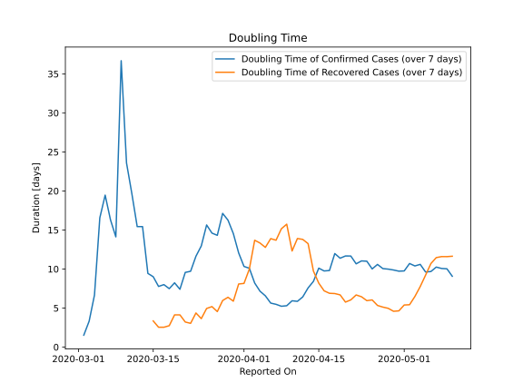

# Country Figures: New Infections in Previous 7 Days per 100,000 Population for Kuwait 

<!--  --> 

| Reported On | &Delta; Confirmed (on the day) | &Delta; Confirmed (last 7 days) | New Cases in Previous 7 Days per 100,000 Population |
|-------------|--------------------------------|---------------------------------|-----------------------------------------------------|
| 2020-05-10 |  1065  |  3705  |  89.551  |
| 2020-05-09 |  415  |  3004  |  72.608  |
| 2020-05-08 |  641  |  2831  |  68.426  |
| 2020-05-07 |  278  |  2543  |  61.465  |
| 2020-05-06 |  485  |  2549  |  61.610  |
| 2020-05-05 |  526  |  2364  |  57.139  |
| 2020-05-04 |  295  |  1990  |  48.099  |
| 2020-05-03 |  364  |  1908  |  46.117  |
| 2020-05-02 |  242  |  1727  |  41.742  |
| 2020-05-01 |  353  |  1763  |  42.612  |
| 2020-04-30 |  284  |  1625  |  39.277  |
| 2020-04-29 |  300  |  1492  |  36.062  |
| 2020-04-28 |  152  |  1360  |  32.872  |
| 2020-04-27 |  213  |  1293  |  31.252  |
| 2020-04-26 |  183  |  1160  |  28.038  |
| 2020-04-25 |  278  |  1141  |  27.578  |
| 2020-04-24 |  215  |  956  |  23.107  |
| 2020-04-23 |  151  |  875  |  21.149  |
| 2020-04-22 |  168  |  843  |  20.376  |
| 2020-04-21 |  85  |  725  |  17.523  |
| 2020-04-20 |  80  |  695  |  16.798  |
| 2020-04-19 |  164  |  681  |  16.460  |
| 2020-04-18 |  93  |  597  |  14.430  |
| 2020-04-17 |  134  |  665  |  16.073  |
| 2020-04-16 |  119  |  614  |  14.841  |
| 2020-04-15 |  50  |  550  |  13.294  |
| 2020-04-14 |  55  |  612  |  14.792  |
| 2020-04-13 |  66  |  635  |  15.348  |
| 2020-04-12 |  80  |  678  |  16.387  |
| 2020-04-11 |  161  |  675  |  16.315  |
| 2020-04-10 |  83  |  576  |  13.922  |
| 2020-04-09 |  55  |  568  |  13.729  |
| 2020-04-08 |  112  |  538  |  13.004  |
| 2020-04-07 |  78  |  454  |  10.973  |
| 2020-04-06 |  109  |  399  |  9.644  |
| 2020-04-05 |  77  |  301  |  7.275  |
| 2020-04-04 |  62  |  244  |  5.898  |
| 2020-04-03 |  75  |  192  |  4.641  |
| 2020-04-02 |  25  |  134  |  3.239  |
| 2020-04-01 |  28  |  122  |  2.949  |
| 2020-03-31 |  23  |  98  |  2.369  |
| 2020-03-30 |  11  |  77  |  1.861  |
| 2020-03-29 |  20  |  67  |  1.619  |
| 2020-03-28 |  10  |  59  |  1.426  |
| 2020-03-27 |  17  |  66  |  1.595  |
| 2020-03-26 |  13  |  60  |  1.450  |
| 2020-03-25 |  4  |  53  |  1.281  |
| 2020-03-24 |  2  |  61  |  1.474  |
| 2020-03-23 |  1  |  66  |  1.595  |
| 2020-03-22 |  12  |  76  |  1.837  |
| 2020-03-21 |  17  |  72  |  1.740  |
| 2020-03-20 |  11  |  79  |  1.909  |
| 2020-03-19 |  6  |  68  |  1.644  |
| 2020-03-18 |  12  |  70  |  1.692  |
| 2020-03-17 |  7  |  61  |  1.474  |
| 2020-03-16 |  11  |  59  |  1.426  |
| 2020-03-15 |  8  |  48  |  1.160  |
| 2020-03-14 |  24  |  43  |  1.039  |
| 2020-03-13 |  None  |  22  |  0.532  |
| 2020-03-12 |  8  |  22  |  0.532  |
| 2020-03-11 |  3  |  16  |  0.387  |
| 2020-03-10 |  5  |  13  |  0.314  |
| 2020-03-09 |  None  |  8  |  0.193  |
| 2020-03-08 |  3  |  19  |  0.459  |
| 2020-03-07 |  3  |  16  |  0.387  |
| 2020-03-06 |  None  |  13  |  0.314  |
| 2020-03-05 |  2  |  15  |  0.363  |
| 2020-03-04 |  None  |  30  |  0.725  |
| 2020-03-03 |  None  |  45  |  1.088  |
| 2020-03-02 |  11  |  55  |  1.329  |
| 2020-03-01 |  None  |  44  |  1.063  |
| 2020-02-29 |  None  |  44  |  1.063  |
| 2020-02-28 |  2  |  44  |  1.063  |
| 2020-02-27 |  17  |  42  |  1.015  |
| 2020-02-26 |  15  |  25  |  0.604  |
| 2020-02-25 |  10  |  10  |  0.242  |
| 2020-02-24 |  None  |  None  |  None  |

