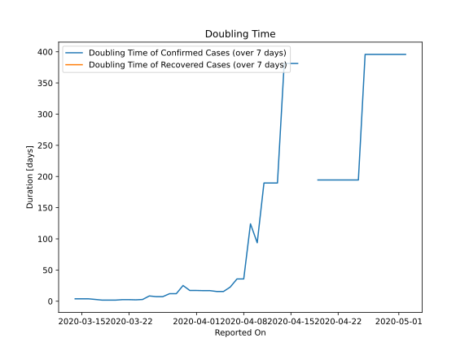

# Country Figures: New Infections in Previous 7 Days per 100,000 Population for Liechtenstein 

<!--  --> 

| Reported On | &Delta; Confirmed (on the day) | &Delta; Confirmed (last 7 days) | New Cases in Previous 7 Days per 100,000 Population |
|-------------|--------------------------------|---------------------------------|-----------------------------------------------------|
| 2020-05-10 |  None  |  None  |  None  |
| 2020-05-09 |  None  |  None  |  None  |
| 2020-05-08 |  None  |  None  |  None  |
| 2020-05-07 |  None  |  None  |  None  |
| 2020-05-06 |  None  |  None  |  None  |
| 2020-05-05 |  None  |  None  |  None  |
| 2020-05-04 |  None  |  None  |  None  |
| 2020-05-03 |  None  |  None  |  None  |
| 2020-05-02 |  None  |  1  |  2.638  |
| 2020-05-01 |  None  |  1  |  2.638  |
| 2020-04-30 |  None  |  1  |  2.638  |
| 2020-04-29 |  None  |  1  |  2.638  |
| 2020-04-28 |  None  |  1  |  2.638  |
| 2020-04-27 |  None  |  1  |  2.638  |
| 2020-04-26 |  1  |  1  |  2.638  |
| 2020-04-25 |  None  |  2  |  5.276  |
| 2020-04-24 |  None  |  2  |  5.276  |
| 2020-04-23 |  None  |  2  |  5.276  |
| 2020-04-22 |  None  |  2  |  5.276  |
| 2020-04-21 |  None  |  2  |  5.276  |
| 2020-04-20 |  None  |  2  |  5.276  |
| 2020-04-19 |  2  |  2  |  5.276  |
| 2020-04-18 |  None  |  None  |  None  |
| 2020-04-17 |  None  |  None  |  None  |
| 2020-04-16 |  None  |  1  |  2.638  |
| 2020-04-15 |  None  |  1  |  2.638  |
| 2020-04-14 |  None  |  1  |  2.638  |
| 2020-04-13 |  None  |  2  |  5.276  |
| 2020-04-12 |  None  |  2  |  5.276  |
| 2020-04-11 |  None  |  2  |  5.276  |
| 2020-04-10 |  1  |  4  |  10.551  |
| 2020-04-09 |  None  |  3  |  7.913  |
| 2020-04-08 |  None  |  10  |  26.378  |
| 2020-04-07 |  1  |  10  |  26.378  |
| 2020-04-06 |  None  |  15  |  39.567  |
| 2020-04-05 |  None  |  21  |  55.394  |
| 2020-04-04 |  2  |  21  |  55.394  |
| 2020-04-03 |  None  |  19  |  50.119  |
| 2020-04-02 |  7  |  19  |  50.119  |
| 2020-04-01 |  None  |  17  |  44.843  |
| 2020-03-31 |  6  |  17  |  44.843  |
| 2020-03-30 |  6  |  11  |  29.016  |
| 2020-03-29 |  None  |  19  |  50.119  |
| 2020-03-28 |  None  |  19  |  50.119  |
| 2020-03-27 |  None  |  28  |  73.859  |
| 2020-03-26 |  5  |  28  |  73.859  |
| 2020-03-25 |  None  |  23  |  60.670  |
| 2020-03-24 |  None  |  44  |  116.064  |
| 2020-03-23 |  14  |  47  |  123.978  |
| 2020-03-22 |  None  |  33  |  87.048  |
| 2020-03-21 |  9  |  33  |  87.048  |
| 2020-03-20 |  None  |  27  |  71.221  |
| 2020-03-19 |  None  |  27  |  71.221  |
| 2020-03-18 |  21  |  27  |  71.221  |
| 2020-03-17 |  3  |  6  |  15.827  |
| 2020-03-16 |  None  |  3  |  7.913  |
| 2020-03-15 |  None  |  3  |  7.913  |
| 2020-03-14 |  3  |  3  |  7.913  |
| 2020-03-13 |  None  |  None  |  None  |
| 2020-03-12 |  None  |  None  |  None  |
| 2020-03-11 |  None  |  None  |  None  |
| 2020-03-10 |  None  |  None  |  None  |
| 2020-03-09 |  None  |  None  |  None  |
| 2020-03-08 |  None  |  None  |  None  |
| 2020-03-07 |  None  |  None  |  None  |
| 2020-03-06 |  None  |  None  |  None  |
| 2020-03-05 |  None  |  None  |  None  |
| 2020-03-04 |  None  |  None  |  None  |

