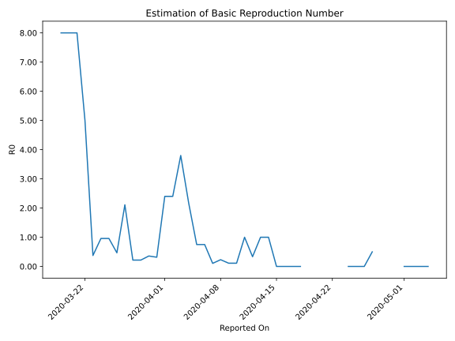

# Country Figures: Time Series for Basic Reproduction Number of Liechtenstein 

| Reported On | &Delta; Confirmed | Total &Delta; Confirmed First Interval | Total &Delta; Confirmed Second Interval | Estimated Basic Reproduction Number R0 | 
|-------------|-------------------|----------------------------------------|-----------------------------------------|---------------------------------------------------|
| 2020-05-10 | 0 |  None  |  None  |  None  | 
| 2020-05-09 | 0 |  None  |  None  |  None  | 
| 2020-05-08 | 0 |  None  |  None  |  None  | 
| 2020-05-07 | 0 |  None  |  None  |  None  | 
| 2020-05-06 | 0 |  None  |  None  |  None  | 
| 2020-05-05 | 0 |  None  |  None  |  None  | 
| 2020-05-04 | 0 |  None  |  1  |  None  | 
| 2020-05-03 | 0 |  None  |  1  |  None  | 
| 2020-05-02 | 0 |  None  |  1  |  None  | 
| 2020-05-01 | 0 |  None  |  1  |  None  | 
| 2020-04-30 | 0 |  1  |  None  |  None  | 
| 2020-04-29 | 0 |  1  |  None  |  None  | 
| 2020-04-28 | 0 |  1  |  None  |  None  | 
| 2020-04-27 | 0 |  1  |  2  |  0.50  | 
| 2020-04-26 | 1 |  None  |  2  |  None  | 
| 2020-04-25 | 0 |  None  |  2  |  None  | 
| 2020-04-24 | 0 |  None  |  2  |  None  | 
| 2020-04-23 | 0 |  2  |  None  |  None  | 
| 2020-04-22 | 0 |  2  |  None  |  None  | 
| 2020-04-21 | 0 |  2  |  None  |  None  | 
| 2020-04-20 | 0 |  2  |  None  |  None  | 
| 2020-04-19 | 2 |  None  |  None  |  None  | 
| 2020-04-18 | 0 |  None  |  1  |  None  | 
| 2020-04-17 | 0 |  None  |  1  |  None  | 
| 2020-04-16 | 0 |  None  |  1  |  None  | 
| 2020-04-15 | 0 |  None  |  2  |  None  | 
| 2020-04-14 | 0 |  1  |  1  |  1.00  | 
| 2020-04-13 | 0 |  1  |  1  |  1.00  | 
| 2020-04-12 | 0 |  1  |  3  |  0.33  | 
| 2020-04-11 | 0 |  2  |  2  |  1.00  | 
| 2020-04-10 | 1 |  1  |  9  |  0.11  | 
| 2020-04-09 | 0 |  1  |  9  |  0.11  | 
| 2020-04-08 | 0 |  3  |  13  |  0.23  | 
| 2020-04-07 | 1 |  2  |  19  |  0.11  | 
| 2020-04-06 | 0 |  9  |  12  |  0.75  | 
| 2020-04-05 | 0 |  9  |  12  |  0.75  | 
| 2020-04-04 | 2 |  13  |  6  |  2.17  | 
| 2020-04-03 | 0 |  19  |  5  |  3.80  | 
| 2020-04-02 | 7 |  12  |  5  |  2.40  | 
| 2020-04-01 | 0 |  12  |  5  |  2.40  | 
| 2020-03-31 | 6 |  6  |  19  |  0.32  | 
| 2020-03-30 | 6 |  5  |  14  |  0.36  | 
| 2020-03-29 | 0 |  5  |  23  |  0.22  | 
| 2020-03-28 | 0 |  5  |  23  |  0.22  | 
| 2020-03-27 | 0 |  19  |  9  |  2.11  | 
| 2020-03-26 | 5 |  14  |  30  |  0.47  | 
| 2020-03-25 | 0 |  23  |  24  |  0.96  | 
| 2020-03-24 | 0 |  23  |  24  |  0.96  | 
| 2020-03-23 | 14 |  9  |  24  |  0.38  | 
| 2020-03-22 | 0 |  30  |  6  |  5.00  | 
| 2020-03-21 | 9 |  24  |  3  |  8.00  | 
| 2020-03-20 | 0 |  24  |  3  |  8.00  | 
| 2020-03-19 | 0 |  24  |  3  |  8.00  | 
| 2020-03-18 | 21 |  6  |  None  |  None  | 
| 2020-03-17 | 3 |  3  |  None  |  None  | 
| 2020-03-16 | 0 |  3  |  None  |  None  | 
| 2020-03-15 | 0 |  3  |  None  |  None  | 
| 2020-03-14 | 3 |  None  |  None  |  None  | 
| 2020-03-13 | 0 |  None  |  None  |  None  | 
| 2020-03-12 | 0 |  None  |  None  |  None  | 
| 2020-03-11 | 0 |  None  |  None  |  None  | 
| 2020-03-10 | 0 |  None  |  None  |  None  | 
| 2020-03-09 | 0 |  None  |  None  |  None  | 
| 2020-03-08 | 0 |  None  |  None  |  None  | 
| 2020-03-07 | 0 |  None  |  None  |  None  | 
| 2020-03-06 | 0 |  None  |  None  |  None  | 
| 2020-03-05 | 0 |  None  |  None  |  None  | 
| 2020-03-04 | None |  None  |  None  |  None  | 

