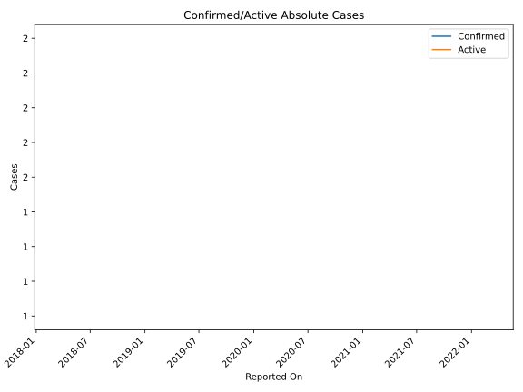
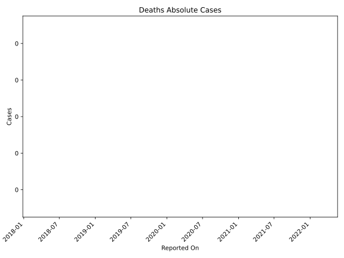
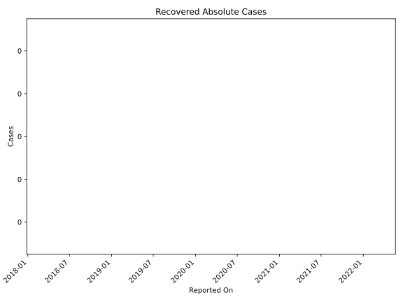

# Country Figures: Time Series for St.Martin 

| Reported On | Confirmed | Deaths | Recovered | Active | Mortality | &Delta; Confirmed | &Delta; Deaths | &Delta; Recovered | &Delta; Active | % Active of Population |
|-------------|-----------|--------|-----------|--------|-----------|-------------------|----------------|-------------------|----------------|------------------------|
| 2020-03-09 | 2 | 0 | 0 | 2 |  None  | None | None | None | None |  0.005 %  | 

