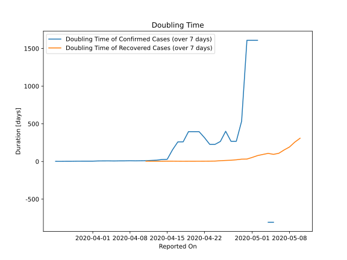

# Country Figures: New Infections in Previous 7 Days per 100,000 Population for Mauritius 

<!--  --> 

| Reported On | &Delta; Confirmed (on the day) | &Delta; Confirmed (last 7 days) | New Cases in Previous 7 Days per 100,000 Population |
|-------------|--------------------------------|---------------------------------|-----------------------------------------------------|
| 2020-05-10 |  None  |  None  |  None  |
| 2020-05-09 |  None  |  None  |  None  |
| 2020-05-08 |  None  |  None  |  None  |
| 2020-05-07 |  None  |  None  |  None  |
| 2020-05-06 |  None  |  None  |  None  |
| 2020-05-05 |  None  |  -2  |  -0.158  |
| 2020-05-04 |  None  |  -2  |  -0.158  |
| 2020-05-03 |  None  |  None  |  None  |
| 2020-05-02 |  None  |  1  |  0.079  |
| 2020-05-01 |  None  |  1  |  0.079  |
| 2020-04-30 |  None  |  1  |  0.079  |
| 2020-04-29 |  -2  |  3  |  0.237  |
| 2020-04-28 |  None  |  6  |  0.474  |
| 2020-04-27 |  2  |  6  |  0.474  |
| 2020-04-26 |  1  |  4  |  0.316  |
| 2020-04-25 |  None  |  6  |  0.474  |
| 2020-04-24 |  None  |  7  |  0.553  |
| 2020-04-23 |  2  |  7  |  0.553  |
| 2020-04-22 |  1  |  5  |  0.395  |
| 2020-04-21 |  None  |  4  |  0.316  |
| 2020-04-20 |  None  |  4  |  0.316  |
| 2020-04-19 |  3  |  4  |  0.316  |
| 2020-04-18 |  1  |  6  |  0.474  |
| 2020-04-17 |  None  |  6  |  0.474  |
| 2020-04-16 |  None  |  10  |  0.790  |
| 2020-04-15 |  None  |  51  |  4.031  |
| 2020-04-14 |  None  |  56  |  4.426  |
| 2020-04-13 |  None  |  80  |  6.323  |
| 2020-04-12 |  5  |  97  |  7.666  |
| 2020-04-11 |  1  |  123  |  9.721  |
| 2020-04-10 |  4  |  132  |  10.432  |
| 2020-04-09 |  41  |  145  |  11.460  |
| 2020-04-08 |  5  |  112  |  8.852  |
| 2020-04-07 |  24  |  125  |  9.879  |
| 2020-04-06 |  17  |  116  |  9.168  |
| 2020-04-05 |  31  |  120  |  9.484  |
| 2020-04-04 |  10  |  94  |  7.429  |
| 2020-04-03 |  17  |  92  |  7.271  |
| 2020-04-02 |  8  |  88  |  6.955  |
| 2020-04-01 |  18  |  113  |  8.931  |
| 2020-03-31 |  15  |  101  |  7.982  |
| 2020-03-30 |  21  |  92  |  7.271  |
| 2020-03-29 |  5  |  79  |  6.244  |
| 2020-03-28 |  8  |  88  |  6.955  |
| 2020-03-27 |  13  |  82  |  6.481  |
| 2020-03-26 |  33  |  78  |  6.165  |
| 2020-03-25 |  6  |  45  |  3.556  |
| 2020-03-24 |  6  |  39  |  3.082  |
| 2020-03-23 |  8  |  33  |  2.608  |
| 2020-03-22 |  14  |  25  |  1.976  |
| 2020-03-21 |  2  |  11  |  0.869  |
| 2020-03-20 |  9  |  9  |  0.711  |
| 2020-03-19 |  None  |  None  |  None  |
| 2020-03-18 |  None  |  None  |  None  |

