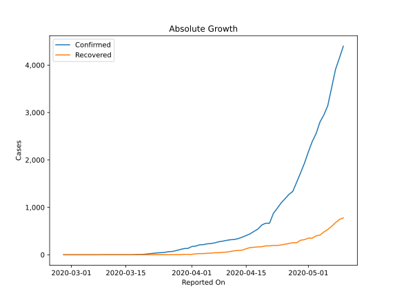
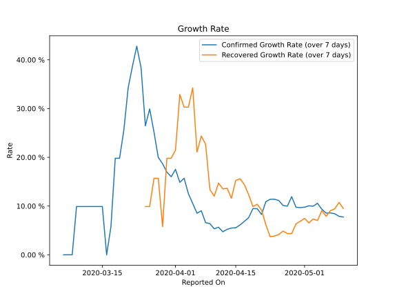

# Country Figures: Growth Rate for Nigeria 

The growth rates below are calculated based on
* an exponential growth assumption
* for time difference of past seven (7) days.
The growth rate is to be understood as on "growth per day".

The first growth rate indicates the increase of confirmed (infected) cases.

The second growth rate indicates the increase of recovered (healed) cases.

| Reported On | Confirmed | Growth Rate (Confirmed) | Recovered | Growth Rate (Recovered) |
|-------------|-----------|-------------------------|-----------|-------------------------|
| 2020-05-10 | 4399 |  7.75 %  | 778 |  9.504 %  | 
| 2020-05-09 | 4151 |  7.90 %  | 745 |  10.751 %  | 
| 2020-05-08 | 3912 |  8.42 %  | 679 |  9.426 %  | 
| 2020-05-07 | 3526 |  8.59 %  | 601 |  9.049 %  | 
| 2020-05-06 | 3145 |  8.55 %  | 534 |  7.908 %  | 
| 2020-05-05 | 2950 |  9.36 %  | 481 |  9.066 %  | 
| 2020-05-04 | 2802 |  10.57 %  | 417 |  7.026 %  | 
| 2020-05-03 | 2558 |  9.97 %  | 400 |  7.357 %  | 
| 2020-05-02 | 2388 |  10.05 %  | 351 |  6.544 %  | 
| 2020-05-01 | 2170 |  9.77 %  | 351 |  7.475 %  | 
| 2020-04-30 | 1932 |  9.68 %  | 319 |  6.886 %  | 
| 2020-04-29 | 1728 |  9.75 %  | 307 |  6.338 %  | 
| 2020-04-28 | 1532 |  11.92 %  | 255 |  4.355 %  | 
| 2020-04-27 | 1337 |  9.98 %  | 255 |  4.355 %  | 
| 2020-04-26 | 1273 |  10.12 %  | 239 |  4.867 %  | 
| 2020-04-25 | 1182 |  11.14 %  | 222 |  4.153 %  | 
| 2020-04-24 | 1095 |  11.40 %  | 208 |  3.838 %  | 
| 2020-04-23 | 981 |  11.39 %  | 197 |  3.705 %  | 
| 2020-04-22 | 873 |  10.90 %  | 197 |  6.160 %  | 
| 2020-04-21 | 665 |  8.26 %  | 188 |  9.162 %  | 
| 2020-04-20 | 665 |  9.46 %  | 188 |  10.365 %  | 
| 2020-04-19 | 627 |  9.48 %  | 170 |  9.902 %  | 
| 2020-04-18 | 542 |  7.62 %  | 166 |  12.336 %  | 
| 2020-04-17 | 493 |  6.86 %  | 159 |  14.407 %  | 
| 2020-04-16 | 442 |  6.12 %  | 152 |  15.601 %  | 
| 2020-04-15 | 407 |  5.55 %  | 128 |  15.255 %  | 
| 2020-04-14 | 373 |  5.49 %  | 99 |  11.585 %  | 
| 2020-04-13 | 343 |  5.22 %  | 91 |  13.650 %  | 
| 2020-04-12 | 323 |  4.73 %  | 85 |  13.516 %  | 
| 2020-04-11 | 318 |  5.66 %  | 70 |  14.709 %  | 
| 2020-04-10 | 305 |  5.33 %  | 58 |  12.022 %  | 
| 2020-04-09 | 288 |  6.40 %  | 51 |  13.373 %  | 
| 2020-04-08 | 276 |  6.59 %  | 44 |  22.671 %  | 
| 2020-04-07 | 254 |  9.03 %  | 44 |  24.354 %  | 
| 2020-04-06 | 238 |  8.53 %  | 35 |  21.084 %  | 
| 2020-04-05 | 232 |  10.53 %  | 33 |  34.256 %  | 
| 2020-04-04 | 214 |  12.53 %  | 25 |  30.289 %  | 
| 2020-04-03 | 210 |  15.69 %  | 25 |  30.289 %  | 
| 2020-04-02 | 184 |  14.86 %  | 20 |  32.894 %  | 
| 2020-04-01 | 174 |  17.53 %  | 9 |  21.487 %  | 
| 2020-03-31 | 135 |  16.02 %  | 8 |  19.804 %  | 
| 2020-03-30 | 131 |  16.95 %  | 8 |  19.804 %  | 
| 2020-03-29 | 111 |  18.69 %  | 3 |  5.792 %  | 
| 2020-03-28 | 89 |  19.97 %  | 3 |  15.694 %  | 
| 2020-03-27 | 70 |  25.19 %  | 3 |  15.694 %  | 
| 2020-03-26 | 65 |  29.93 %  | 2 |  9.902 %  | 
| 2020-03-25 | 51 |  26.46 %  | 2 |  9.902 %  | 
| 2020-03-24 | 44 |  38.37 %  | 2 |  None  | 
| 2020-03-23 | 40 |  42.80 %  | 2 |  None  | 
| 2020-03-22 | 30 |  38.69 %  | 2 |  None  | 
| 2020-03-21 | 22 |  34.26 %  | 1 |  None  | 
| 2020-03-20 | 12 |  25.60 %  | 1 |  None  | 
| 2020-03-19 | 8 |  19.80 %  | 1 |  None  | 
| 2020-03-18 | 8 |  19.80 %  | 1 |  None  | 
| 2020-03-17 | 3 |  5.79 %  | 0 |  None  | 
| 2020-03-16 | 2 |  None  | 0 |  None  | 
| 2020-03-15 | 2 |  9.90 %  | 0 |  None  | 
| 2020-03-14 | 2 |  9.90 %  | 0 |  None  | 
| 2020-03-13 | 2 |  9.90 %  | 0 |  None  | 
| 2020-03-12 | 2 |  9.90 %  | 0 |  None  | 
| 2020-03-11 | 2 |  9.90 %  | 0 |  None  | 
| 2020-03-10 | 2 |  9.90 %  | 0 |  None  | 
| 2020-03-09 | 2 |  9.90 %  | 0 |  None  | 
| 2020-03-08 | 1 |  None  | 0 |  None  | 
| 2020-03-07 | 1 |  None  | 0 |  None  | 
| 2020-03-06 | 1 |  None  | 0 |  None  | 
| 2020-03-05 | 1 |  None  | 0 |  None  | 
| 2020-03-04 | 1 |  None  | 0 |  None  | 
| 2020-03-03 | 1 |  None  | 0 |  None  | 
| 2020-03-02 | 1 |  None  | 0 |  None  | 
| 2020-03-01 | 1 |  None  | 0 |  None  | 
| 2020-02-29 | 1 |  None  | 0 |  None  | 
| 2020-02-28 | 1 |  None  | 0 |  None  | 

