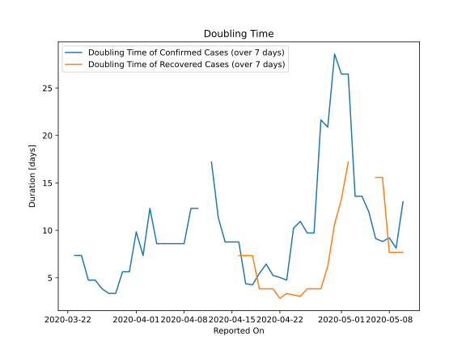

# Country Figures: New Infections in Previous 7 Days per 100,000 Population for Nepal 

<!--  --> 

| Reported On | &Delta; Confirmed (on the day) | &Delta; Confirmed (last 7 days) | New Cases in Previous 7 Days per 100,000 Population |
|-------------|--------------------------------|---------------------------------|-----------------------------------------------------|
| 2020-05-10 |  None  |  35  |  0.125  |
| 2020-05-09 |  8  |  51  |  0.182  |
| 2020-05-08 |  1  |  43  |  0.153  |
| 2020-05-07 |  2  |  44  |  0.157  |
| 2020-05-06 |  17  |  42  |  0.150  |
| 2020-05-05 |  7  |  28  |  0.100  |
| 2020-05-04 |  None  |  23  |  0.082  |
| 2020-05-03 |  16  |  23  |  0.082  |
| 2020-05-02 |  None  |  10  |  0.036  |
| 2020-05-01 |  2  |  10  |  0.036  |
| 2020-04-30 |  None  |  9  |  0.032  |
| 2020-04-29 |  3  |  12  |  0.043  |
| 2020-04-28 |  2  |  11  |  0.039  |
| 2020-04-27 |  None  |  21  |  0.075  |
| 2020-04-26 |  3  |  21  |  0.075  |
| 2020-04-25 |  None  |  18  |  0.064  |
| 2020-04-24 |  1  |  19  |  0.068  |
| 2020-04-23 |  3  |  32  |  0.114  |
| 2020-04-22 |  2  |  29  |  0.103  |
| 2020-04-21 |  12  |  27  |  0.096  |
| 2020-04-20 |  None  |  17  |  0.061  |
| 2020-04-19 |  None  |  19  |  0.068  |
| 2020-04-18 |  1  |  22  |  0.078  |
| 2020-04-17 |  14  |  21  |  0.075  |
| 2020-04-16 |  None  |  7  |  0.025  |
| 2020-04-15 |  None  |  7  |  0.025  |
| 2020-04-14 |  2  |  7  |  0.025  |
| 2020-04-13 |  2  |  5  |  0.018  |
| 2020-04-12 |  3  |  3  |  0.011  |
| 2020-04-11 |  None  |  None  |  None  |
| 2020-04-10 |  None  |  3  |  0.011  |
| 2020-04-09 |  None  |  3  |  0.011  |
| 2020-04-08 |  None  |  4  |  0.014  |
| 2020-04-07 |  None  |  4  |  0.014  |
| 2020-04-06 |  None  |  4  |  0.014  |
| 2020-04-05 |  None  |  4  |  0.014  |
| 2020-04-04 |  3  |  4  |  0.014  |
| 2020-04-03 |  None  |  2  |  0.007  |
| 2020-04-02 |  1  |  3  |  0.011  |
| 2020-04-01 |  None  |  2  |  0.007  |
| 2020-03-31 |  None  |  3  |  0.011  |
| 2020-03-30 |  None  |  3  |  0.011  |
| 2020-03-29 |  None  |  4  |  0.014  |
| 2020-03-28 |  1  |  4  |  0.014  |
| 2020-03-27 |  1  |  3  |  0.011  |
| 2020-03-26 |  None  |  2  |  0.007  |
| 2020-03-25 |  1  |  2  |  0.007  |
| 2020-03-24 |  None  |  1  |  0.004  |
| 2020-03-23 |  1  |  1  |  0.004  |
| 2020-03-22 |  None  |  None  |  None  |
| 2020-03-21 |  None  |  None  |  None  |
| 2020-03-20 |  None  |  None  |  None  |
| 2020-03-19 |  None  |  None  |  None  |
| 2020-03-18 |  None  |  None  |  None  |
| 2020-03-17 |  None  |  None  |  None  |
| 2020-03-16 |  None  |  None  |  None  |
| 2020-03-15 |  None  |  None  |  None  |
| 2020-03-14 |  None  |  None  |  None  |
| 2020-03-13 |  None  |  None  |  None  |
| 2020-03-12 |  None  |  None  |  None  |
| 2020-03-11 |  None  |  None  |  None  |
| 2020-03-10 |  None  |  None  |  None  |
| 2020-03-09 |  None  |  None  |  None  |
| 2020-03-08 |  None  |  None  |  None  |
| 2020-03-07 |  None  |  None  |  None  |
| 2020-03-06 |  None  |  None  |  None  |
| 2020-03-05 |  None  |  None  |  None  |
| 2020-03-04 |  None  |  None  |  None  |
| 2020-03-03 |  None  |  None  |  None  |
| 2020-03-02 |  None  |  None  |  None  |
| 2020-03-01 |  None  |  None  |  None  |
| 2020-02-29 |  None  |  None  |  None  |
| 2020-02-28 |  None  |  None  |  None  |
| 2020-02-27 |  None  |  None  |  None  |
| 2020-02-26 |  None  |  None  |  None  |
| 2020-02-25 |  None  |  None  |  None  |
| 2020-02-24 |  None  |  None  |  None  |
| 2020-02-23 |  None  |  None  |  None  |
| 2020-02-22 |  None  |  None  |  None  |
| 2020-02-21 |  None  |  None  |  None  |
| 2020-02-20 |  None  |  None  |  None  |
| 2020-02-19 |  None  |  None  |  None  |
| 2020-02-18 |  None  |  None  |  None  |
| 2020-02-17 |  None  |  None  |  None  |
| 2020-02-16 |  None  |  None  |  None  |
| 2020-02-15 |  None  |  None  |  None  |
| 2020-02-14 |  None  |  None  |  None  |
| 2020-02-13 |  None  |  None  |  None  |
| 2020-02-12 |  None  |  None  |  None  |
| 2020-02-11 |  None  |  None  |  None  |
| 2020-02-10 |  None  |  None  |  None  |
| 2020-02-09 |  None  |  None  |  None  |
| 2020-02-08 |  None  |  None  |  None  |
| 2020-02-07 |  None  |  None  |  None  |
| 2020-02-06 |  None  |  None  |  None  |
| 2020-02-05 |  None  |  None  |  None  |
| 2020-02-04 |  None  |  None  |  None  |
| 2020-02-03 |  None  |  None  |  None  |
| 2020-02-02 |  None  |  None  |  None  |
| 2020-02-01 |  None  |  None  |  None  |
| 2020-01-31 |  None  |  None  |  None  |
| 2020-01-30 |  None  |  None  |  None  |
| 2020-01-29 |  None  |  None  |  None  |
| 2020-01-28 |  None  |  None  |  None  |
| 2020-01-27 |  None  |  None  |  None  |
| 2020-01-26 |  None  |  None  |  None  |
| 2020-01-25 |  None  |  None  |  None  |

