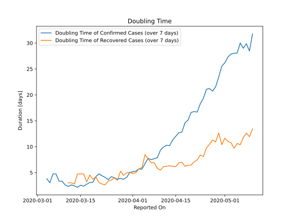

# Country Figures: New Infections in Previous 7 Days per 100,000 Population for Romania 

<!--  --> 

| Reported On | &Delta; Confirmed (on the day) | &Delta; Confirmed (last 7 days) | New Cases in Previous 7 Days per 100,000 Population |
|-------------|--------------------------------|---------------------------------|-----------------------------------------------------|
| 2020-05-10 |  231  |  2199  |  11.292  |
| 2020-05-09 |  320  |  2399  |  12.319  |
| 2020-05-08 |  312  |  2244  |  11.523  |
| 2020-05-07 |  392  |  2259  |  11.600  |
| 2020-05-06 |  270  |  2129  |  10.933  |
| 2020-05-05 |  325  |  2221  |  11.405  |
| 2020-05-04 |  349  |  2173  |  11.159  |
| 2020-05-03 |  431  |  2127  |  10.922  |
| 2020-05-02 |  165  |  2097  |  10.768  |
| 2020-05-01 |  327  |  2150  |  11.040  |
| 2020-04-30 |  262  |  2144  |  11.010  |
| 2020-04-29 |  362  |  2268  |  11.646  |
| 2020-04-28 |  277  |  2374  |  12.191  |
| 2020-04-27 |  303  |  2403  |  12.340  |
| 2020-04-26 |  401  |  2290  |  11.759  |
| 2020-04-25 |  218  |  2217  |  11.384  |
| 2020-04-24 |  321  |  2350  |  12.067  |
| 2020-04-23 |  386  |  2389  |  12.268  |
| 2020-04-22 |  468  |  2494  |  12.807  |
| 2020-04-21 |  306  |  2363  |  12.134  |
| 2020-04-20 |  190  |  2303  |  11.826  |
| 2020-04-19 |  328  |  2446  |  12.560  |
| 2020-04-18 |  351  |  2428  |  12.468  |
| 2020-04-17 |  360  |  2600  |  13.351  |
| 2020-04-16 |  491  |  2505  |  12.863  |
| 2020-04-15 |  337  |  2455  |  12.607  |
| 2020-04-14 |  246  |  2462  |  12.643  |
| 2020-04-13 |  333  |  2576  |  13.228  |
| 2020-04-12 |  310  |  2436  |  12.509  |
| 2020-04-11 |  523  |  2377  |  12.206  |
| 2020-04-10 |  265  |  2284  |  11.728  |
| 2020-04-09 |  441  |  2464  |  12.653  |
| 2020-04-08 |  344  |  2301  |  11.816  |
| 2020-04-07 |  360  |  2172  |  11.153  |
| 2020-04-06 |  193  |  1948  |  10.003  |
| 2020-04-05 |  251  |  2049  |  10.522  |
| 2020-04-04 |  430  |  2161  |  11.097  |
| 2020-04-03 |  445  |  1891  |  9.710  |
| 2020-04-02 |  278  |  1709  |  8.776  |
| 2020-04-01 |  215  |  1554  |  7.980  |
| 2020-03-31 |  136  |  1451  |  7.451  |
| 2020-03-30 |  294  |  1533  |  7.872  |
| 2020-03-29 |  363  |  1382  |  7.097  |
| 2020-03-28 |  160  |  1085  |  5.572  |
| 2020-03-27 |  263  |  984  |  5.053  |
| 2020-03-26 |  123  |  752  |  3.862  |
| 2020-03-25 |  112  |  646  |  3.317  |
| 2020-03-24 |  218  |  610  |  3.132  |
| 2020-03-23 |  143  |  418  |  2.146  |
| 2020-03-22 |  66  |  302  |  1.551  |
| 2020-03-21 |  59  |  244  |  1.253  |
| 2020-03-20 |  31  |  219  |  1.125  |
| 2020-03-19 |  17  |  228  |  1.171  |
| 2020-03-18 |  76  |  215  |  1.104  |
| 2020-03-17 |  26  |  159  |  0.816  |
| 2020-03-16 |  27  |  143  |  0.734  |
| 2020-03-15 |  8  |  116  |  0.596  |
| 2020-03-14 |  34  |  114  |  0.585  |
| 2020-03-13 |  40  |  80  |  0.411  |
| 2020-03-12 |  4  |  43  |  0.221  |
| 2020-03-11 |  20  |  41  |  0.211  |
| 2020-03-10 |  10  |  22  |  0.113  |
| 2020-03-09 |  None  |  12  |  0.062  |
| 2020-03-08 |  6  |  12  |  0.062  |
| 2020-03-07 |  None  |  6  |  0.031  |
| 2020-03-06 |  3  |  6  |  0.031  |
| 2020-03-05 |  2  |  5  |  0.026  |
| 2020-03-04 |  1  |  3  |  0.015  |
| 2020-03-03 |  None  |  2  |  0.010  |
| 2020-03-02 |  None  |  2  |  0.010  |
| 2020-03-01 |  None  |  2  |  0.010  |
| 2020-02-29 |  None  |  2  |  0.010  |
| 2020-02-28 |  2  |  2  |  0.010  |
| 2020-02-27 |  None  |  None  |  None  |
| 2020-02-26 |  None  |  None  |  None  |

