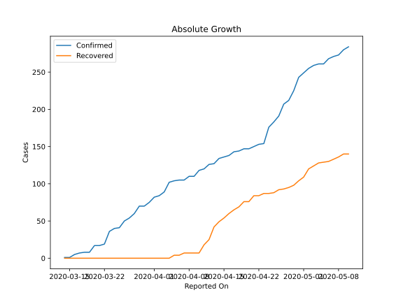
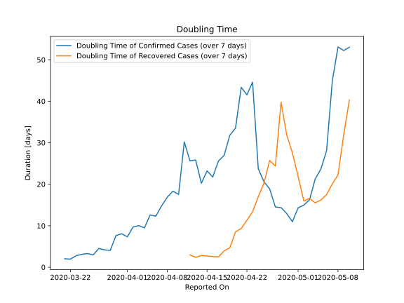

# Country Figures: Doubling Time of Infections for Rwanda 

The doubling time below are calculated based on
* an exponential growth assumption
* for time difference of past seven (7) days.
The doubling time's unit is "days".

The first doubling time indicates the increase of confirmed (infected)
cases. There, the *higher* the number is, the better is to take control
of the disease.

The second doubling time indicates the increase of recovered (healed)
cases. There, the *lower* the number is, the better it is to take
control of the disease.

| Reported On | Confirmed | Doubling Time (Confirmed) | Recovered | Doubling Time (Recovered) |
|-------------|-----------|---------------------------|-----------|---------------------------|
| 2020-05-10 | 284 |  53.0 days  | 140 |  40.3 days  | 
| 2020-05-09 | 280 |  52.2 days  | 140 |  31.8 days  | 
| 2020-05-08 | 273 |  53.1 days  | 136 |  22.3 days  | 
| 2020-05-07 | 271 |  44.8 days  | 133 |  20.1 days  | 
| 2020-05-06 | 268 |  28.1 days  | 130 |  17.5 days  | 
| 2020-05-05 | 261 |  23.7 days  | 129 |  16.2 days  | 
| 2020-05-04 | 261 |  21.3 days  | 128 |  15.5 days  | 
| 2020-05-03 | 259 |  16.3 days  | 124 |  16.6 days  | 
| 2020-05-02 | 255 |  15.0 days  | 120 |  16.0 days  | 
| 2020-05-01 | 249 |  14.3 days  | 109 |  21.9 days  | 
| 2020-04-30 | 243 |  11.0 days  | 104 |  27.5 days  | 
| 2020-04-29 | 225 |  12.9 days  | 98 |  31.8 days  | 
| 2020-04-28 | 212 |  14.4 days  | 95 |  39.8 days  | 
| 2020-04-27 | 207 |  14.5 days  | 93 |  24.4 days  | 
| 2020-04-26 | 191 |  18.9 days  | 92 |  25.7 days  | 
| 2020-04-25 | 183 |  20.6 days  | 88 |  20.3 days  | 
| 2020-04-24 | 176 |  23.7 days  | 87 |  17.0 days  | 
| 2020-04-23 | 154 |  44.6 days  | 87 |  13.4 days  | 
| 2020-04-22 | 153 |  41.5 days  | 84 |  11.3 days  | 
| 2020-04-21 | 150 |  43.4 days  | 84 |  9.3 days  | 
| 2020-04-20 | 147 |  33.5 days  | 76 |  8.5 days  | 
| 2020-04-19 | 147 |  31.8 days  | 76 |  4.7 days  | 
| 2020-04-18 | 144 |  27.0 days  | 69 |  3.9 days  | 
| 2020-04-17 | 143 |  25.6 days  | 65 |  2.5 days  | 
| 2020-04-16 | 138 |  21.7 days  | 60 |  2.6 days  | 
| 2020-04-15 | 136 |  23.2 days  | 54 |  2.7 days  | 
| 2020-04-14 | 134 |  20.2 days  | 49 |  2.8 days  | 
| 2020-04-13 | 127 |  25.9 days  | 42 |  2.4 days  | 
| 2020-04-12 | 126 |  25.6 days  | 25 |  3.0 days  | 
| 2020-04-11 | 120 |  30.2 days  | 18 |  None  | 
| 2020-04-10 | 118 |  17.5 days  | 7 |  None  | 
| 2020-04-09 | 110 |  18.3 days  | 7 |  None  | 
| 2020-04-08 | 110 |  16.9 days  | 7 |  None  | 
| 2020-04-07 | 105 |  14.8 days  | 7 |  None  | 
| 2020-04-06 | 105 |  12.3 days  | 4 |  None  | 
| 2020-04-05 | 104 |  12.6 days  | 4 |  None  | 
| 2020-04-04 | 102 |  9.5 days  | 0 |  None  | 
| 2020-04-03 | 89 |  10.1 days  | 0 |  None  | 
| 2020-04-02 | 84 |  9.7 days  | 0 |  None  | 
| 2020-04-01 | 82 |  7.3 days  | 0 |  None  | 
| 2020-03-31 | 75 |  8.1 days  | 0 |  None  | 
| 2020-03-30 | 70 |  7.6 days  | 0 |  None  | 
| 2020-03-29 | 70 |  4.1 days  | 0 |  None  | 
| 2020-03-28 | 60 |  4.2 days  | 0 |  None  | 
| 2020-03-27 | 54 |  4.5 days  | 0 |  None  | 
| 2020-03-26 | 50 |  3.0 days  | 0 |  None  | 
| 2020-03-25 | 41 |  3.3 days  | 0 |  None  | 
| 2020-03-24 | 40 |  3.1 days  | 0 |  None  | 
| 2020-03-23 | 36 |  2.8 days  | 0 |  None  | 
| 2020-03-22 | 19 |  2.0 days  | 0 |  None  | 
| 2020-03-21 | 17 |  2.0 days  | 0 |  None  | 
| 2020-03-20 | 17 |  None  | 0 |  None  | 
| 2020-03-19 | 8 |  None  | 0 |  None  | 
| 2020-03-18 | 8 |  None  | 0 |  None  | 
| 2020-03-17 | 7 |  None  | 0 |  None  | 
| 2020-03-16 | 5 |  None  | 0 |  None  | 
| 2020-03-15 | 1 |  None  | 0 |  None  | 
| 2020-03-14 | 1 |  None  | 0 |  None  | 

