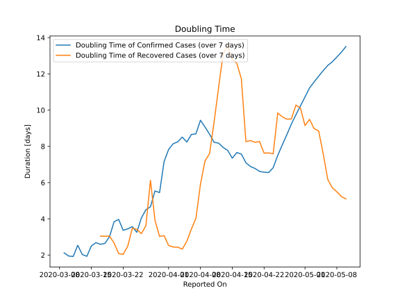

# Country Figures: New Infections in Previous 7 Days per 100,000 Population for SaudiArabia 

<!--  --> 

| Reported On | &Delta; Confirmed (on the day) | &Delta; Confirmed (last 7 days) | New Cases in Previous 7 Days per 100,000 Population |
|-------------|--------------------------------|---------------------------------|-----------------------------------------------------|
| 2020-05-10 |  1912  |  12037  |  35.718  |
| 2020-05-09 |  1704  |  11677  |  34.650  |
| 2020-05-08 |  1701  |  11335  |  33.635  |
| 2020-05-07 |  1793  |  10978  |  32.576  |
| 2020-05-06 |  1687  |  10536  |  31.264  |
| 2020-05-05 |  1595  |  10174  |  30.190  |
| 2020-05-04 |  1645  |  9845  |  29.214  |
| 2020-05-03 |  1552  |  9489  |  28.157  |
| 2020-05-02 |  1362  |  9160  |  27.181  |
| 2020-05-01 |  1344  |  8995  |  26.691  |
| 2020-04-30 |  1351  |  8823  |  26.181  |
| 2020-04-29 |  1325  |  8630  |  25.608  |
| 2020-04-28 |  1266  |  8446  |  25.062  |
| 2020-04-27 |  1289  |  8327  |  24.709  |
| 2020-04-26 |  1223  |  8160  |  24.214  |
| 2020-04-25 |  1197  |  8025  |  23.813  |
| 2020-04-24 |  1172  |  7960  |  23.620  |
| 2020-04-23 |  1158  |  7550  |  22.404  |
| 2020-04-22 |  1141  |  6910  |  20.504  |
| 2020-04-21 |  1147  |  6262  |  18.582  |
| 2020-04-20 |  1122  |  5550  |  16.469  |
| 2020-04-19 |  1088  |  4900  |  14.540  |
| 2020-04-18 |  1132  |  4241  |  12.585  |
| 2020-04-17 |  762  |  3491  |  10.359  |
| 2020-04-16 |  518  |  3093  |  9.178  |
| 2020-04-15 |  493  |  2930  |  8.694  |
| 2020-04-14 |  435  |  2574  |  7.638  |
| 2020-04-13 |  472  |  2329  |  6.911  |
| 2020-04-12 |  429  |  2060  |  6.113  |
| 2020-04-11 |  382  |  1854  |  5.501  |
| 2020-04-10 |  364  |  1612  |  4.783  |
| 2020-04-09 |  355  |  1402  |  4.160  |
| 2020-04-08 |  137  |  1212  |  3.596  |
| 2020-04-07 |  190  |  1232  |  3.656  |
| 2020-04-06 |  203  |  1152  |  3.418  |
| 2020-04-05 |  223  |  1103  |  3.273  |
| 2020-04-04 |  140  |  976  |  2.896  |
| 2020-04-03 |  154  |  935  |  2.774  |
| 2020-04-02 |  165  |  873  |  2.591  |
| 2020-04-01 |  157  |  820  |  2.433  |
| 2020-03-31 |  110  |  796  |  2.362  |
| 2020-03-30 |  154  |  891  |  2.644  |
| 2020-03-29 |  96  |  788  |  2.338  |
| 2020-03-28 |  99  |  811  |  2.407  |
| 2020-03-27 |  92  |  760  |  2.255  |
| 2020-03-26 |  112  |  738  |  2.190  |
| 2020-03-25 |  133  |  729  |  2.163  |
| 2020-03-24 |  205  |  596  |  1.769  |
| 2020-03-23 |  51  |  444  |  1.318  |
| 2020-03-22 |  119  |  408  |  1.211  |
| 2020-03-21 |  48  |  289  |  0.858  |
| 2020-03-20 |  70  |  258  |  0.766  |
| 2020-03-19 |  103  |  229  |  0.680  |
| 2020-03-18 |  None  |  150  |  0.445  |
| 2020-03-17 |  53  |  151  |  0.448  |
| 2020-03-16 |  15  |  103  |  0.306  |
| 2020-03-15 |  None  |  92  |  0.273  |
| 2020-03-14 |  17  |  98  |  0.291  |
| 2020-03-13 |  41  |  81  |  0.240  |
| 2020-03-12 |  24  |  40  |  0.119  |
| 2020-03-11 |  1  |  20  |  0.059  |
| 2020-03-10 |  5  |  19  |  0.056  |
| 2020-03-09 |  4  |  14  |  0.042  |
| 2020-03-08 |  6  |  10  |  0.030  |
| 2020-03-07 |  None  |  4  |  0.012  |
| 2020-03-06 |  None  |  4  |  0.012  |
| 2020-03-05 |  4  |  4  |  0.012  |
| 2020-03-04 |  None  |  None  |  None  |
| 2020-03-03 |  None  |  None  |  None  |
| 2020-03-02 |  None  |  None  |  None  |

