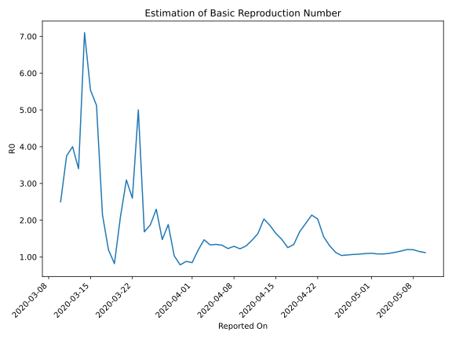

# Country Figures: Time Series for Basic Reproduction Number of SaudiArabia 

| Reported On | &Delta; Confirmed | Total &Delta; Confirmed First Interval | Total &Delta; Confirmed Second Interval | Estimated Basic Reproduction Number R0 | 
|-------------|-------------------|----------------------------------------|-----------------------------------------|---------------------------------------------------|
| 2020-05-10 | 1912 |  6885  |  6154  |  1.12  | 
| 2020-05-09 | 1704 |  6776  |  5903  |  1.15  | 
| 2020-05-08 | 1701 |  6720  |  5609  |  1.20  | 
| 2020-05-07 | 1793 |  6479  |  5382  |  1.20  | 
| 2020-05-06 | 1687 |  6154  |  5286  |  1.16  | 
| 2020-05-05 | 1595 |  5903  |  5231  |  1.13  | 
| 2020-05-04 | 1645 |  5609  |  5103  |  1.10  | 
| 2020-05-03 | 1552 |  5382  |  4975  |  1.08  | 
| 2020-05-02 | 1362 |  5286  |  4881  |  1.08  | 
| 2020-05-01 | 1344 |  5231  |  4750  |  1.10  | 
| 2020-04-30 | 1351 |  5103  |  4668  |  1.09  | 
| 2020-04-29 | 1325 |  4975  |  4618  |  1.08  | 
| 2020-04-28 | 1266 |  4881  |  4568  |  1.07  | 
| 2020-04-27 | 1289 |  4750  |  4498  |  1.06  | 
| 2020-04-26 | 1223 |  4668  |  4489  |  1.04  | 
| 2020-04-25 | 1197 |  4618  |  4104  |  1.13  | 
| 2020-04-24 | 1172 |  4568  |  3500  |  1.31  | 
| 2020-04-23 | 1158 |  4498  |  2905  |  1.55  | 
| 2020-04-22 | 1141 |  4489  |  2208  |  2.03  | 
| 2020-04-21 | 1147 |  4104  |  1918  |  2.14  | 
| 2020-04-20 | 1122 |  3500  |  1829  |  1.91  | 
| 2020-04-19 | 1088 |  2905  |  1718  |  1.69  | 
| 2020-04-18 | 1132 |  2208  |  1647  |  1.34  | 
| 2020-04-17 | 762 |  1918  |  1530  |  1.25  | 
| 2020-04-16 | 518 |  1829  |  1238  |  1.48  | 
| 2020-04-15 | 493 |  1718  |  1046  |  1.64  | 
| 2020-04-14 | 435 |  1647  |  885  |  1.86  | 
| 2020-04-13 | 472 |  1530  |  753  |  2.03  | 
| 2020-04-12 | 429 |  1238  |  756  |  1.64  | 
| 2020-04-11 | 382 |  1046  |  720  |  1.45  | 
| 2020-04-10 | 364 |  885  |  682  |  1.30  | 
| 2020-04-09 | 355 |  753  |  616  |  1.22  | 
| 2020-04-08 | 137 |  756  |  586  |  1.29  | 
| 2020-04-07 | 190 |  720  |  586  |  1.23  | 
| 2020-04-06 | 203 |  682  |  517  |  1.32  | 
| 2020-04-05 | 223 |  616  |  459  |  1.34  | 
| 2020-04-04 | 140 |  586  |  441  |  1.33  | 
| 2020-04-03 | 154 |  586  |  399  |  1.47  | 
| 2020-04-02 | 165 |  517  |  436  |  1.19  | 
| 2020-04-01 | 157 |  459  |  542  |  0.85  | 
| 2020-03-31 | 110 |  441  |  501  |  0.88  | 
| 2020-03-30 | 154 |  399  |  508  |  0.79  | 
| 2020-03-29 | 96 |  436  |  423  |  1.03  | 
| 2020-03-28 | 99 |  542  |  288  |  1.88  | 
| 2020-03-27 | 92 |  501  |  340  |  1.47  | 
| 2020-03-26 | 112 |  508  |  221  |  2.30  | 
| 2020-03-25 | 133 |  423  |  226  |  1.87  | 
| 2020-03-24 | 205 |  288  |  171  |  1.68  | 
| 2020-03-23 | 51 |  340  |  68  |  5.00  | 
| 2020-03-22 | 119 |  221  |  85  |  2.60  | 
| 2020-03-21 | 48 |  226  |  73  |  3.10  | 
| 2020-03-20 | 70 |  171  |  82  |  2.09  | 
| 2020-03-19 | 103 |  68  |  83  |  0.82  | 
| 2020-03-18 | 0 |  85  |  71  |  1.20  | 
| 2020-03-17 | 53 |  73  |  34  |  2.15  | 
| 2020-03-16 | 15 |  82  |  16  |  5.12  | 
| 2020-03-15 | 0 |  83  |  15  |  5.53  | 
| 2020-03-14 | 17 |  71  |  10  |  7.10  | 
| 2020-03-13 | 41 |  34  |  10  |  3.40  | 
| 2020-03-12 | 24 |  16  |  4  |  4.00  | 
| 2020-03-11 | 1 |  15  |  4  |  3.75  | 
| 2020-03-10 | 5 |  10  |  4  |  2.50  | 
| 2020-03-09 | 4 |  10  |  None  |  None  | 
| 2020-03-08 | 6 |  4  |  None  |  None  | 
| 2020-03-07 | 0 |  4  |  None  |  None  | 
| 2020-03-06 | 0 |  4  |  None  |  None  | 
| 2020-03-05 | 4 |  None  |  None  |  None  | 
| 2020-03-04 | 0 |  None  |  None  |  None  | 
| 2020-03-03 | 0 |  None  |  None  |  None  | 
| 2020-03-02 | None |  None  |  None  |  None  | 

