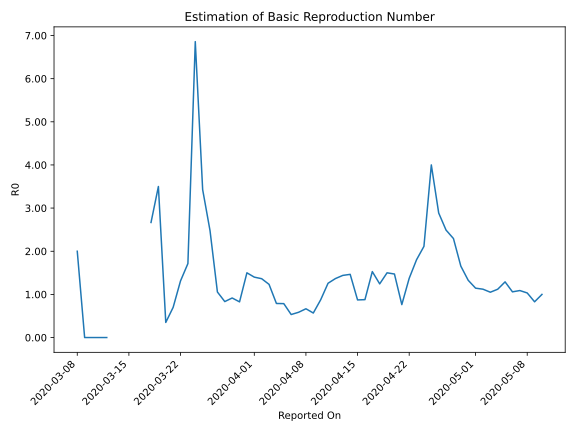

# Country Figures: Time Series for Basic Reproduction Number of Senegal 

| Reported On | &Delta; Confirmed | Total &Delta; Confirmed First Interval | Total &Delta; Confirmed Second Interval | Estimated Basic Reproduction Number R0 | 
|-------------|-------------------|----------------------------------------|-----------------------------------------|---------------------------------------------------|
| 2020-05-10 | 75 |  305  |  305  |  1.00  | 
| 2020-05-09 | 83 |  280  |  338  |  0.83  | 
| 2020-05-08 | 59 |  310  |  300  |  1.03  | 
| 2020-05-07 | 59 |  318  |  292  |  1.09  | 
| 2020-05-06 | 104 |  305  |  288  |  1.06  | 
| 2020-05-05 | 58 |  338  |  262  |  1.29  | 
| 2020-05-04 | 89 |  300  |  268  |  1.12  | 
| 2020-05-03 | 67 |  292  |  278  |  1.05  | 
| 2020-05-02 | 91 |  288  |  257  |  1.12  | 
| 2020-05-01 | 91 |  262  |  229  |  1.14  | 
| 2020-04-30 | 51 |  268  |  202  |  1.33  | 
| 2020-04-29 | 59 |  278  |  168  |  1.65  | 
| 2020-04-28 | 87 |  257  |  112  |  2.29  | 
| 2020-04-27 | 65 |  229  |  92  |  2.49  | 
| 2020-04-26 | 57 |  202  |  70  |  2.89  | 
| 2020-04-25 | 69 |  168  |  42  |  4.00  | 
| 2020-04-24 | 66 |  112  |  53  |  2.11  | 
| 2020-04-23 | 37 |  92  |  51  |  1.80  | 
| 2020-04-22 | 30 |  70  |  51  |  1.37  | 
| 2020-04-21 | 35 |  42  |  55  |  0.76  | 
| 2020-04-20 | 10 |  53  |  36  |  1.47  | 
| 2020-04-19 | 17 |  51  |  34  |  1.50  | 
| 2020-04-18 | 8 |  51  |  41  |  1.24  | 
| 2020-04-17 | 7 |  55  |  36  |  1.53  | 
| 2020-04-16 | 21 |  36  |  41  |  0.88  | 
| 2020-04-15 | 15 |  34  |  39  |  0.87  | 
| 2020-04-14 | 8 |  41  |  28  |  1.46  | 
| 2020-04-13 | 11 |  36  |  25  |  1.44  | 
| 2020-04-12 | 2 |  41  |  30  |  1.37  | 
| 2020-04-11 | 13 |  39  |  31  |  1.26  | 
| 2020-04-10 | 15 |  28  |  32  |  0.88  | 
| 2020-04-09 | 6 |  25  |  44  |  0.57  | 
| 2020-04-08 | 7 |  30  |  45  |  0.67  | 
| 2020-04-07 | 11 |  31  |  53  |  0.58  | 
| 2020-04-06 | 4 |  32  |  60  |  0.53  | 
| 2020-04-05 | 3 |  44  |  56  |  0.79  | 
| 2020-04-04 | 12 |  45  |  57  |  0.79  | 
| 2020-04-03 | 12 |  53  |  43  |  1.23  | 
| 2020-04-02 | 5 |  60  |  44  |  1.36  | 
| 2020-04-01 | 15 |  56  |  40  |  1.40  | 
| 2020-03-31 | 13 |  57  |  38  |  1.50  | 
| 2020-03-30 | 20 |  43  |  52  |  0.83  | 
| 2020-03-29 | 12 |  44  |  48  |  0.92  | 
| 2020-03-28 | 11 |  40  |  48  |  0.83  | 
| 2020-03-27 | 14 |  38  |  36  |  1.06  | 
| 2020-03-26 | 6 |  52  |  21  |  2.48  | 
| 2020-03-25 | 13 |  48  |  14  |  3.43  | 
| 2020-03-24 | 7 |  48  |  7  |  6.86  | 
| 2020-03-23 | 12 |  36  |  21  |  1.71  | 
| 2020-03-22 | 20 |  21  |  16  |  1.31  | 
| 2020-03-21 | 9 |  14  |  20  |  0.70  | 
| 2020-03-20 | 7 |  7  |  20  |  0.35  | 
| 2020-03-19 | 0 |  21  |  6  |  3.50  | 
| 2020-03-18 | 5 |  16  |  6  |  2.67  | 
| 2020-03-17 | 2 |  20  |  None  |  None  | 
| 2020-03-16 | 0 |  20  |  None  |  None  | 
| 2020-03-15 | 14 |  6  |  None  |  None  | 
| 2020-03-14 | 0 |  6  |  None  |  None  | 
| 2020-03-13 | 6 |  None  |  None  |  None  | 
| 2020-03-12 | 0 |  None  |  2  |  None  | 
| 2020-03-11 | 0 |  None  |  3  |  None  | 
| 2020-03-10 | 0 |  None  |  3  |  None  | 
| 2020-03-09 | 0 |  None  |  3  |  None  | 
| 2020-03-08 | 0 |  2  |  1  |  2.00  | 
| 2020-03-07 | 0 |  3  |  None  |  None  | 
| 2020-03-06 | 0 |  3  |  None  |  None  | 
| 2020-03-05 | 0 |  3  |  None  |  None  | 
| 2020-03-04 | 2 |  1  |  None  |  None  | 
| 2020-03-03 | 1 |  None  |  None  |  None  | 
| 2020-03-02 | None |  None  |  None  |  None  | 

