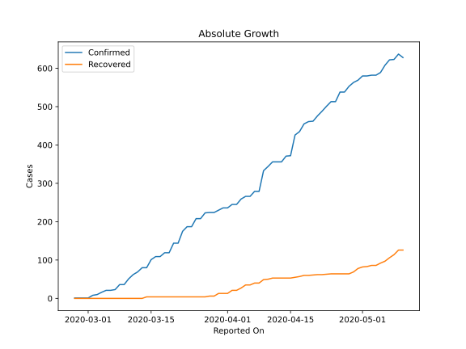
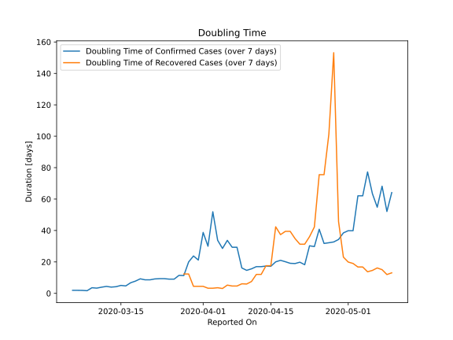

# Country Figures: Doubling Time of Infections for SanMarino 

The doubling time below are calculated based on
* an exponential growth assumption
* for time difference of past seven (7) days.
The doubling time's unit is "days".

The first doubling time indicates the increase of confirmed (infected)
cases. There, the *higher* the number is, the better is to take control
of the disease.

The second doubling time indicates the increase of recovered (healed)
cases. There, the *lower* the number is, the better it is to take
control of the disease.

| Reported On | Confirmed | Doubling Time (Confirmed) | Recovered | Doubling Time (Recovered) |
|-------------|-----------|---------------------------|-----------|---------------------------|
| 2020-05-10 | 628 |  64.1 days  | 126 |  13.0 days  | 
| 2020-05-09 | 637 |  52.1 days  | 126 |  12.0 days  | 
| 2020-05-08 | 623 |  68.2 days  | 114 |  15.1 days  | 
| 2020-05-07 | 622 |  54.8 days  | 106 |  16.2 days  | 
| 2020-05-06 | 608 |  63.4 days  | 97 |  14.6 days  | 
| 2020-05-05 | 589 |  77.3 days  | 92 |  13.7 days  | 
| 2020-05-04 | 582 |  62.1 days  | 86 |  16.8 days  | 
| 2020-05-03 | 582 |  62.1 days  | 86 |  16.8 days  | 
| 2020-05-02 | 580 |  39.9 days  | 83 |  19.0 days  | 
| 2020-05-01 | 580 |  39.9 days  | 82 |  19.9 days  | 
| 2020-04-30 | 569 |  38.5 days  | 78 |  23.1 days  | 
| 2020-04-29 | 563 |  34.3 days  | 69 |  45.7 days  | 
| 2020-04-28 | 553 |  32.7 days  | 64 |  153.2 days  | 
| 2020-04-27 | 538 |  32.2 days  | 64 |  101.4 days  | 
| 2020-04-26 | 538 |  31.8 days  | 64 |  75.5 days  | 
| 2020-04-25 | 513 |  40.8 days  | 64 |  75.5 days  | 
| 2020-04-24 | 513 |  29.8 days  | 64 |  42.2 days  | 
| 2020-04-23 | 501 |  30.3 days  | 63 |  36.1 days  | 
| 2020-04-22 | 488 |  18.2 days  | 62 |  31.3 days  | 
| 2020-04-21 | 476 |  19.8 days  | 62 |  31.3 days  | 
| 2020-04-20 | 462 |  19.0 days  | 61 |  34.9 days  | 
| 2020-04-19 | 461 |  19.1 days  | 60 |  39.5 days  | 
| 2020-04-18 | 455 |  20.1 days  | 60 |  39.5 days  | 
| 2020-04-17 | 435 |  21.0 days  | 57 |  37.4 days  | 
| 2020-04-16 | 426 |  20.0 days  | 55 |  42.3 days  | 
| 2020-04-15 | 372 |  17.2 days  | 53 |  17.6 days  | 
| 2020-04-14 | 371 |  17.4 days  | 53 |  17.6 days  | 
| 2020-04-13 | 356 |  17.0 days  | 53 |  12.0 days  | 
| 2020-04-12 | 356 |  17.0 days  | 53 |  12.0 days  | 
| 2020-04-11 | 356 |  15.6 days  | 53 |  7.5 days  | 
| 2020-04-10 | 344 |  14.6 days  | 50 |  5.9 days  | 
| 2020-04-09 | 333 |  16.2 days  | 49 |  6.1 days  | 
| 2020-04-08 | 279 |  29.3 days  | 40 |  4.7 days  | 
| 2020-04-07 | 279 |  29.3 days  | 40 |  4.7 days  | 
| 2020-04-06 | 266 |  33.7 days  | 35 |  5.2 days  | 
| 2020-04-05 | 266 |  28.6 days  | 35 |  3.1 days  | 
| 2020-04-04 | 259 |  33.8 days  | 27 |  3.6 days  | 
| 2020-04-03 | 245 |  51.9 days  | 21 |  3.3 days  | 
| 2020-04-02 | 245 |  30.0 days  | 21 |  3.3 days  | 
| 2020-04-01 | 236 |  38.8 days  | 13 |  4.5 days  | 
| 2020-03-31 | 236 |  21.2 days  | 13 |  4.5 days  | 
| 2020-03-30 | 230 |  23.8 days  | 13 |  4.5 days  | 
| 2020-03-29 | 224 |  20.0 days  | 6 |  12.3 days  | 
| 2020-03-28 | 224 |  11.3 days  | 6 |  12.3 days  | 
| 2020-03-27 | 223 |  11.4 days  | 4 |  None  | 
| 2020-03-26 | 208 |  9.0 days  | 4 |  None  | 
| 2020-03-25 | 208 |  9.0 days  | 4 |  None  | 
| 2020-03-24 | 187 |  9.3 days  | 4 |  None  | 
| 2020-03-23 | 187 |  9.3 days  | 4 |  None  | 
| 2020-03-22 | 175 |  9.2 days  | 4 |  None  | 
| 2020-03-21 | 144 |  8.6 days  | 4 |  None  | 
| 2020-03-20 | 144 |  8.6 days  | 4 |  None  | 
| 2020-03-19 | 119 |  9.2 days  | 4 |  None  | 
| 2020-03-18 | 119 |  7.8 days  | 4 |  None  | 
| 2020-03-17 | 109 |  6.7 days  | 4 |  None  | 
| 2020-03-16 | 109 |  4.7 days  | 4 |  None  | 
| 2020-03-15 | 101 |  5.0 days  | 4 |  None  | 
| 2020-03-14 | 80 |  4.2 days  | 4 |  None  | 
| 2020-03-13 | 80 |  4.0 days  | 0 |  None  | 
| 2020-03-12 | 69 |  4.4 days  | 0 |  None  | 
| 2020-03-11 | 62 |  3.9 days  | 0 |  None  | 
| 2020-03-10 | 51 |  3.3 days  | 0 |  None  | 
| 2020-03-09 | 36 |  3.6 days  | 0 |  None  | 
| 2020-03-08 | 36 |  1.7 days  | 0 |  None  | 
| 2020-03-07 | 23 |  1.9 days  | 0 |  None  | 
| 2020-03-06 | 21 |  1.9 days  | 0 |  None  | 
| 2020-03-05 | 21 |  1.9 days  | 0 |  None  | 
| 2020-03-04 | 16 |  None  | 0 |  None  | 
| 2020-03-03 | 10 |  None  | 0 |  None  | 
| 2020-03-02 | 8 |  None  | 0 |  None  | 
| 2020-03-01 | 1 |  None  | 0 |  None  | 
| 2020-02-29 | 1 |  None  | 0 |  None  | 
| 2020-02-28 | 1 |  None  | 0 |  None  | 
| 2020-02-27 | 1 |  None  | 0 |  None  | 

