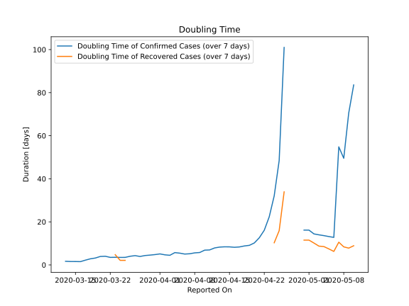

# Country Figures: New Infections in Previous 7 Days per 100,000 Population for Serbia 

<!--  --> 

| Reported On | &Delta; Confirmed (on the day) | &Delta; Confirmed (last 7 days) | New Cases in Previous 7 Days per 100,000 Population |
|-------------|--------------------------------|---------------------------------|-----------------------------------------------------|
| 2020-05-10 |  None  |  568  |  8.135  |
| 2020-05-09 |  89  |  670  |  9.596  |
| 2020-05-08 |  95  |  934  |  13.377  |
| 2020-05-07 |  57  |  839  |  12.016  |
| 2020-05-06 |  114  |  3161  |  45.273  |
| 2020-05-05 |  120  |  3047  |  43.640  |
| 2020-05-04 |  93  |  2927  |  41.922  |
| 2020-05-03 |  102  |  2834  |  40.590  |
| 2020-05-02 |  353  |  2732  |  39.129  |
| 2020-05-01 |  None  |  2379  |  34.073  |
| 2020-04-30 |  2379  |  2379  |  34.073  |
| 2020-04-29 |  None  |  None  |  None  |
| 2020-04-28 |  None  |  None  |  None  |
| 2020-04-27 |  None  |  None  |  None  |
| 2020-04-26 |  None  |  312  |  4.469  |
| 2020-04-25 |  None  |  636  |  9.109  |
| 2020-04-24 |  None  |  940  |  13.463  |
| 2020-04-23 |  None  |  1312  |  18.791  |
| 2020-04-22 |  None  |  1757  |  25.164  |
| 2020-04-21 |  None  |  2165  |  31.008  |
| 2020-04-20 |  312  |  2576  |  36.894  |
| 2020-04-19 |  324  |  2688  |  38.499  |
| 2020-04-18 |  304  |  2614  |  37.439  |
| 2020-04-17 |  372  |  2585  |  37.023  |
| 2020-04-16 |  445  |  2451  |  35.104  |
| 2020-04-15 |  408  |  2207  |  31.609  |
| 2020-04-14 |  411  |  2018  |  28.903  |
| 2020-04-13 |  424  |  1854  |  26.554  |
| 2020-04-12 |  250  |  1722  |  24.663  |
| 2020-04-11 |  275  |  1756  |  25.150  |
| 2020-04-10 |  238  |  1629  |  23.331  |
| 2020-04-09 |  201  |  1696  |  24.291  |
| 2020-04-08 |  219  |  1606  |  23.002  |
| 2020-04-07 |  247  |  1547  |  22.157  |
| 2020-04-06 |  292  |  1415  |  20.266  |
| 2020-04-05 |  284  |  1167  |  16.714  |
| 2020-04-04 |  148  |  965  |  13.821  |
| 2020-04-03 |  305  |  1019  |  14.594  |
| 2020-04-02 |  111  |  787  |  11.272  |
| 2020-04-01 |  160  |  676  |  9.682  |
| 2020-03-31 |  115  |  597  |  8.550  |
| 2020-03-30 |  44  |  536  |  7.677  |
| 2020-03-29 |  82  |  519  |  7.433  |
| 2020-03-28 |  202  |  488  |  6.989  |
| 2020-03-27 |  73  |  322  |  4.612  |
| 2020-03-26 |  None  |  281  |  4.025  |
| 2020-03-25 |  81  |  301  |  4.311  |
| 2020-03-24 |  54  |  238  |  3.409  |
| 2020-03-23 |  27  |  194  |  2.779  |
| 2020-03-22 |  51  |  174  |  2.492  |
| 2020-03-21 |  36  |  125  |  1.790  |
| 2020-03-20 |  32  |  100  |  1.432  |
| 2020-03-19 |  20  |  84  |  1.203  |
| 2020-03-18 |  18  |  71  |  1.017  |
| 2020-03-17 |  10  |  60  |  0.859  |
| 2020-03-16 |  7  |  54  |  0.773  |
| 2020-03-15 |  2  |  47  |  0.673  |
| 2020-03-14 |  11  |  45  |  0.645  |
| 2020-03-13 |  16  |  34  |  0.487  |
| 2020-03-12 |  7  |  18  |  0.258  |
| 2020-03-11 |  7  |  11  |  0.158  |
| 2020-03-10 |  4  |  4  |  0.057  |
| 2020-03-09 |  None  |  None  |  None  |
| 2020-03-08 |  None  |  None  |  None  |
| 2020-03-07 |  None  |  None  |  None  |
| 2020-03-06 |  None  |  None  |  None  |

