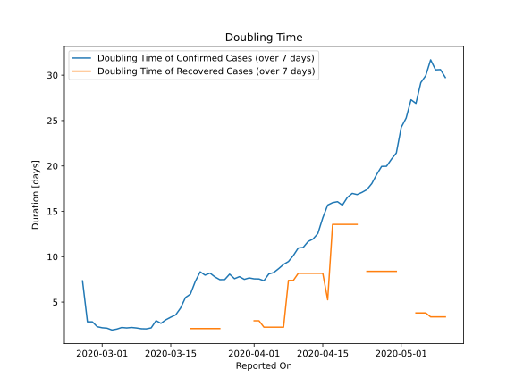

# Country Figures: New Infections in Previous 7 Days per 100,000 Population for Sweden 

<!--  --> 

| Reported On | &Delta; Confirmed (on the day) | &Delta; Confirmed (last 7 days) | New Cases in Previous 7 Days per 100,000 Population |
|-------------|--------------------------------|---------------------------------|-----------------------------------------------------|
| 2020-05-10 |  401  |  4005  |  39.330  |
| 2020-05-09 |  656  |  3839  |  37.699  |
| 2020-05-08 |  642  |  3745  |  36.776  |
| 2020-05-07 |  705  |  3531  |  34.675  |
| 2020-05-06 |  702  |  3616  |  35.510  |
| 2020-05-05 |  495  |  3595  |  35.303  |
| 2020-05-04 |  404  |  3795  |  37.267  |
| 2020-05-03 |  235  |  3677  |  36.109  |
| 2020-05-02 |  562  |  3905  |  38.348  |
| 2020-05-01 |  428  |  3953  |  38.819  |
| 2020-04-30 |  790  |  4337  |  42.590  |
| 2020-04-29 |  681  |  4298  |  42.207  |
| 2020-04-28 |  695  |  4299  |  42.217  |
| 2020-04-27 |  286  |  4149  |  40.744  |
| 2020-04-26 |  463  |  4255  |  41.785  |
| 2020-04-25 |  610  |  4355  |  42.767  |
| 2020-04-24 |  812  |  4351  |  42.727  |
| 2020-04-23 |  751  |  4215  |  41.392  |
| 2020-04-22 |  682  |  4077  |  40.037  |
| 2020-04-21 |  545  |  3877  |  38.073  |
| 2020-04-20 |  392  |  3829  |  37.601  |
| 2020-04-19 |  563  |  3902  |  38.318  |
| 2020-04-18 |  606  |  3671  |  36.050  |
| 2020-04-17 |  676  |  3531  |  34.675  |
| 2020-04-16 |  613  |  3399  |  33.379  |
| 2020-04-15 |  482  |  3508  |  34.449  |
| 2020-04-14 |  497  |  3752  |  36.845  |
| 2020-04-13 |  465  |  3742  |  36.747  |
| 2020-04-12 |  332  |  3653  |  35.873  |
| 2020-04-11 |  466  |  3708  |  36.413  |
| 2020-04-10 |  544  |  3554  |  34.901  |
| 2020-04-09 |  722  |  3573  |  35.087  |
| 2020-04-08 |  726  |  3472  |  34.095  |
| 2020-04-07 |  487  |  3258  |  31.994  |
| 2020-04-06 |  376  |  3178  |  31.208  |
| 2020-04-05 |  387  |  3130  |  30.737  |
| 2020-04-04 |  312  |  2996  |  29.421  |
| 2020-04-03 |  563  |  3062  |  30.069  |
| 2020-04-02 |  621  |  2728  |  26.789  |
| 2020-04-01 |  512  |  2421  |  23.775  |
| 2020-03-31 |  407  |  2149  |  21.103  |
| 2020-03-30 |  328  |  1982  |  19.463  |
| 2020-03-29 |  253  |  1769  |  17.372  |
| 2020-03-28 |  378  |  1684  |  16.537  |
| 2020-03-27 |  229  |  1430  |  14.043  |
| 2020-03-26 |  314  |  1401  |  13.758  |
| 2020-03-25 |  240  |  1247  |  12.246  |
| 2020-03-24 |  240  |  1096  |  10.763  |
| 2020-03-23 |  115  |  943  |  9.260  |
| 2020-03-22 |  168  |  909  |  8.926  |
| 2020-03-21 |  124  |  802  |  7.876  |
| 2020-03-20 |  200  |  825  |  8.102  |
| 2020-03-19 |  160  |  840  |  8.249  |
| 2020-03-18 |  89  |  779  |  7.650  |
| 2020-03-17 |  87  |  835  |  8.200  |
| 2020-03-16 |  81  |  855  |  8.396  |
| 2020-03-15 |  61  |  819  |  8.043  |
| 2020-03-14 |  147  |  800  |  7.856  |
| 2020-03-13 |  215  |  713  |  7.002  |
| 2020-03-12 |  99  |  505  |  4.959  |
| 2020-03-11 |  145  |  465  |  4.566  |
| 2020-03-10 |  107  |  334  |  3.280  |
| 2020-03-09 |  45  |  233  |  2.288  |
| 2020-03-08 |  42  |  189  |  1.856  |
| 2020-03-07 |  60  |  149  |  1.463  |
| 2020-03-06 |  7  |  94  |  0.923  |
| 2020-03-05 |  59  |  87  |  0.854  |
| 2020-03-04 |  14  |  33  |  0.324  |
| 2020-03-03 |  6  |  20  |  0.196  |
| 2020-03-02 |  1  |  14  |  0.137  |
| 2020-03-01 |  2  |  13  |  0.128  |
| 2020-02-29 |  5  |  11  |  0.108  |
| 2020-02-28 |  None  |  6  |  0.059  |
| 2020-02-27 |  5  |  6  |  0.059  |
| 2020-02-26 |  1  |  1  |  0.010  |
| 2020-02-25 |  None  |  None  |  None  |
| 2020-02-24 |  None  |  None  |  None  |
| 2020-02-23 |  None  |  None  |  None  |
| 2020-02-22 |  None  |  None  |  None  |
| 2020-02-21 |  None  |  None  |  None  |
| 2020-02-20 |  None  |  None  |  None  |
| 2020-02-19 |  None  |  None  |  None  |
| 2020-02-18 |  None  |  None  |  None  |
| 2020-02-17 |  None  |  None  |  None  |
| 2020-02-16 |  None  |  None  |  None  |
| 2020-02-15 |  None  |  None  |  None  |
| 2020-02-14 |  None  |  None  |  None  |
| 2020-02-13 |  None  |  None  |  None  |
| 2020-02-12 |  None  |  None  |  None  |
| 2020-02-11 |  None  |  None  |  None  |
| 2020-02-10 |  None  |  None  |  None  |
| 2020-02-09 |  None  |  None  |  None  |
| 2020-02-08 |  None  |  None  |  None  |
| 2020-02-07 |  None  |  None  |  None  |
| 2020-02-06 |  None  |  None  |  None  |
| 2020-02-05 |  None  |  None  |  None  |
| 2020-02-04 |  None  |  None  |  None  |
| 2020-02-03 |  None  |  None  |  None  |
| 2020-02-02 |  None  |  None  |  None  |
| 2020-02-01 |  None  |  None  |  None  |
| 2020-01-31 |  None  |  None  |  None  |

