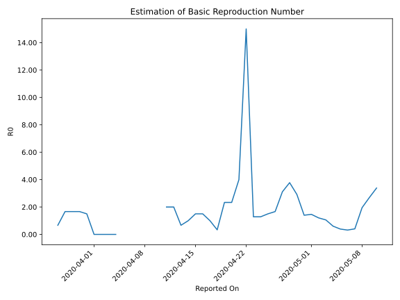

# Country Figures: Time Series for Basic Reproduction Number of Eswatini 

| Reported On | &Delta; Confirmed | Total &Delta; Confirmed First Interval | Total &Delta; Confirmed Second Interval | Estimated Basic Reproduction Number R0 | 
|-------------|-------------------|----------------------------------------|-----------------------------------------|---------------------------------------------------|
| 2020-05-10 | 9 |  44  |  13  |  3.38  | 
| 2020-05-09 | 4 |  43  |  16  |  2.69  | 
| 2020-05-08 | 6 |  41  |  21  |  1.95  | 
| 2020-05-07 | 30 |  15  |  37  |  0.41  | 
| 2020-05-06 | 4 |  13  |  41  |  0.32  | 
| 2020-05-05 | 3 |  16  |  41  |  0.39  | 
| 2020-05-04 | 4 |  21  |  35  |  0.60  | 
| 2020-05-03 | 4 |  37  |  35  |  1.06  | 
| 2020-05-02 | 2 |  41  |  34  |  1.21  | 
| 2020-05-01 | 6 |  41  |  28  |  1.46  | 
| 2020-04-30 | 9 |  35  |  25  |  1.40  | 
| 2020-04-29 | 20 |  35  |  12  |  2.92  | 
| 2020-04-28 | 6 |  34  |  9  |  3.78  | 
| 2020-04-27 | 6 |  28  |  9  |  3.11  | 
| 2020-04-26 | 3 |  25  |  15  |  1.67  | 
| 2020-04-25 | 20 |  12  |  8  |  1.50  | 
| 2020-04-24 | 5 |  9  |  7  |  1.29  | 
| 2020-04-23 | 0 |  9  |  7  |  1.29  | 
| 2020-04-22 | 0 |  15  |  1  |  15.00  | 
| 2020-04-21 | 7 |  8  |  2  |  4.00  | 
| 2020-04-20 | 2 |  7  |  3  |  2.33  | 
| 2020-04-19 | 0 |  7  |  3  |  2.33  | 
| 2020-04-18 | 6 |  1  |  3  |  0.33  | 
| 2020-04-17 | 0 |  2  |  2  |  1.00  | 
| 2020-04-16 | 1 |  3  |  2  |  1.50  | 
| 2020-04-15 | 0 |  3  |  2  |  1.50  | 
| 2020-04-14 | 0 |  3  |  3  |  1.00  | 
| 2020-04-13 | 1 |  2  |  3  |  0.67  | 
| 2020-04-12 | 2 |  2  |  1  |  2.00  | 
| 2020-04-11 | 0 |  2  |  1  |  2.00  | 
| 2020-04-10 | 0 |  3  |  None  |  None  | 
| 2020-04-09 | 0 |  3  |  None  |  None  | 
| 2020-04-08 | 2 |  1  |  None  |  None  | 
| 2020-04-07 | 0 |  1  |  None  |  None  | 
| 2020-04-06 | 1 |  None  |  None  |  None  | 
| 2020-04-05 | 0 |  None  |  None  |  None  | 
| 2020-04-04 | 0 |  None  |  3  |  None  | 
| 2020-04-03 | 0 |  None  |  5  |  None  | 
| 2020-04-02 | 0 |  None  |  5  |  None  | 
| 2020-04-01 | 0 |  None  |  5  |  None  | 
| 2020-03-31 | 0 |  3  |  2  |  1.50  | 
| 2020-03-30 | 0 |  5  |  3  |  1.67  | 
| 2020-03-29 | 0 |  5  |  3  |  1.67  | 
| 2020-03-28 | 0 |  5  |  3  |  1.67  | 
| 2020-03-27 | 3 |  2  |  3  |  0.67  | 
| 2020-03-26 | 2 |  3  |  None  |  None  | 
| 2020-03-25 | 0 |  3  |  None  |  None  | 
| 2020-03-24 | 0 |  3  |  None  |  None  | 
| 2020-03-23 | 0 |  3  |  None  |  None  | 
| 2020-03-22 | 3 |  None  |  None  |  None  | 
| 2020-03-21 | 0 |  None  |  None  |  None  | 
| 2020-03-20 | 0 |  None  |  None  |  None  | 
| 2020-03-19 | 0 |  None  |  None  |  None  | 
| 2020-03-18 | 0 |  None  |  None  |  None  | 
| 2020-03-17 | 0 |  None  |  None  |  None  | 
| 2020-03-16 | 0 |  None  |  None  |  None  | 
| 2020-03-15 | 0 |  None  |  None  |  None  | 
| 2020-03-14 | None |  None  |  None  |  None  | 

