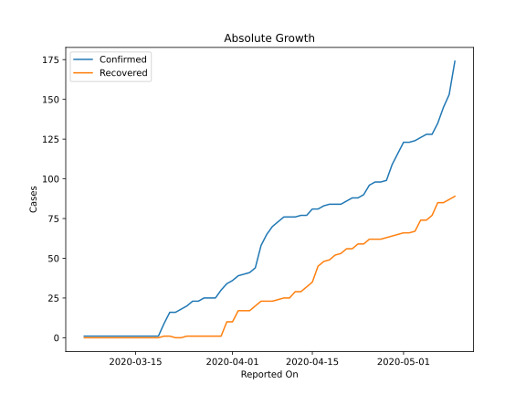

# Country Figures: Doubling Time of Infections for Togo 

The doubling time below are calculated based on
* an exponential growth assumption
* for time difference of past seven (7) days.
The doubling time's unit is "days".

The first doubling time indicates the increase of confirmed (infected)
cases. There, the *higher* the number is, the better is to take control
of the disease.

The second doubling time indicates the increase of recovered (healed)
cases. There, the *lower* the number is, the better it is to take
control of the disease.

| Reported On | Confirmed | Doubling Time (Confirmed) | Recovered | Doubling Time (Recovered) |
|-------------|-----------|---------------------------|-----------|---------------------------|
| 2020-05-10 | 174 |  14.7 days  | 89 |  17.4 days  | 
| 2020-05-09 | 153 |  22.6 days  | 87 |  17.9 days  | 
| 2020-05-08 | 145 |  29.8 days  | 85 |  19.5 days  | 
| 2020-05-07 | 135 |  32.3 days  | 85 |  18.4 days  | 
| 2020-05-06 | 128 |  30.5 days  | 77 |  26.6 days  | 
| 2020-05-05 | 128 |  19.2 days  | 74 |  30.5 days  | 
| 2020-05-04 | 126 |  19.7 days  | 74 |  27.8 days  | 
| 2020-05-03 | 124 |  21.0 days  | 67 |  62.9 days  | 
| 2020-05-02 | 123 |  19.9 days  | 66 |  78.0 days  | 
| 2020-05-01 | 123 |  15.9 days  | 66 |  43.6 days  | 
| 2020-04-30 | 116 |  17.9 days  | 65 |  50.4 days  | 
| 2020-04-29 | 109 |  23.0 days  | 64 |  36.7 days  | 
| 2020-04-28 | 99 |  34.8 days  | 63 |  41.5 days  | 
| 2020-04-27 | 98 |  31.8 days  | 62 |  31.3 days  | 
| 2020-04-26 | 98 |  31.8 days  | 62 |  27.9 days  | 
| 2020-04-25 | 96 |  36.7 days  | 62 |  21.0 days  | 
| 2020-04-24 | 90 |  60.3 days  | 59 |  23.9 days  | 
| 2020-04-23 | 88 |  58.9 days  | 59 |  18.3 days  | 
| 2020-04-22 | 88 |  58.9 days  | 56 |  10.7 days  | 
| 2020-04-21 | 86 |  44.2 days  | 56 |  9.0 days  | 
| 2020-04-20 | 84 |  56.1 days  | 53 |  8.4 days  | 
| 2020-04-19 | 84 |  48.8 days  | 52 |  8.7 days  | 
| 2020-04-18 | 84 |  48.8 days  | 49 |  7.6 days  | 
| 2020-04-17 | 83 |  55.4 days  | 48 |  7.8 days  | 
| 2020-04-16 | 81 |  47.0 days  | 45 |  8.1 days  | 
| 2020-04-15 | 81 |  33.6 days  | 35 |  11.9 days  | 
| 2020-04-14 | 77 |  29.0 days  | 32 |  15.0 days  | 
| 2020-04-13 | 77 |  17.5 days  | 29 |  21.3 days  | 
| 2020-04-12 | 76 |  9.2 days  | 29 |  13.4 days  | 
| 2020-04-11 | 76 |  8.2 days  | 25 |  12.9 days  | 
| 2020-04-10 | 76 |  7.9 days  | 25 |  12.9 days  | 
| 2020-04-09 | 73 |  8.1 days  | 24 |  14.4 days  | 
| 2020-04-08 | 70 |  7.6 days  | 23 |  6.2 days  | 
| 2020-04-07 | 65 |  7.8 days  | 23 |  6.2 days  | 
| 2020-04-06 | 58 |  7.7 days  | 23 |  1.9 days  | 
| 2020-04-05 | 44 |  8.9 days  | 20 |  1.9 days  | 
| 2020-04-04 | 41 |  10.2 days  | 17 |  2.0 days  | 
| 2020-04-03 | 40 |  10.7 days  | 17 |  2.0 days  | 
| 2020-04-02 | 39 |  9.5 days  | 17 |  2.0 days  | 
| 2020-04-01 | 36 |  11.2 days  | 10 |  2.4 days  | 
| 2020-03-31 | 34 |  9.5 days  | 10 |  2.4 days  | 
| 2020-03-30 | 30 |  9.8 days  | 1 |  None  | 
| 2020-03-29 | 25 |  11.2 days  | 1 |  None  | 
| 2020-03-28 | 25 |  11.2 days  | 1 |  None  | 
| 2020-03-27 | 25 |  5.1 days  | 1 |  None  | 
| 2020-03-26 | 23 |  1.9 days  | 1 |  None  | 
| 2020-03-25 | 23 |  1.9 days  | 1 |  None  | 
| 2020-03-24 | 20 |  1.9 days  | 1 |  None  | 
| 2020-03-23 | 18 |  2.0 days  | 0 |  None  | 
| 2020-03-22 | 16 |  2.1 days  | 0 |  None  | 
| 2020-03-21 | 16 |  2.1 days  | 1 |  None  | 
| 2020-03-20 | 9 |  2.5 days  | 1 |  None  | 
| 2020-03-19 | 1 |  None  | 0 |  None  | 
| 2020-03-18 | 1 |  None  | 0 |  None  | 
| 2020-03-17 | 1 |  None  | 0 |  None  | 
| 2020-03-16 | 1 |  None  | 0 |  None  | 
| 2020-03-15 | 1 |  None  | 0 |  None  | 
| 2020-03-14 | 1 |  None  | 0 |  None  | 
| 2020-03-13 | 1 |  None  | 0 |  None  | 
| 2020-03-12 | 1 |  None  | 0 |  None  | 
| 2020-03-11 | 1 |  None  | 0 |  None  | 
| 2020-03-10 | 1 |  None  | 0 |  None  | 
| 2020-03-09 | 1 |  None  | 0 |  None  | 
| 2020-03-08 | 1 |  None  | 0 |  None  | 
| 2020-03-07 | 1 |  None  | 0 |  None  | 
| 2020-03-06 | 1 |  None  | 0 |  None  | 

